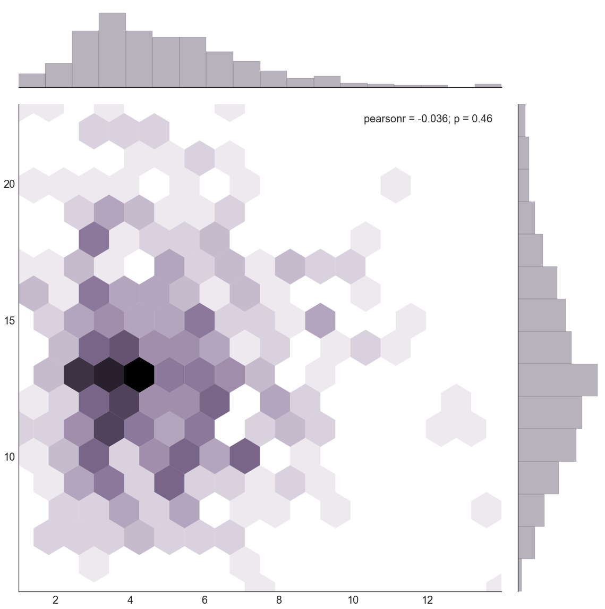
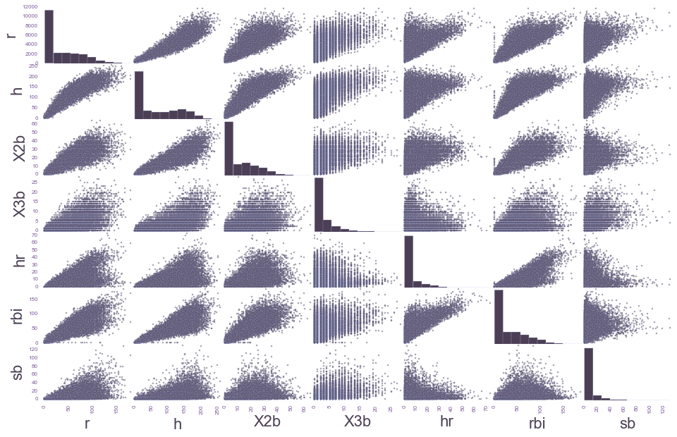

# A Preview


<!-- toc orderedList:0 depthFrom:1 depthTo:6 -->

- [A Preview](#a-preview)
	- [Joint Plots with Seaborn](#joint-plots-with-seaborn)
	- [Scatter Plot Matrix Graphs with Pandas](#scatter-plot-matrix-graphs-with-pandas)

<!-- tocstop -->


A quick look at some examples indicating the sorts of things that will be examined in later notebooks.

Each notebook will take advantage of the *NbAgg* backend, and we set that up first:


```python
import matplotlib
matplotlib.use('nbagg')
%matplotlib inline
```

Next we'll do whatever imports we will need for the session:


```python
import matplotlib.pyplot as plt
import matplotlib.colors as colors
import seaborn as sns
import numpy as np
from scipy import stats
import pandas as pd
```

## Joint Plots with Seaborn

As you can see from the import, we're going to use Seaborn for some nice visual presentation. Let's select a [palette](http://web.stanford.edu/~mwaskom/software/seaborn/tutorial/color_palettes.html) and color saturation level:


```python
sns.set_palette("BuPu_d")
sns.set_context("notebook", font_scale=2.0)
```

We're also going to use NumPy and SciPy to generate some data. Next, let's get some Seaborn defaults set up:


```python
np.random.seed(42424242)
```

Let's create some random data to use for our visualization:


```python
x = stats.gamma(5).rvs(420)
y = stats.gamma(13).rvs(420)
```

And now, let's plot the data:


```python
with sns.axes_style("white"):
    sns.jointplot(x, y, kind="hex", size=16)
```





## Scatter Plot Matrix Graphs with Pandas

Our next preview will be a Pandas teaser displaying a great deal of data in a single plot. The Pandas project ships with some sample data that we can load and view:


```python
baseball = pd.read_csv("../data/baseball.csv")
```

Pandas uses the new "ggplot" style defined in matplotlib. We'd like to override that with a custom style sheet based on the palette we've chosen from Seaborn. Let's get the list of colors from our palette:


```python
[colors.rgb2hex(x) for x in sns.color_palette()]
```


    ['#4c3f55', '#654b77', '#7e5799', '#8f6cb2', '#9889c0', '#a0a7cf']


To see how we used some of these colors, take a look at ``./styles/custom.mplstyle``.

Now let's graph our data, using the custom style that changes the default background color used by pandas (from the 'ggplot' style):


```python
plt.style.use('../styles/custom.mplstyle')
data = pd.scatter_matrix(baseball.loc[:,'r':'sb'], figsize=(16, 10))
```



