# Exploring the Architecture of matplotlib

<!-- toc orderedList:0 depthFrom:1 depthTo:6 -->

- [Exploring the Architecture of matplotlib](#exploring-the-architecture-of-matplotlib)
	- [Modules and matplotlib import graphs](#modules-and-matplotlib-import-graphs)
		- [Modules](#modules)
		- [A Simple Script](#a-simple-script)
		- [``ModuleFinder``](#modulefinder)
		- [``CustomFinder``](#customfinder)
		- [Visualizing Dependency Graphs](#visualizing-dependency-graphs)
		- [Defining Structures](#defining-structures)
	- [Execution flow in matplotlib](#execution-flow-in-matplotlib)
	- [Callgraphs](#callgraphs)
	- [``trace``](#trace)

<!-- tocstop -->


In the following sections of this IPython Notebook we will investigate different aspects of matplotlib's architecture. These include:
 * modules and import graphs
 * execution flow
 * the objects created by the pyplot scripting layer

Before we start, though, let's get things warmed up:


```python
import matplotlib
matplotlib.use('nbagg')
%matplotlib inline
```

Now we'll bring in the modules we'll be using in this notebook:


```python
from glob import glob
from modulefinder import Module
from modulefinder import ModuleFinder
from os.path import dirname
from pprint import pprint
import sys
import trace
import urllib.request

import matplotlib.pyplot as plt
from IPython.core.display import Image

from pycallgraph import Config
from pycallgraph import GlobbingFilter
from pycallgraph import PyCallGraph
from pycallgraph.output import GraphvizOutput
```

Now let's get some code we created espeically for this notebook:


```python
sys.path.append("../lib")
from modarch import matplotlib_groupings
import modfind
import modgraph
from modutil import ls, rm
```

## Modules and matplotlib import graphs

In this section, will will explore the architecture of matplotlib using the NetworkX library in conjunction with matplotlib itself. First, though, let's take a look at matplotlib's package structure.

### Modules

We can get a first glimps of the structure by looking at the package directory. IPython actually supports the ``ls -al`` shell command, but we're going to need something a bit more flexible, so let's import a convenience function we defined in the ``modutil`` module:


```python
libdir = "../../.venv-mmpl/lib/python3.4/site-packages/matplotlib"
ls(libdir)
```

    total 15400
    -rw-r--r--   1 oubiwann  staff   94005 May  6 10:13 _cm.py
    -rw-r--r--   1 oubiwann  staff   90077 May  6 10:13 _mathtext_data.py
    -rw-r--r--   1 oubiwann  staff    3506 May  6 10:13 _pylab_helpers.py
    -rw-r--r--   1 oubiwann  staff   16200 May  6 10:13 afm.py
    -rw-r--r--   1 oubiwann  staff   44129 May  6 10:13 animation.py
    -rw-r--r--   1 oubiwann  staff   41588 May  6 10:13 artist.py
    drwxr-xr-x   7 oubiwann  staff     238 May  6 10:13 axes
    -rw-r--r--   1 oubiwann  staff   80644 May  6 10:13 axis.py
    -rw-r--r--   1 oubiwann  staff  106046 May  6 10:13 backend_bases.py
    drwxr-xr-x  41 oubiwann  staff    1394 May  6 10:13 backends
    -rw-r--r--   1 oubiwann  staff   15695 May  6 10:13 bezier.py
    -rw-r--r--   1 oubiwann  staff   11636 May  6 10:13 blocking_input.py
    -rw-r--r--   1 oubiwann  staff   70573 May  6 10:13 cbook.py
    -rw-r--r--   1 oubiwann  staff   11669 May  6 10:13 cm.py
    -rw-r--r--   1 oubiwann  staff   63102 May  6 10:13 collections.py
    -rw-r--r--   1 oubiwann  staff   49307 May  6 10:13 colorbar.py
    -rw-r--r--   1 oubiwann  staff   57606 May  6 10:13 colors.py
    drwxr-xr-x   5 oubiwann  staff     170 May  6 10:13 compat
    -rw-r--r--   1 oubiwann  staff    3370 May  6 10:13 container.py
    -rw-r--r--   1 oubiwann  staff   67142 May  6 10:13 contour.py
    -rw-r--r--   1 oubiwann  staff   45489 May  6 10:13 dates.py
    drwxr-xr-x   7 oubiwann  staff     238 May  6 10:13 delaunay
    -rw-r--r--   1 oubiwann  staff    3995 May  6 10:13 docstring.py
    -rw-r--r--   1 oubiwann  staff   33923 May  6 10:13 dviread.py
    -rw-r--r--   1 oubiwann  staff   58719 May  6 10:13 figure.py
    -rw-r--r--   1 oubiwann  staff   51311 May  6 10:13 finance.py
    -rw-r--r--   1 oubiwann  staff   47415 May  6 10:13 font_manager.py
    -rw-r--r--   1 oubiwann  staff    6601 May  6 10:13 fontconfig_pattern.py
    -rw-r--r--   1 oubiwann  staff   15668 May  6 10:13 gridspec.py
    -rw-r--r--   1 oubiwann  staff    7132 May  6 10:13 hatch.py
    -rw-r--r--   1 oubiwann  staff   49749 May  6 10:13 image.py
    -rw-r--r--   1 oubiwann  staff   38001 May  6 10:13 legend.py
    -rw-r--r--   1 oubiwann  staff   21027 May  6 10:13 legend_handler.py
    -rw-r--r--   1 oubiwann  staff   47376 May  6 10:13 lines.py
    -rw-r--r--   1 oubiwann  staff   26324 May  6 10:13 markers.py
    -rw-r--r--   1 oubiwann  staff  111285 May  6 10:13 mathtext.py
    -rw-r--r--   1 oubiwann  staff  128046 May  6 10:13 mlab.py
    drwxr-xr-x   7 oubiwann  staff     238 May  6 10:13 mpl-data
    -rw-r--r--   1 oubiwann  staff    1069 May  6 10:13 mpl.py
    -rw-r--r--   1 oubiwann  staff   53384 May  6 10:13 offsetbox.py
    -rw-r--r--   1 oubiwann  staff  142681 May  6 10:13 patches.py
    -rw-r--r--   1 oubiwann  staff   36297 May  6 10:13 path.py
    -rw-r--r--   1 oubiwann  staff   15361 May  6 10:13 patheffects.py
    drwxr-xr-x   6 oubiwann  staff     204 May  6 10:13 projections
    -rw-r--r--   1 oubiwann  staff   11092 May  6 10:13 pylab.py
    -rw-r--r--   1 oubiwann  staff  120496 May  6 10:13 pyplot.py
    -rw-r--r--   1 oubiwann  staff   43406 May  6 10:13 quiver.py
    -rw-r--r--   1 oubiwann  staff   33270 May  6 10:13 rcsetup.py
    -rw-r--r--   1 oubiwann  staff   40247 May  6 10:13 sankey.py
    -rw-r--r--   1 oubiwann  staff   16046 May  6 10:13 scale.py
    drwxr-xr-x   9 oubiwann  staff     306 May  6 10:13 sphinxext
    -rw-r--r--   1 oubiwann  staff   18621 May  6 10:13 spines.py
    -rw-r--r--   1 oubiwann  staff    3978 May  6 10:13 stackplot.py
    -rw-r--r--   1 oubiwann  staff   19119 May  6 10:13 streamplot.py
    drwxr-xr-x   5 oubiwann  staff     170 May  6 10:13 style
    -rw-r--r--   1 oubiwann  staff   17551 May  6 10:13 table.py
    drwxr-xr-x   9 oubiwann  staff     306 May  6 10:13 testing
    drwxr-xr-x  61 oubiwann  staff    2074 May  6 10:13 tests
    -rw-r--r--   1 oubiwann  staff   25173 May  6 10:13 texmanager.py
    -rw-r--r--   1 oubiwann  staff   73585 May  6 10:13 text.py
    -rw-r--r--   1 oubiwann  staff   16650 May  6 10:13 textpath.py
    -rw-r--r--   1 oubiwann  staff   56708 May  6 10:13 ticker.py
    -rw-r--r--   1 oubiwann  staff    2601 May  6 10:13 tight_bbox.py
    -rw-r--r--   1 oubiwann  staff   13115 May  6 10:13 tight_layout.py
    -rw-r--r--   1 oubiwann  staff   92440 May  6 10:13 transforms.py
    drwxr-xr-x  12 oubiwann  staff     408 May  6 10:13 tri
    -rw-r--r--   1 oubiwann  staff   12650 May  6 10:13 type1font.py
    -rw-r--r--   1 oubiwann  staff    6146 May  6 10:13 units.py
    -rw-r--r--   1 oubiwann  staff   56160 May  6 10:13 widgets.py


Let's get a cleaner view, though. Here are all the top-level matplotlib modules:


```python
toplevel = glob(libdir + "/*.py")
modules = ["matplotlib" + x.split(libdir)[1] for x in toplevel]
len(modules)
```


    59


```python
pprint(modules)
```

    ['matplotlib/__init__.py',
     'matplotlib/_cm.py',
     'matplotlib/_mathtext_data.py',
     'matplotlib/_pylab_helpers.py',
     'matplotlib/afm.py',
     'matplotlib/animation.py',
     'matplotlib/artist.py',
     'matplotlib/axis.py',
     'matplotlib/backend_bases.py',
     'matplotlib/bezier.py',
     'matplotlib/blocking_input.py',
     'matplotlib/cbook.py',
     'matplotlib/cm.py',
     'matplotlib/collections.py',
     'matplotlib/colorbar.py',
     'matplotlib/colors.py',
     'matplotlib/container.py',
     'matplotlib/contour.py',
     'matplotlib/dates.py',
     'matplotlib/docstring.py',
     'matplotlib/dviread.py',
     'matplotlib/figure.py',
     'matplotlib/finance.py',
     'matplotlib/font_manager.py',
     'matplotlib/fontconfig_pattern.py',
     'matplotlib/gridspec.py',
     'matplotlib/hatch.py',
     'matplotlib/image.py',
     'matplotlib/legend.py',
     'matplotlib/legend_handler.py',
     'matplotlib/lines.py',
     'matplotlib/markers.py',
     'matplotlib/mathtext.py',
     'matplotlib/mlab.py',
     'matplotlib/mpl.py',
     'matplotlib/offsetbox.py',
     'matplotlib/patches.py',
     'matplotlib/path.py',
     'matplotlib/patheffects.py',
     'matplotlib/pylab.py',
     'matplotlib/pyplot.py',
     'matplotlib/quiver.py',
     'matplotlib/rcsetup.py',
     'matplotlib/sankey.py',
     'matplotlib/scale.py',
     'matplotlib/spines.py',
     'matplotlib/stackplot.py',
     'matplotlib/streamplot.py',
     'matplotlib/table.py',
     'matplotlib/texmanager.py',
     'matplotlib/text.py',
     'matplotlib/textpath.py',
     'matplotlib/ticker.py',
     'matplotlib/tight_bbox.py',
     'matplotlib/tight_layout.py',
     'matplotlib/transforms.py',
     'matplotlib/type1font.py',
     'matplotlib/units.py',
     'matplotlib/widgets.py']


And these are matplotlib's subpackages:


```python
modfile = "/__init__.py"
subs = [dirname(x) for x in glob(libdir + "/*" + modfile)]
pprint(["matplotlib" + x.split(libdir)[1] for x in subs])
```

    ['matplotlib/axes',
     'matplotlib/backends',
     'matplotlib/compat',
     'matplotlib/delaunay',
     'matplotlib/projections',
     'matplotlib/sphinxext',
     'matplotlib/style',
     'matplotlib/testing',
     'matplotlib/tests',
     'matplotlib/tri']


Let's take a peek into some of these:


```python
ignore_output =[ls(libdir + x) for x in ["/backends", "/axes", "/projections"]]
```

    total 6248
    -rw-r--r--   1 oubiwann  staff    21106 May  6 10:13 backend_agg.py
    -rw-r--r--   1 oubiwann  staff    17494 May  6 10:13 backend_cairo.py
    -rw-r--r--   1 oubiwann  staff     9980 May  6 10:13 backend_cocoaagg.py
    -rw-r--r--   1 oubiwann  staff    16712 May  6 10:13 backend_gdk.py
    -rw-r--r--   1 oubiwann  staff    37356 May  6 10:13 backend_gtk.py
    -rw-r--r--   1 oubiwann  staff    30540 May  6 10:13 backend_gtk3.py
    -rw-r--r--   1 oubiwann  staff     3815 May  6 10:13 backend_gtk3agg.py
    -rw-r--r--   1 oubiwann  staff     2321 May  6 10:13 backend_gtk3cairo.py
    -rw-r--r--   1 oubiwann  staff     4354 May  6 10:13 backend_gtkagg.py
    -rw-r--r--   1 oubiwann  staff     2348 May  6 10:13 backend_gtkcairo.py
    -rw-r--r--   1 oubiwann  staff    15754 May  6 10:13 backend_macosx.py
    -rw-r--r--   1 oubiwann  staff     5673 May  6 10:13 backend_mixed.py
    -rw-r--r--   1 oubiwann  staff     9518 May  6 10:13 backend_nbagg.py
    -rw-r--r--   1 oubiwann  staff    94712 May  6 10:13 backend_pdf.py
    -rw-r--r--   1 oubiwann  staff    36343 May  6 10:13 backend_pgf.py
    -rw-r--r--   1 oubiwann  staff    62836 May  6 10:13 backend_ps.py
    -rw-r--r--   1 oubiwann  staff     2919 May  6 10:13 backend_qt4.py
    -rw-r--r--   1 oubiwann  staff     3003 May  6 10:13 backend_qt4agg.py
    -rw-r--r--   1 oubiwann  staff    29378 May  6 10:13 backend_qt5.py
    -rw-r--r--   1 oubiwann  staff     7342 May  6 10:13 backend_qt5agg.py
    -rw-r--r--   1 oubiwann  staff    45804 May  6 10:13 backend_svg.py
    -rw-r--r--   1 oubiwann  staff     9358 May  6 10:13 backend_template.py
    -rw-r--r--   1 oubiwann  staff    31659 May  6 10:13 backend_tkagg.py
    -rw-r--r--   1 oubiwann  staff    12184 May  6 10:13 backend_webagg.py
    -rw-r--r--   1 oubiwann  staff    17119 May  6 10:13 backend_webagg_core.py
    -rw-r--r--   1 oubiwann  staff    65412 May  6 10:13 backend_wx.py
    -rw-r--r--   1 oubiwann  staff     5902 May  6 10:13 backend_wxagg.py
    -rw-r--r--   1 oubiwann  staff      402 May  6 10:13 qt4_compat.py
    -rw-r--r--   1 oubiwann  staff     4816 May  6 10:13 qt_compat.py
    drwxr-xr-x   7 oubiwann  staff      238 May  6 10:13 qt_editor
    -rw-r--r--   1 oubiwann  staff     1161 May  6 10:13 tkagg.py
    drwxr-xr-x  11 oubiwann  staff      374 May  6 10:13 web_backend
    -rw-r--r--   1 oubiwann  staff      790 May  6 10:13 windowing.py
    total 776
    -rw-r--r--   1 oubiwann  staff  260820 May  6 10:13 _axes.py
    -rw-r--r--   1 oubiwann  staff  115150 May  6 10:13 _base.py
    -rw-r--r--   1 oubiwann  staff    8572 May  6 10:13 _subplots.py
    total 112
    -rw-r--r--   1 oubiwann  staff  21733 May  6 10:13 geo.py
    -rw-r--r--   1 oubiwann  staff  27444 May  6 10:13 polar.py


matplotlib has an architecture that conceptually groups areas of functionality into the following layers:
 * scripting
 * artist
 * backend

There's nothing in matplotlib that correlates modules and subpackages to these conceptual layers, so we created one in a module used by this notebook:


```python
pprint(matplotlib_groupings)
```

    {'artist layer': ['matplotlib.afm',
                      'matplotlib.animation',
                      'matplotlib.artist',
                      'matplotlib.ax',
                      'matplotlib.container',
                      'matplotlib.contour',
                      'matplotlib.figure',
                      'matplotlib.gridspec',
                      'matplotlib.hatch',
                      'matplotlib.image',
                      'matplotlib.legend',
                      'matplotlib.lines',
                      'matplotlib.marker',
                      'matplotlib.offset',
                      'matplotlib.patches',
                      'matplotlib.path',
                      'matplotlib.projection',
                      'matplotlib.quiver',
                      'matplotlib.sankey',
                      'matplotlib.scale',
                      'matplotlib.spines',
                      'matplotlib.stackplot',
                      'matplotlib.streamplot',
                      'matplotlib.table',
                      'matplotlib.text',
                      'matplotlib.ticker',
                      'matplotlib.tight',
                      'matplotlib.transforms',
                      'matplotlib.tri.',
                      'matplotlib.units'],
     'backend layer': ['matplotlib.backend',
                       'matplotlib.blocking',
                       'matplotlib.dviread',
                       'matplotlib.mathtext',
                       'matplotlib.texmanager',
                       'matplotlib.type1font',
                       'matplotlib.widgets'],
     'configuration': ['matplotlib.rcsetup', 'matplotlib.style'],
     'scripting layer': ['matplotlib.mlab',
                         'matplotlib.pylab',
                         'matplotlib.pyplot'],
     'utilities': ['matplotlib.bezier',
                   'matplotlib.cbook',
                   'matplotlib.cm',
                   'matplotlib.collections',
                   'matplotlib.color',
                   'matplotlib.compat',
                   'matplotlib.dates',
                   'matplotlib.delaunay',
                   'matplotlib.docstring',
                   'matplotlib.finance',
                   'matplotlib.font',
                   'matplotlib.sphinxext',
                   'mpl_tool']}


As you may notice, not all of the strings in the key/list pairs match exactly to matplotlib's modules or subpackages. That's because these strings are used to match beginnings of strings. Their intended use is in a call such as ``x.startswith(mod_name_part)``.

We will use this information later when building structured graphs of matplotlib imports, but for now this offers additional insight into how one can view the Python modules which comprise matplotlib.

### A Simple Script

We've got a simple matplotlib script that's in the ``./scripts`` directory. It has the following contents:


```python
#! /usr/bin/env python3.4
import matplotlib.pyplot as plt

def main () -> None:
    plt.plot([1,2,3,4])
    plt.ylabel('some numbers')
    plt.savefig('simple-line.png')

if __name__ == '__main__':
    main()
```


Super easy. But the purpose of this isn't to demonstrate something impressive with matplotlib. Rather, as we dig into the matplotlib modules, and in this case explore the module dependencies for our script, we want the simplest case possible so that we can focus on out goal: understanding how it all hooks up.

### ``ModuleFinder``

We'd like to see all the matplotlib modules that are imported just to do this simple script. There's a great Python module for just this sort of task: ``ModuleFinder``:


```python
finder = ModuleFinder()
finder.run_script('../scripts/simple-line.py')
```

Now, the problem with this, is that it's going to pull in *every* dependency for every library used. We're going to see ``matplotlib``, ``numpy``, the Python standard library, etc. Let's just take a look at the module count, and not display all of them:


```python
len(finder.modules)
```


    1068


So we're going to need to do some customization...

### ``CustomFinder``

To do this, we're going to have to override methods that aren't part of the public API. In particular, we're going to want to get our mits into ``ModuleFinder.import_hook``. The reason for this is that we don't want to have the finder digging into modules we don't care about -- before it imports them, let's do a check, and only continue if everything looks okay.

Let's start with a simple subclass:


```python
class CustomFinder(ModuleFinder):

    def __init__(self, include:list, *args, **kwargs):
        super().__init__(*args, **kwargs)
        self.cf_include = include

    def matches(self, name:str) -> bool:
        if True in [name.startswith(x) for x in self.cf_include]:
            return True
        return False

    def import_hook(self, name:str, caller:Module=None, fromlist:list=None,
                    level:int=-1) -> Module:
        if self.matches(name):
            super().import_hook(name, caller, fromlist, level)
```

Let's give this a try, passing a list of strings that module names can start with (just the ones we're interested in):


```python
finder = CustomFinder(["matpl", "mpl"])
finder.run_script('../scripts/simple-line.py')
len(finder.modules)
```


    65


That's more like it! Since it's not 1000s of modules, let's take a peek:


```python
finder.modules.keys()
```


    dict_keys(['matplotlib.widgets', 'matplotlib.type1font', 'matplotlib.bezier', 'matplotlib.patches', 'matplotlib.docstring', 'matplotlib.scale', 'matplotlib.contour', 'matplotlib.ft2font', '__main__', 'matplotlib.ttconv', 'matplotlib.axes', 'matplotlib.legend_handler', 'matplotlib.compat', 'matplotlib.markers', 'matplotlib.offsetbox', 'matplotlib.fontconfig_pattern', 'matplotlib.gridspec', 'matplotlib._mathtext_data', 'matplotlib.rcsetup', 'matplotlib._pylab_helpers', 'matplotlib.legend', 'matplotlib.backends.backend_agg', 'matplotlib._path', 'matplotlib.mlab', 'matplotlib.lines', 'matplotlib.ticker', 'matplotlib._image', 'matplotlib.style', 'matplotlib.textpath', 'matplotlib.backends', 'matplotlib.backends.backend_svg', 'matplotlib.backends.backend_webagg_core', 'matplotlib.figure', 'matplotlib.artist', 'matplotlib.hatch', 'matplotlib.texmanager', 'matplotlib.text', 'matplotlib.backend_bases', 'matplotlib.container', 'matplotlib.compat.subprocess', 'matplotlib.pyplot', 'matplotlib._cntr', 'matplotlib.colorbar', 'matplotlib.dviread', 'matplotlib.cbook', 'matplotlib.blocking_input', 'matplotlib.colors', 'matplotlib.projections', 'matplotlib', 'matplotlib.cm', 'matplotlib.backends.backend_mixed', 'matplotlib._png', 'matplotlib.mathtext', 'matplotlib.path', 'matplotlib.backends._backend_agg', 'matplotlib.afm', 'matplotlib.backends.backend_webagg', 'matplotlib.transforms', 'matplotlib.font_manager', 'matplotlib.patheffects', 'matplotlib.backends.backend_pdf', 'matplotlib.image', 'matplotlib.collections', 'matplotlib.tight_bbox', 'matplotlib._cm'])


We've created a custom finder very similar to the one above in the ``modfind`` module for this notebook. Try it out:


```python
finder = modfind.CustomFinder()
finder.run_script('../scripts/simple-line.py')
len(finder.modules)
```


    62


As you can see, the loaded finder is a little more strict, having 3 fewer modules.

Okay, we've got our data. It's time to start gaining some insight ...

### Visualizing Dependency Graphs

In order to build a good picture of what we're looking at, we're going to want to have connections between modules (which modules import other modules), weighted values (which modules get imported the most), and node colors (which modules are more closely related to other modules). We've created a class that tracks all this data (as well as creating an instance of our custom finder).

Using this module will allow us to jump into the bigger-picture analysis more quickly, since we won't have to build up everthing from scratch in this notebook. However, you should definitely take a look at the code there for a deeper understanding of what's going on.

Let's take a look at these modules using our module grapher:


```python
grapher = modgraph.ModGrapher(
    source='../scripts/simple-line.py',
    layout='neato')
grapher.render()
```


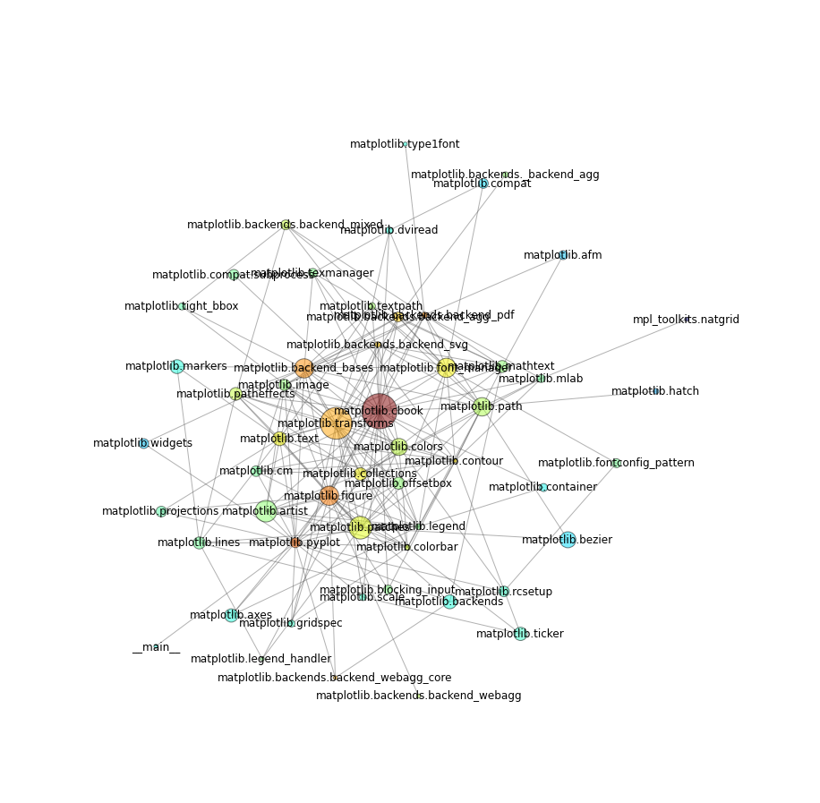


Well, that's a bit of a mess. Not so "neato". Usig the ``dot`` layout is worse. Let's try ``twopi``:


```python
grapher.render(layout="twopi")
```


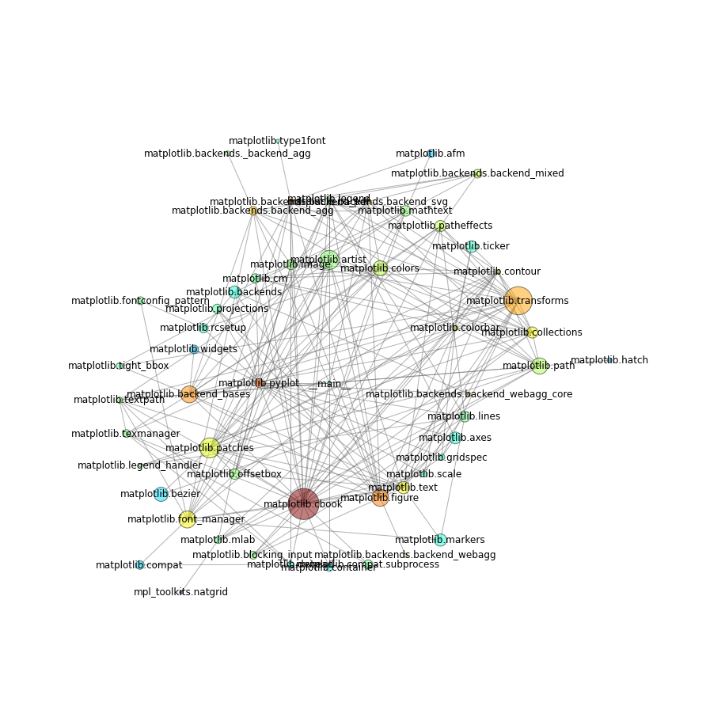


That's a little bit better, but we're still not that much closer to seeing some structure. If we turn off the lables, we might get a better sense of things:


```python
grapher.render(layout="twopi", labels=False)
```


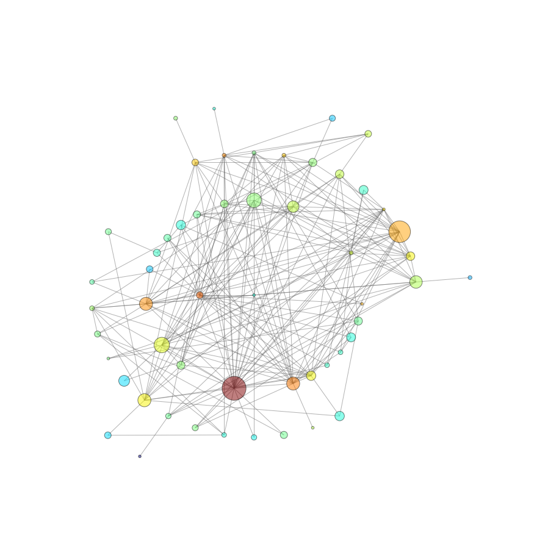


The way things are colored right now is fairly highly tweaked in the custom class: a combination of the [Levenshtein distance](http://en.wikipedia.org/wiki/Levenshtein_distance) of the module name and the [valency](http://en.wikipedia.org/wiki/Degree_(graph_theory)) of the given node. In other words, nodes with similar names and numbers of connections are closer in color. It's okay for a start (and kind of fun). But we could do better.

A quick thing to try would be to reduce the total number of modules we're looking at by grouping via submodules. For instance, all ``matplotlib.backend.*`` modules would be grouped with ``matplotlib.backend``. Out little custom module finder has a mode for this: "simple":


```python
grapher.render(layout="twopi", labels=False, mode="simple")
```


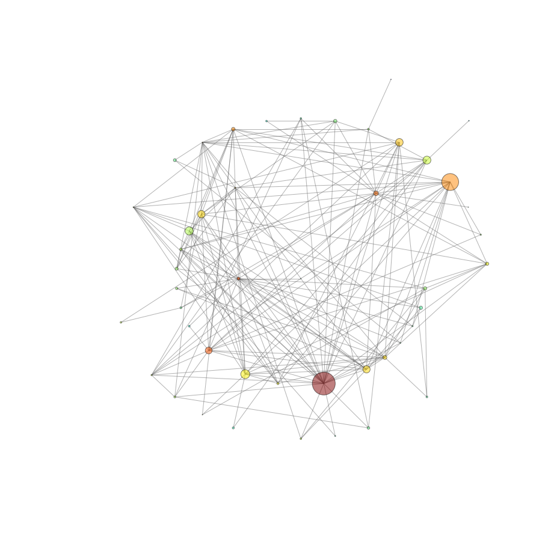


That's a *little* better, but I don't think we've really seen any structure revealed over what was visible in the previous rendering.

### Defining Structures

What we'd really like is a graph that showed how groups of modules connect. That's not an emergent property of the system itself, so it requires some manual work. As mentioned in this previous sections, the ``modgraph`` module defines the relationships of the top-level matplotlib modules with regard to the higher-level, conceptual architecture of matplotlib.

Let's re-render using a mode which takes advantage of this data structure:


```python
grapher.render(layout="neato", labels=True, mode="reduced-structure")
```


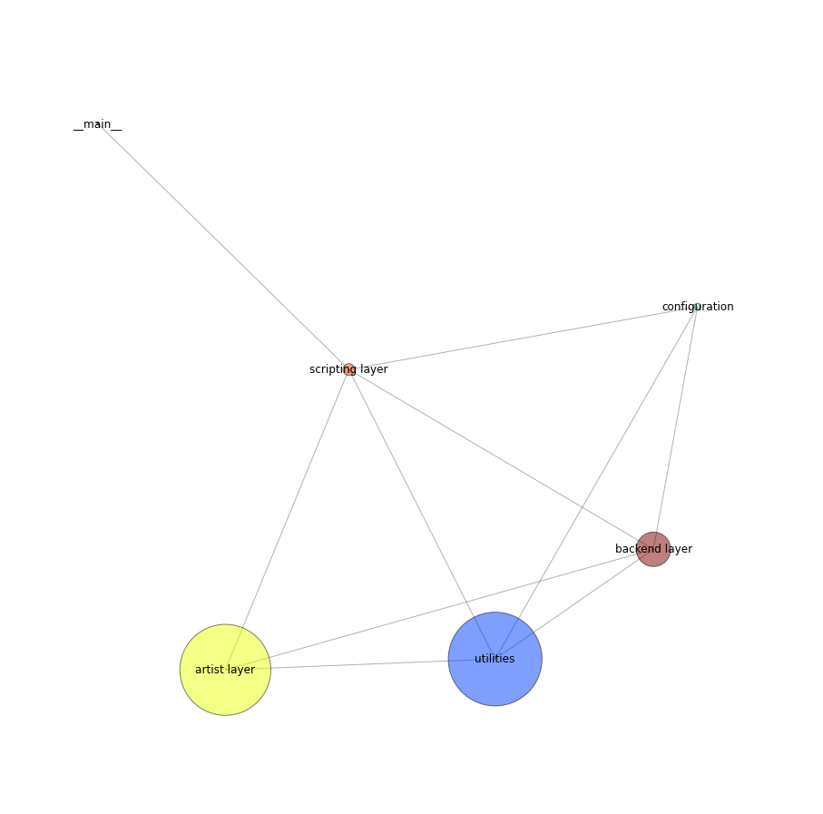


This definitely simplifies things! But if we can combine this with the simple mode, it might help us better see how the individual components are related:


```python
grapher.render(layout="neato", labels=True, mode="simple-structure")
```


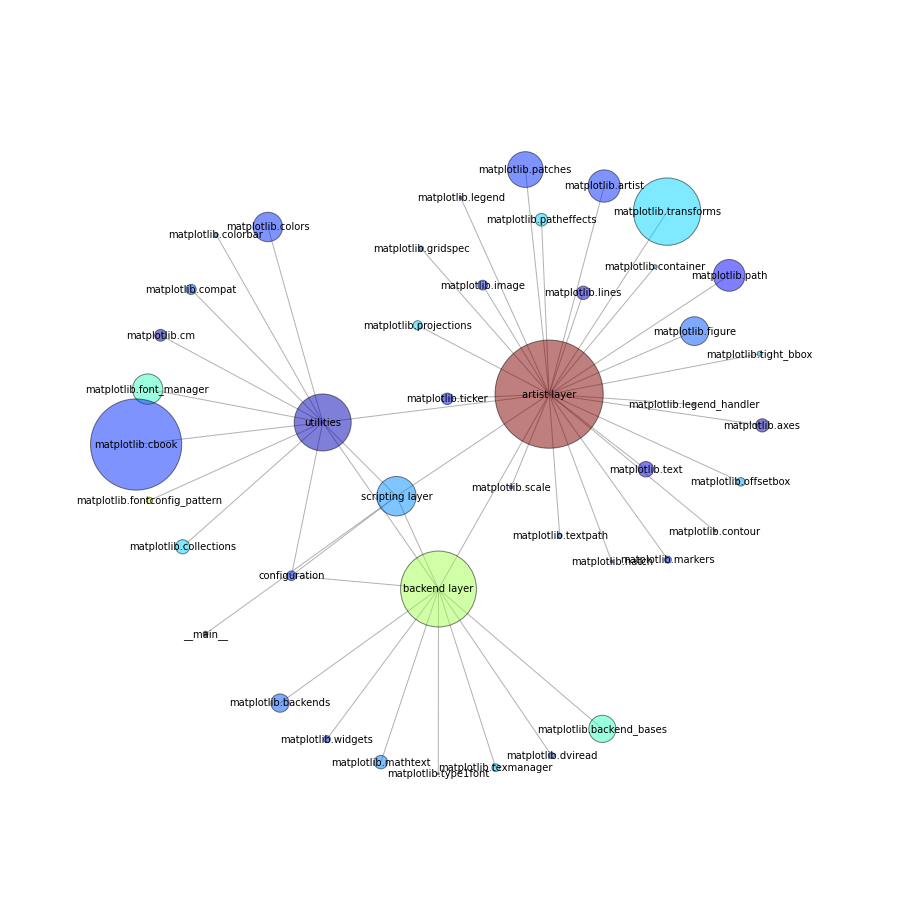


Now we're getting somewhere. What about with the full set of modules?


```python
grapher.render(layout="neato", labels=True, mode="full-structure")
```


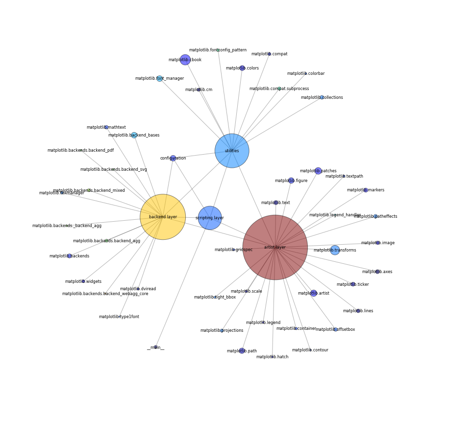


And there you have it: the architecture of matplotlib from the perspective of a simple plotting script, and the imports that said script causes to occur.

## Execution flow in matplotlib

We've explored how imports cascade out into all the parts of matplotlib for our script. Next, let's actually look at what gets *called*.

Fore quick reference, here's the code for the simple script we created above:


```python
#! /usr/bin/env python3.4
import matplotlib.pyplot as plt

def main () -> None:
    plt.plot([1,2,3,4])
    plt.ylabel('some numbers')
    plt.savefig('simple-line.png')

if __name__ == '__main__':
    main()
```


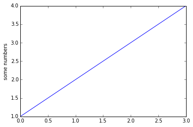


Now we will step through this on bit at a time:


```python
plt.rcParams['backend']
```


    'module://IPython.kernel.zmq.pylab.backend_inline'


```python
plt._backend_mod.__name__
```


    'IPython.kernel.zmq.pylab.backend_inline'


```python
plt._show
```


    <function IPython.kernel.zmq.pylab.backend_inline.show>


```python
plt.plot([1,2,3,4])
```


    [<matplotlib.lines.Line2D at 0x109a66ac8>]


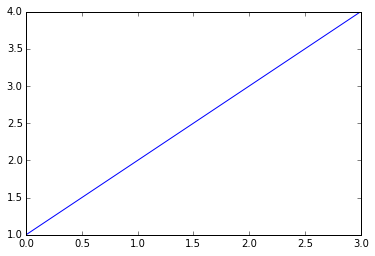


```python
plt.get_current_fig_manager()
```


    <matplotlib.backend_bases.FigureManagerBase at 0x109a6ff28>


    <matplotlib.figure.Figure at 0x109942748>


```python
plt.get_current_fig_manager().canvas
```


    <matplotlib.backends.backend_agg.FigureCanvasAgg at 0x109a6f198>


    <matplotlib.figure.Figure at 0x109a6f358>


```python
plt.get_current_fig_manager().canvas.figure
```


    <matplotlib.figure.Figure at 0x109a6fa58>


    <matplotlib.figure.Figure at 0x109a6fa58>


Or we can just use the ``pyplot`` utility functions:


```python
plt.gcf()
```


    <matplotlib.figure.Figure at 0x109a6fda0>


    <matplotlib.figure.Figure at 0x109a6fda0>


```python
plt.gca()
```


    <matplotlib.axes._subplots.AxesSubplot at 0x108fc0eb8>


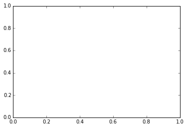


```python
plt.gca().lines
```


    []


```python
plt.gca().get_ylabel()
```


    ''


```python
plt.ylabel('some numbers')
```


    <matplotlib.text.Text at 0x1094212b0>


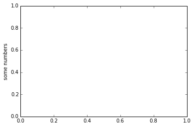


```python
print(plt.gca().get_ylabel())
```


Let's clean up from any previous runs:


```python
image_file = "simple-line.png"
if os.path.exists(image_file):
    rm(image_file)
```


```python
if os.path.exists(image_file):
    ls("*.png")
```

Finally, we can save our image:


```python
plt.savefig(image_file)
```


    <matplotlib.figure.Figure at 0x10b12ed68>


```python
if os.path.exists(image_file):
    ls("*.png")
```

    -rw-r--r--  1 oubiwann  staff  1205 May  6 10:26 simple-line.png


## Callgraphs

[Note: the following section is experimental; pycallgraph is not returning everything it should for matplotlib.]

The next thing we'd like to look at is the call graph for our simple matplotlib script.

Before we dive into that, though, let's look at a simple example using the Python standard library only. Let's go with an old standard:


```python
def hello_world():
    print("Hello, World!")
```

Now, let's generate a call graph for this function, and then display it:


```python
config = Config(groups=False, trace_filter=None)
output = output=GraphvizOutput(output_file='callgraph.png')

with PyCallGraph(config=config, output=output):
    hello_world()

Image(filename='callgraph.png')
```

    Hello, World!


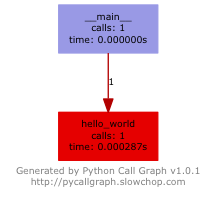


Pretty simple, eh? Not too much information there to ponder. Let's try something a little more involved:


```python
with PyCallGraph(config=config, output=output):
    urllib.request.urlopen('http://matplotlib.org/')

Image(filename='callgraph.png')
```


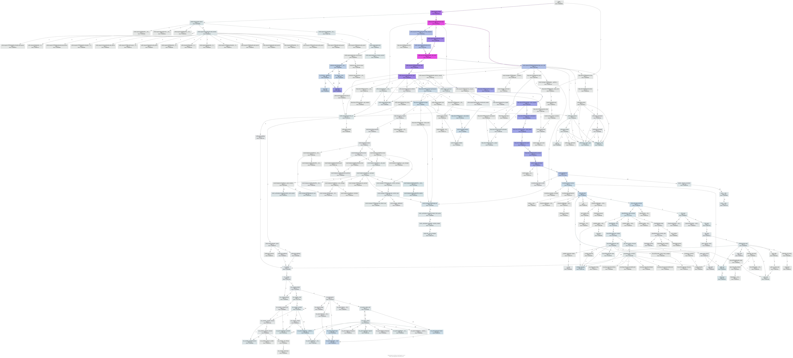


That's something to stare at for a while! Ready for the big one now? Let's do it!

First, we're going to add a configuration option for just returning calls from the modules we care about.

Next, you should still have ``main()`` defined from above -- go ahead and run it:


```python
with PyCallGraph(config=config, output=output):
    import matplotlib.pyplot as plt

    def plotit():
        plt.plot([1,2,3,4])
        plt.ylabel('some numbers')
        plt.show()

    plotit()

Image(filename='callgraph.png')
```


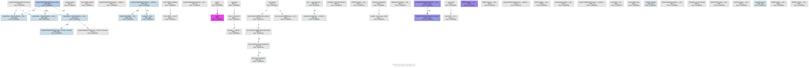


## ``trace``

Since we can't seem to get pycallgraph to render calls into matplotlib, let's take a look at the tracing module instead. This next one may take a few minutes, depending upon your machine:


```python
def plotit():
    plt.plot([1,2,3,4])
    plt.ylabel('some numbers')
    plt.show()

tracer = trace.Trace(countfuncs=1, countcallers=1)
_ = tracer.runfunc(plotit)
```


```python
results = tracer.results()
_ = results.write_results(show_missing=True, summary=True, coverdir=".")
```


    calling relationships:

    *** /Library/Frameworks/Python.framework/Versions/3.4/lib/python3.4/base64.py ***
        base64.encodebytes -> base64._input_type_check

    *** /Library/Frameworks/Python.framework/Versions/3.4/lib/python3.4/copy.py ***
      --> /Library/Frameworks/Python.framework/Versions/3.4/lib/python3.4/copyreg.py
        copy._reconstruct -> copyreg.__newobj__
        copy.copy -> copy._reconstruct

    *** /Library/Frameworks/Python.framework/Versions/3.4/lib/python3.4/hmac.py ***
        hmac.HMAC.hexdigest -> hmac.HMAC._current

    *** /Library/Frameworks/Python.framework/Versions/3.4/lib/python3.4/json/__init__.py ***
      --> /Library/Frameworks/Python.framework/Versions/3.4/lib/python3.4/json/encoder.py
        __init__.dumps -> encoder.JSONEncoder.__init__
        __init__.dumps -> encoder.JSONEncoder.encode

    *** /Library/Frameworks/Python.framework/Versions/3.4/lib/python3.4/json/encoder.py ***
        encoder.JSONEncoder.encode -> encoder.JSONEncoder.iterencode
        encoder.JSONEncoder.iterencode -> encoder.encode_basestring
      --> /Users/oubiwann/tmp/.venv-mmpl/lib/python3.4/site-packages/IPython/utils/jsonutil.py
        encoder.JSONEncoder.iterencode -> jsonutil.date_default
        encoder.encode_basestring -> encoder.replace

    *** /Library/Frameworks/Python.framework/Versions/3.4/lib/python3.4/trace.py ***
      --> <ipython-input-46-295ae59ff02d>
        trace.Trace.runfunc -> <ipython-input-46-295ae59ff02d>.plotit

    *** /Library/Frameworks/Python.framework/Versions/3.4/lib/python3.4/uuid.py ***
        uuid.uuid4 -> uuid.UUID.__init__

    *** /Library/Frameworks/Python.framework/Versions/3.4/lib/python3.4/weakref.py ***
      --> /usr/local/bin/../../../Library/Frameworks/Python.framework/Versions/3.4/lib/python3.4/_weakrefset.py
        weakref.WeakKeyDictionary.items -> _weakrefset._IterationGuard.__enter__
        weakref.WeakKeyDictionary.items -> _weakrefset._IterationGuard.__exit__
        weakref.WeakKeyDictionary.items -> _weakrefset._IterationGuard.__init__
        weakref.WeakValueDictionary.__init__ -> weakref.WeakValueDictionary.update
        weakref.WeakValueDictionary.__setitem__ -> weakref.KeyedRef.__init__
        weakref.WeakValueDictionary.__setitem__ -> weakref.__new__
        weakref.WeakValueDictionary.values -> _weakrefset._IterationGuard.__enter__
        weakref.WeakValueDictionary.values -> _weakrefset._IterationGuard.__exit__
        weakref.WeakValueDictionary.values -> _weakrefset._IterationGuard.__init__

    *** /Users/oubiwann/tmp/.venv-mmpl/lib/python3.4/site-packages/IPython/core/display.py ***
      --> /Users/oubiwann/tmp/.venv-mmpl/lib/python3.4/site-packages/IPython/config/configurable.py
        display.display -> configurable.instance
        display.display -> display.publish_display_data
      --> /Users/oubiwann/tmp/.venv-mmpl/lib/python3.4/site-packages/IPython/core/formatters.py
        display.display -> formatters.DisplayFormatter.format
      --> /Users/oubiwann/tmp/.venv-mmpl/lib/python3.4/site-packages/IPython/utils/traitlets.py
        display.display -> traitlets.TraitType.__get__
      --> <frozen importlib._bootstrap>
        display.display -> <frozen importlib._handle_fromlist
      --> /Users/oubiwann/tmp/.venv-mmpl/lib/python3.4/site-packages/IPython/config/configurable.py
        display.publish_display_data -> configurable.instance
      --> /Users/oubiwann/tmp/.venv-mmpl/lib/python3.4/site-packages/IPython/kernel/zmq/zmqshell.py
        display.publish_display_data -> zmqshell.ZMQDisplayPublisher.publish
      --> <frozen importlib._bootstrap>
        display.publish_display_data -> <frozen importlib._handle_fromlist

    *** /Users/oubiwann/tmp/.venv-mmpl/lib/python3.4/site-packages/IPython/core/formatters.py ***
      --> /Users/oubiwann/tmp/.venv-mmpl/lib/python3.4/site-packages/IPython/utils/traitlets.py
        formatters.BaseFormatter._in_deferred_types -> traitlets.TraitType.__get__
        formatters.BaseFormatter.lookup -> formatters.BaseFormatter.lookup_by_type
        formatters.BaseFormatter.lookup -> formatters._get_type
        formatters.BaseFormatter.lookup -> traitlets.TraitType.__get__
        formatters.BaseFormatter.lookup_by_type -> formatters.BaseFormatter._in_deferred_types
      --> /Users/oubiwann/tmp/.venv-mmpl/lib/python3.4/site-packages/IPython/lib/pretty.py
        formatters.BaseFormatter.lookup_by_type -> pretty._get_mro
      --> /Users/oubiwann/tmp/.venv-mmpl/lib/python3.4/site-packages/IPython/utils/traitlets.py
        formatters.BaseFormatter.lookup_by_type -> traitlets.TraitType.__get__
        formatters.DisplayFormatter.format -> traitlets.TraitType.__get__
      --> <string>
        formatters.DisplayFormatter.format -> <string>.__call__
        formatters.__call__ -> formatters.BaseFormatter.lookup
        formatters.__call__ -> formatters._safe_get_formatter_method
      --> /Users/oubiwann/tmp/.venv-mmpl/lib/python3.4/site-packages/IPython/core/pylabtools.py
        formatters.__call__ -> pylabtools.<lambda>
      --> /Users/oubiwann/tmp/.venv-mmpl/lib/python3.4/site-packages/IPython/lib/pretty.py
        formatters.__call__ -> pretty.PrettyPrinter.flush
        formatters.__call__ -> pretty.RepresentationPrinter.__init__
        formatters.__call__ -> pretty.RepresentationPrinter.pretty
      --> /Users/oubiwann/tmp/.venv-mmpl/lib/python3.4/site-packages/IPython/utils/traitlets.py
        formatters.__call__ -> traitlets.TraitType.__get__
      --> /Users/oubiwann/tmp/.venv-mmpl/lib/python3.4/site-packages/matplotlib/figure.py
        formatters.__call__ -> figure.Figure._repr_html_
      --> /Library/Frameworks/Python.framework/Versions/3.4/lib/python3.4/inspect.py
        formatters._safe_get_formatter_method -> inspect.isclass
      --> /Users/oubiwann/tmp/.venv-mmpl/lib/python3.4/site-packages/IPython/lib/pretty.py
        formatters._safe_get_formatter_method -> pretty._safe_getattr
        formatters.catch_format_error -> formatters.BaseFormatter._check_return
        formatters.catch_format_error -> formatters.JSONFormatter._check_return
        formatters.catch_format_error -> formatters.__call__

    *** /Users/oubiwann/tmp/.venv-mmpl/lib/python3.4/site-packages/IPython/core/pylabtools.py ***
        pylabtools.<lambda> -> pylabtools.print_figure
      --> /Library/Frameworks/Python.framework/Versions/3.4/lib/python3.4/weakref.py
        pylabtools.print_figure -> weakref.remove
      --> /Users/oubiwann/tmp/.venv-mmpl/lib/python3.4/site-packages/matplotlib/__init__.py
        pylabtools.print_figure -> __init__.RcParams.__getitem__
      --> /Users/oubiwann/tmp/.venv-mmpl/lib/python3.4/site-packages/matplotlib/backend_bases.py
        pylabtools.print_figure -> backend_bases.FigureCanvasBase.print_figure
      --> /Users/oubiwann/tmp/.venv-mmpl/lib/python3.4/site-packages/matplotlib/figure.py
        pylabtools.print_figure -> figure.Figure._get_axes
        pylabtools.print_figure -> figure.Figure.get_edgecolor
        pylabtools.print_figure -> figure.Figure.get_facecolor
      --> <frozen importlib._bootstrap>
        pylabtools.print_figure -> <frozen importlib._handle_fromlist

    *** /Users/oubiwann/tmp/.venv-mmpl/lib/python3.4/site-packages/IPython/kernel/zmq/iostream.py ***
        iostream.OutStream._check_mp_mode -> iostream.OutStream._is_master_process
        iostream.OutStream._flush_buffer -> iostream.OutStream._new_buffer
        iostream.OutStream._flush_from_subprocesses -> iostream.OutStream._is_master_process
      --> /Users/oubiwann/tmp/.venv-mmpl/lib/python3.4/site-packages/zmq/sugar/poll.py
        iostream.OutStream._flush_from_subprocesses -> poll.Poller.poll
      --> /Library/Frameworks/Python.framework/Versions/3.4/lib/python3.4/threading.py
        iostream.OutStream._is_master_thread -> threading.current_thread
        iostream.OutStream._is_master_thread -> threading.ident
        iostream.OutStream.flush -> iostream.OutStream._check_mp_mode
        iostream.OutStream.flush -> iostream.OutStream._flush_buffer
        iostream.OutStream.flush -> iostream.OutStream._flush_from_subprocesses
        iostream.OutStream.flush -> iostream.OutStream._is_master_thread

    *** /Users/oubiwann/tmp/.venv-mmpl/lib/python3.4/site-packages/IPython/kernel/zmq/pylab/backend_inline.py ***
      --> /Users/oubiwann/tmp/.venv-mmpl/lib/python3.4/site-packages/matplotlib/__init__.py
        backend_inline.draw_if_interactive -> __init__.is_interactive
      --> /Users/oubiwann/tmp/.venv-mmpl/lib/python3.4/site-packages/matplotlib/_pylab_helpers.py
        backend_inline.draw_if_interactive -> _pylab_helpers.get_active
      --> /Users/oubiwann/tmp/.venv-mmpl/lib/python3.4/site-packages/IPython/config/configurable.py
        backend_inline.show -> configurable.instance
      --> /Users/oubiwann/tmp/.venv-mmpl/lib/python3.4/site-packages/IPython/core/display.py
        backend_inline.show -> display.display
      --> /Users/oubiwann/tmp/.venv-mmpl/lib/python3.4/site-packages/IPython/utils/traitlets.py
        backend_inline.show -> traitlets.TraitType.__get__
      --> /Users/oubiwann/tmp/.venv-mmpl/lib/python3.4/site-packages/matplotlib/_pylab_helpers.py
        backend_inline.show -> _pylab_helpers.get_all_fig_managers
      --> /Users/oubiwann/tmp/.venv-mmpl/lib/python3.4/site-packages/matplotlib/pyplot.py
        backend_inline.show -> pyplot.close

    *** /Users/oubiwann/tmp/.venv-mmpl/lib/python3.4/site-packages/IPython/kernel/zmq/session.py ***
      --> /Users/oubiwann/tmp/.venv-mmpl/lib/python3.4/site-packages/zmq/utils/jsonapi.py
        session.<lambda> -> jsonapi.dumps
        session.Session.msg -> session.Session.msg_header
        session.Session.msg -> session.extract_header
      --> /Users/oubiwann/tmp/.venv-mmpl/lib/python3.4/site-packages/IPython/utils/traitlets.py
        session.Session.msg -> traitlets.TraitType.__get__
        session.Session.msg_header -> session.msg_header
        session.Session.msg_header -> session.msg_id
        session.Session.msg_header -> traitlets.TraitType.__get__
        session.Session.send -> session.<listcomp>
        session.Session.send -> session.Session.msg
        session.Session.send -> session.Session.serialize
        session.Session.send -> traitlets.TraitType.__get__
      --> /Users/oubiwann/tmp/.venv-mmpl/lib/python3.4/site-packages/zmq/sugar/socket.py
        session.Session.send -> socket.Socket.send_multipart
        session.Session.serialize -> session.<lambda>
        session.Session.serialize -> session.Session.sign
      --> /Users/oubiwann/tmp/.venv-mmpl/lib/python3.4/site-packages/IPython/utils/traitlets.py
        session.Session.serialize -> traitlets.TraitType.__get__
      --> /Library/Frameworks/Python.framework/Versions/3.4/lib/python3.4/hmac.py
        session.Session.sign -> hmac.HMAC.copy
        session.Session.sign -> hmac.HMAC.hexdigest
        session.Session.sign -> hmac.HMAC.update
      --> /Users/oubiwann/tmp/.venv-mmpl/lib/python3.4/site-packages/IPython/utils/py3compat.py
        session.Session.sign -> py3compat.encode
      --> /Users/oubiwann/tmp/.venv-mmpl/lib/python3.4/site-packages/IPython/utils/traitlets.py
        session.Session.sign -> traitlets.TraitType.__get__
      --> /Library/Frameworks/Python.framework/Versions/3.4/lib/python3.4/uuid.py
        session.msg_id -> uuid.UUID.__str__
        session.msg_id -> uuid.uuid4

    *** /Users/oubiwann/tmp/.venv-mmpl/lib/python3.4/site-packages/IPython/kernel/zmq/zmqshell.py ***
      --> /Users/oubiwann/tmp/.venv-mmpl/lib/python3.4/site-packages/IPython/kernel/zmq/iostream.py
        zmqshell.ZMQDisplayPublisher._flush_streams -> iostream.OutStream.flush
      --> /Users/oubiwann/tmp/.venv-mmpl/lib/python3.4/site-packages/IPython/core/displaypub.py
        zmqshell.ZMQDisplayPublisher.publish -> displaypub.DisplayPublisher._validate_data
      --> /Users/oubiwann/tmp/.venv-mmpl/lib/python3.4/site-packages/IPython/kernel/zmq/session.py
        zmqshell.ZMQDisplayPublisher.publish -> session.Session.send
        zmqshell.ZMQDisplayPublisher.publish -> zmqshell.ZMQDisplayPublisher._flush_streams
      --> /Users/oubiwann/tmp/.venv-mmpl/lib/python3.4/site-packages/IPython/utils/jsonutil.py
        zmqshell.ZMQDisplayPublisher.publish -> jsonutil.encode_images
        zmqshell.ZMQDisplayPublisher.publish -> jsonutil.json_clean
      --> /Users/oubiwann/tmp/.venv-mmpl/lib/python3.4/site-packages/IPython/utils/traitlets.py
        zmqshell.ZMQDisplayPublisher.publish -> traitlets.TraitType.__get__

    *** /Users/oubiwann/tmp/.venv-mmpl/lib/python3.4/site-packages/IPython/lib/pretty.py ***
        pretty.GroupQueue.__init__ -> pretty.GroupQueue.enq
        pretty.PrettyPrinter.__init__ -> pretty.Group.__init__
        pretty.PrettyPrinter.__init__ -> pretty.GroupQueue.__init__
        pretty.PrettyPrinter.begin_group -> pretty.Group.__init__
        pretty.PrettyPrinter.begin_group -> pretty.GroupQueue.enq
        pretty.PrettyPrinter.begin_group -> pretty.PrettyPrinter.text
        pretty.PrettyPrinter.end_group -> pretty.GroupQueue.remove
        pretty.PrettyPrinter.end_group -> pretty.PrettyPrinter.text
        pretty.RepresentationPrinter.__init__ -> pretty.PrettyPrinter.__init__
        pretty.RepresentationPrinter._in_deferred_types -> pretty._safe_getattr
        pretty.RepresentationPrinter.pretty -> pretty.PrettyPrinter.begin_group
        pretty.RepresentationPrinter.pretty -> pretty.PrettyPrinter.end_group
        pretty.RepresentationPrinter.pretty -> pretty.RepresentationPrinter._in_deferred_types
        pretty.RepresentationPrinter.pretty -> pretty._default_pprint
        pretty.RepresentationPrinter.pretty -> pretty._get_mro
        pretty.RepresentationPrinter.pretty -> pretty._safe_getattr
        pretty.RepresentationPrinter.pretty -> pretty._type_pprint
        pretty._default_pprint -> pretty.PrettyPrinter.begin_group
        pretty._default_pprint -> pretty.PrettyPrinter.end_group
        pretty._default_pprint -> pretty.PrettyPrinter.text
        pretty._default_pprint -> pretty.RepresentationPrinter.pretty
        pretty._default_pprint -> pretty._safe_getattr
        pretty._type_pprint -> pretty.PrettyPrinter.text
        pretty._type_pprint -> pretty._safe_getattr

    *** /Users/oubiwann/tmp/.venv-mmpl/lib/python3.4/site-packages/IPython/utils/jsonutil.py ***
      --> /Library/Frameworks/Python.framework/Versions/3.4/lib/python3.4/base64.py
        jsonutil.encode_images -> base64.encodebytes
        jsonutil.json_clean -> jsonutil.json_clean
      --> /Users/oubiwann/tmp/.venv-mmpl/lib/python3.4/site-packages/IPython/utils/py3compat.py
        jsonutil.json_clean -> py3compat.iteritems

    *** /Users/oubiwann/tmp/.venv-mmpl/lib/python3.4/site-packages/matplotlib/__init__.py ***
        __init__.Verbose.report -> __init__.Verbose.ge
        __init__.get_backend -> __init__.RcParams.__getitem__
        __init__.is_interactive -> __init__.RcParams.__getitem__

    *** /Users/oubiwann/tmp/.venv-mmpl/lib/python3.4/site-packages/matplotlib/_pylab_helpers.py ***
      --> /Users/oubiwann/tmp/.venv-mmpl/lib/python3.4/site-packages/matplotlib/backend_bases.py
        _pylab_helpers.destroy_all -> backend_bases.FigureCanvasBase.mpl_disconnect
        _pylab_helpers.destroy_all -> backend_bases.FigureManagerBase.destroy

    *** /Users/oubiwann/tmp/.venv-mmpl/lib/python3.4/site-packages/matplotlib/artist.py ***
      --> /Users/oubiwann/tmp/.venv-mmpl/lib/python3.4/site-packages/matplotlib/__init__.py
        artist.Artist.__init__ -> __init__.RcParams.__getitem__
      --> /Users/oubiwann/tmp/.venv-mmpl/lib/python3.4/site-packages/matplotlib/backend_bases.py
        artist.Artist._set_gc_clip -> backend_bases.GraphicsContextBase.set_clip_path
        artist.Artist._set_gc_clip -> backend_bases.GraphicsContextBase.set_clip_rectangle
      --> /Users/oubiwann/tmp/.venv-mmpl/lib/python3.4/site-packages/matplotlib/axis.py
        artist.Artist.convert_xunits -> axis.Axis.convert_units
        artist.Artist.convert_yunits -> axis.Axis.convert_units
      --> /Users/oubiwann/tmp/.venv-mmpl/lib/python3.4/site-packages/matplotlib/__init__.py
        artist.Artist.get_snap -> __init__.RcParams.__getitem__
      --> /Users/oubiwann/tmp/.venv-mmpl/lib/python3.4/site-packages/matplotlib/transforms.py
        artist.Artist.get_window_extent -> transforms.Bbox.__init__
      --> /Users/oubiwann/tmp/.venv-mmpl/lib/python3.4/site-packages/six.py
        artist.Artist.pchanged -> six.iteritems
        artist.Artist.set_alpha -> artist.Artist.pchanged
        artist.Artist.set_clip_box -> artist.Artist.pchanged
        artist.Artist.set_clip_path -> artist.Artist.pchanged
      --> /Users/oubiwann/tmp/.venv-mmpl/lib/python3.4/site-packages/matplotlib/patches.py
        artist.Artist.set_clip_path -> patches.Patch.get_transform
      --> /Users/oubiwann/tmp/.venv-mmpl/lib/python3.4/site-packages/matplotlib/transforms.py
        artist.Artist.set_clip_path -> transforms.TransformedBbox.__init__
        artist.Artist.set_clip_path -> transforms.unit
      --> <frozen importlib._bootstrap>
        artist.Artist.set_clip_path -> <frozen importlib._handle_fromlist
        artist.Artist.set_figure -> artist.Artist.pchanged
        artist.Artist.set_label -> artist.Artist.pchanged
        artist.Artist.set_transform -> artist.Artist.pchanged
        artist.Artist.set_zorder -> artist.Artist.pchanged
        artist.Artist.update -> artist.Artist.pchanged
        artist.Artist.update -> artist.Artist.set_alpha
        artist.Artist.update -> artist.Artist.set_zorder
      --> /Users/oubiwann/tmp/.venv-mmpl/lib/python3.4/site-packages/matplotlib/lines.py
        artist.Artist.update -> lines.Line2D.set_axes
      --> /Users/oubiwann/tmp/.venv-mmpl/lib/python3.4/site-packages/six.py
        artist.Artist.update -> six.iteritems
      --> /Library/Frameworks/Python.framework/Versions/3.4/lib/python3.4/weakref.py
        artist.Artist.update_from -> weakref.remove
        artist.Artist.update_from -> artist.Artist.pchanged
        artist.after -> artist.Artist.get_agg_filter
        artist.after -> artist.Artist.get_rasterized
        artist.before -> artist.Artist.get_agg_filter
        artist.before -> artist.Artist.get_rasterized
        artist.draw_wrapper -> weakref.remove
        artist.draw_wrapper -> artist.after
        artist.draw_wrapper -> artist.before
      --> /Users/oubiwann/tmp/.venv-mmpl/lib/python3.4/site-packages/matplotlib/axes/_base.py
        artist.draw_wrapper -> _base.draw
      --> /Users/oubiwann/tmp/.venv-mmpl/lib/python3.4/site-packages/matplotlib/axis.py
        artist.draw_wrapper -> axis.draw
      --> /Users/oubiwann/tmp/.venv-mmpl/lib/python3.4/site-packages/matplotlib/figure.py
        artist.draw_wrapper -> figure.draw
      --> /Users/oubiwann/tmp/.venv-mmpl/lib/python3.4/site-packages/matplotlib/lines.py
        artist.draw_wrapper -> lines.draw
      --> /Users/oubiwann/tmp/.venv-mmpl/lib/python3.4/site-packages/matplotlib/patches.py
        artist.draw_wrapper -> patches.draw
      --> /Users/oubiwann/tmp/.venv-mmpl/lib/python3.4/site-packages/matplotlib/spines.py
        artist.draw_wrapper -> spines.draw
      --> /Users/oubiwann/tmp/.venv-mmpl/lib/python3.4/site-packages/matplotlib/text.py
        artist.draw_wrapper -> text.draw

    *** /Users/oubiwann/tmp/.venv-mmpl/lib/python3.4/site-packages/matplotlib/axes/_axes.py ***
      --> /Users/oubiwann/tmp/.venv-mmpl/lib/python3.4/site-packages/matplotlib/axes/_base.py
        _axes.Axes.plot -> _base._AxesBase.add_line
        _axes.Axes.plot -> _base._AxesBase.autoscale_view
        _axes.Axes.plot -> _base._process_plot_var_args.__call__
        _axes.Axes.plot -> _base._process_plot_var_args._grab_next_args
      --> /Users/oubiwann/tmp/.venv-mmpl/lib/python3.4/site-packages/matplotlib/axis.py
        _axes.Axes.set_ylabel -> axis.Axis.set_label_text

    *** /Users/oubiwann/tmp/.venv-mmpl/lib/python3.4/site-packages/matplotlib/axes/_base.py ***
      --> /Users/oubiwann/tmp/.venv-mmpl/lib/python3.4/site-packages/matplotlib/artist.py
        _base.<listcomp> -> artist.Artist.get_animated
        _base.<listcomp> -> artist.Artist.get_visible
      --> /Users/oubiwann/tmp/.venv-mmpl/lib/python3.4/site-packages/matplotlib/transforms.py
        _base.<listcomp> -> transforms.BboxBase.__array__
        _base.<listcomp> -> transforms.BboxBase._get_height
        _base.<listcomp> -> transforms.BboxBase._get_width
      --> /Users/oubiwann/tmp/.venv-mmpl/lib/python3.4/site-packages/numpy/core/_methods.py
        _base.<listcomp> -> _methods._all
      --> /Users/oubiwann/tmp/.venv-mmpl/lib/python3.4/site-packages/matplotlib/__init__.py
        _base._AxesBase.__init__ -> __init__.RcParams.__getitem__
      --> /Users/oubiwann/tmp/.venv-mmpl/lib/python3.4/site-packages/matplotlib/artist.py
        _base._AxesBase.__init__ -> artist.Artist.__init__
        _base._AxesBase.__init__ -> artist.Artist.set_axes
        _base._AxesBase.__init__ -> artist.Artist.set_label
        _base._AxesBase.__init__ -> _base.<listcomp>
        _base._AxesBase.__init__ -> _base._AxesBase._gen_axes_spines
        _base._AxesBase.__init__ -> _base._AxesBase._init_axis
        _base._AxesBase.__init__ -> _base._AxesBase.cla
        _base._AxesBase.__init__ -> _base._AxesBase.set_anchor
        _base._AxesBase.__init__ -> _base._AxesBase.set_aspect
        _base._AxesBase.__init__ -> _base._AxesBase.set_axes_locator
        _base._AxesBase.__init__ -> _base._AxesBase.set_cursor_props
        _base._AxesBase.__init__ -> _base._AxesBase.set_figure
        _base._AxesBase.__init__ -> _base._AxesBase.set_navigate
        _base._AxesBase.__init__ -> _base._AxesBase.set_navigate_mode
      --> /Users/oubiwann/tmp/.venv-mmpl/lib/python3.4/site-packages/matplotlib/cbook.py
        _base._AxesBase.__init__ -> cbook.CallbackRegistry.connect
      --> /Users/oubiwann/tmp/.venv-mmpl/lib/python3.4/site-packages/matplotlib/scale.py
        _base._AxesBase.__init__ -> scale.get_scale_names
      --> /Users/oubiwann/tmp/.venv-mmpl/lib/python3.4/site-packages/matplotlib/transforms.py
        _base._AxesBase.__init__ -> transforms.BboxBase.frozen
      --> /Users/oubiwann/tmp/.venv-mmpl/lib/python3.4/site-packages/matplotlib/patches.py
        _base._AxesBase._gen_axes_patch -> patches.Rectangle.__init__
      --> /Users/oubiwann/tmp/.venv-mmpl/lib/python3.4/site-packages/matplotlib/spines.py
        _base._AxesBase._gen_axes_spines -> spines.linear_spine
        _base._AxesBase._init_axis -> _base._AxesBase._update_transScale
      --> /Users/oubiwann/tmp/.venv-mmpl/lib/python3.4/site-packages/matplotlib/axis.py
        _base._AxesBase._init_axis -> axis.Axis.__init__
      --> /Users/oubiwann/tmp/.venv-mmpl/lib/python3.4/site-packages/matplotlib/spines.py
        _base._AxesBase._init_axis -> spines.Spine.register_axis
      --> /Users/oubiwann/tmp/.venv-mmpl/lib/python3.4/site-packages/matplotlib/axis.py
        _base._AxesBase._process_unit_info -> axis.Axis.have_units
        _base._AxesBase._process_unit_info -> axis.Axis.update_units
      --> /Users/oubiwann/tmp/.venv-mmpl/lib/python3.4/site-packages/matplotlib/artist.py
        _base._AxesBase._set_artist_props -> artist.Artist.is_transform_set
        _base._AxesBase._set_artist_props -> artist.Artist.set_axes
        _base._AxesBase._set_artist_props -> artist.Artist.set_figure
      --> /Users/oubiwann/tmp/.venv-mmpl/lib/python3.4/site-packages/matplotlib/lines.py
        _base._AxesBase._set_artist_props -> lines.Line2D.set_axes
        _base._AxesBase._set_artist_props -> lines.Line2D.set_transform
      --> /Library/Frameworks/Python.framework/Versions/3.4/lib/python3.4/weakref.py
        _base._AxesBase._set_lim_and_transforms -> weakref.remove
      --> /Users/oubiwann/tmp/.venv-mmpl/lib/python3.4/site-packages/matplotlib/transforms.py
        _base._AxesBase._set_lim_and_transforms -> transforms.AffineBase.__init__
        _base._AxesBase._set_lim_and_transforms -> transforms.BboxTransformFrom.__init__
        _base._AxesBase._set_lim_and_transforms -> transforms.BboxTransformTo.__init__
        _base._AxesBase._set_lim_and_transforms -> transforms.Transform.__add__
        _base._AxesBase._set_lim_and_transforms -> transforms.TransformWrapper.__init__
        _base._AxesBase._set_lim_and_transforms -> transforms.TransformedBbox.__init__
        _base._AxesBase._set_lim_and_transforms -> transforms.blended_transform_factory
      --> /Users/oubiwann/tmp/.venv-mmpl/lib/python3.4/site-packages/matplotlib/artist.py
        _base._AxesBase._update_line_limits -> artist.Artist.get_transform
      --> /Users/oubiwann/tmp/.venv-mmpl/lib/python3.4/site-packages/matplotlib/lines.py
        _base._AxesBase._update_line_limits -> lines.Line2D.get_path
      --> /Users/oubiwann/tmp/.venv-mmpl/lib/python3.4/site-packages/matplotlib/path.py
        _base._AxesBase._update_line_limits -> path.vertices
      --> /Users/oubiwann/tmp/.venv-mmpl/lib/python3.4/site-packages/matplotlib/transforms.py
        _base._AxesBase._update_line_limits -> transforms.Bbox.update_from_path
        _base._AxesBase._update_line_limits -> transforms.CompositeGenericTransform.__eq__
        _base._AxesBase._update_line_limits -> transforms.Transform.contains_branch_seperately
      --> /Users/oubiwann/tmp/.venv-mmpl/lib/python3.4/site-packages/matplotlib/axis.py
        _base._AxesBase._update_transScale -> axis.Axis.get_transform
      --> /Users/oubiwann/tmp/.venv-mmpl/lib/python3.4/site-packages/matplotlib/transforms.py
        _base._AxesBase._update_transScale -> transforms.TransformWrapper.set
        _base._AxesBase._update_transScale -> transforms.blended_transform_factory
      --> /Users/oubiwann/tmp/.venv-mmpl/lib/python3.4/site-packages/matplotlib/artist.py
        _base._AxesBase.add_line -> artist.Artist.get_clip_path
        _base._AxesBase.add_line -> artist.Artist.get_label
        _base._AxesBase.add_line -> artist.Artist.set_clip_path
        _base._AxesBase.add_line -> artist.Artist.set_label
        _base._AxesBase.add_line -> _base._AxesBase._set_artist_props
        _base._AxesBase.add_line -> _base._AxesBase._update_line_limits
        _base._AxesBase.apply_aspect -> _base._AxesBase.get_aspect
        _base._AxesBase.apply_aspect -> _base._AxesBase.get_position
        _base._AxesBase.apply_aspect -> _base._AxesBase.get_xscale
        _base._AxesBase.apply_aspect -> _base._AxesBase.get_yscale
        _base._AxesBase.apply_aspect -> _base._AxesBase.set_position
        _base._AxesBase.autoscale_view -> _base.<listcomp>
        _base._AxesBase.autoscale_view -> _base._AxesBase.set_xbound
        _base._AxesBase.autoscale_view -> _base._AxesBase.set_ybound
      --> /Users/oubiwann/tmp/.venv-mmpl/lib/python3.4/site-packages/matplotlib/axis.py
        _base._AxesBase.autoscale_view -> axis.Axis.get_major_locator
      --> /Users/oubiwann/tmp/.venv-mmpl/lib/python3.4/site-packages/matplotlib/cbook.py
        _base._AxesBase.autoscale_view -> cbook.Grouper.get_siblings
      --> /Users/oubiwann/tmp/.venv-mmpl/lib/python3.4/site-packages/matplotlib/ticker.py
        _base._AxesBase.autoscale_view -> ticker.MaxNLocator.view_limits
      --> /Users/oubiwann/tmp/.venv-mmpl/lib/python3.4/site-packages/matplotlib/transforms.py
        _base._AxesBase.autoscale_view -> transforms.BboxBase._get_intervalx
        _base._AxesBase.autoscale_view -> transforms.BboxBase._get_intervaly
        _base._AxesBase.autoscale_view -> transforms.nonsingular
        _base._AxesBase.autoscale_view -> transforms.union
      --> /Users/oubiwann/tmp/.venv-mmpl/lib/python3.4/site-packages/matplotlib/__init__.py
        _base._AxesBase.cla -> __init__.RcParams.__getitem__
      --> /Users/oubiwann/tmp/.venv-mmpl/lib/python3.4/site-packages/matplotlib/artist.py
        _base._AxesBase.cla -> artist.Artist.get_visible
        _base._AxesBase.cla -> artist.Artist.set_figure
        _base._AxesBase.cla -> artist.Artist.set_transform
        _base._AxesBase.cla -> _base._AxesBase._gen_axes_patch
        _base._AxesBase.cla -> _base._AxesBase._set_artist_props
        _base._AxesBase.cla -> _base._AxesBase._update_transScale
        _base._AxesBase.cla -> _base._AxesBase.grid
        _base._AxesBase.cla -> _base._process_plot_var_args.__init__
      --> /Users/oubiwann/tmp/.venv-mmpl/lib/python3.4/site-packages/matplotlib/axis.py
        _base._AxesBase.cla -> axis.Axis._set_scale
        _base._AxesBase.cla -> axis.Axis.cla
        _base._AxesBase.cla -> axis.Axis.set_clip_path
      --> /Users/oubiwann/tmp/.venv-mmpl/lib/python3.4/site-packages/matplotlib/cbook.py
        _base._AxesBase.cla -> cbook.CallbackRegistry.__init__
        _base._AxesBase.cla -> cbook.Grouper.clean
      --> /Users/oubiwann/tmp/.venv-mmpl/lib/python3.4/site-packages/matplotlib/font_manager.py
        _base._AxesBase.cla -> font_manager.FontProperties.__init__
        _base._AxesBase.cla -> font_manager.FontProperties.copy
      --> /Users/oubiwann/tmp/.venv-mmpl/lib/python3.4/site-packages/matplotlib/patches.py
        _base._AxesBase.cla -> patches.Patch.set_edgecolor
        _base._AxesBase.cla -> patches.Patch.set_facecolor
        _base._AxesBase.cla -> patches.Patch.set_linewidth
      --> /Users/oubiwann/tmp/.venv-mmpl/lib/python3.4/site-packages/matplotlib/spines.py
        _base._AxesBase.cla -> spines.Spine.cla
      --> /Users/oubiwann/tmp/.venv-mmpl/lib/python3.4/site-packages/matplotlib/text.py
        _base._AxesBase.cla -> text.Text.__init__
        _base._AxesBase.cla -> text.Text.set_clip_box
      --> /Users/oubiwann/tmp/.venv-mmpl/lib/python3.4/site-packages/matplotlib/transforms.py
        _base._AxesBase.cla -> transforms.ScaledTranslation.__init__
        _base._AxesBase.cla -> transforms.Transform.__add__
      --> /Users/oubiwann/tmp/.venv-mmpl/lib/python3.4/site-packages/six.py
        _base._AxesBase.cla -> six.iteritems
        _base._AxesBase.get_children -> six.itervalues
        _base._AxesBase.get_default_bbox_extra_artists -> _base.<listcomp>
        _base._AxesBase.get_default_bbox_extra_artists -> _base._AxesBase.get_children
      --> /Users/oubiwann/tmp/.venv-mmpl/lib/python3.4/site-packages/matplotlib/transforms.py
        _base._AxesBase.get_position -> transforms.BboxBase.frozen
      --> /Users/oubiwann/tmp/.venv-mmpl/lib/python3.4/site-packages/matplotlib/artist.py
        _base._AxesBase.get_tightbbox -> artist.Artist.get_visible
        _base._AxesBase.get_tightbbox -> _base.<listcomp>
        _base._AxesBase.get_tightbbox -> _base._AxesBase.apply_aspect
        _base._AxesBase.get_tightbbox -> _base._AxesBase.get_axes_locator
        _base._AxesBase.get_tightbbox -> _base._AxesBase.get_window_extent
      --> /Users/oubiwann/tmp/.venv-mmpl/lib/python3.4/site-packages/matplotlib/axis.py
        _base._AxesBase.get_tightbbox -> axis.Axis.get_tightbbox
      --> /Users/oubiwann/tmp/.venv-mmpl/lib/python3.4/site-packages/matplotlib/text.py
        _base._AxesBase.get_tightbbox -> text.Text.get_window_extent
      --> /Users/oubiwann/tmp/.venv-mmpl/lib/python3.4/site-packages/matplotlib/transforms.py
        _base._AxesBase.get_tightbbox -> transforms.union
        _base._AxesBase.get_xaxis_text1_transform -> _base._AxesBase.get_xaxis_transform
        _base._AxesBase.get_xaxis_text1_transform -> transforms.ScaledTranslation.__init__
        _base._AxesBase.get_xaxis_text1_transform -> transforms.Transform.__add__
        _base._AxesBase.get_xaxis_text2_transform -> _base._AxesBase.get_xaxis_transform
        _base._AxesBase.get_xaxis_text2_transform -> transforms.ScaledTranslation.__init__
        _base._AxesBase.get_xaxis_text2_transform -> transforms.Transform.__add__
      --> /Users/oubiwann/tmp/.venv-mmpl/lib/python3.4/site-packages/matplotlib/spines.py
        _base._AxesBase.get_xaxis_transform -> spines.Spine.get_spine_transform
        _base._AxesBase.get_xbound -> _base._AxesBase.get_xlim
      --> /Users/oubiwann/tmp/.venv-mmpl/lib/python3.4/site-packages/matplotlib/transforms.py
        _base._AxesBase.get_xlim -> transforms.BboxBase._get_intervalx
      --> /Users/oubiwann/tmp/.venv-mmpl/lib/python3.4/site-packages/matplotlib/axis.py
        _base._AxesBase.get_xscale -> axis.Axis.get_scale
        _base._AxesBase.get_yaxis_text1_transform -> _base._AxesBase.get_yaxis_transform
      --> /Users/oubiwann/tmp/.venv-mmpl/lib/python3.4/site-packages/matplotlib/transforms.py
        _base._AxesBase.get_yaxis_text1_transform -> transforms.ScaledTranslation.__init__
        _base._AxesBase.get_yaxis_text1_transform -> transforms.Transform.__add__
        _base._AxesBase.get_yaxis_text2_transform -> _base._AxesBase.get_yaxis_transform
        _base._AxesBase.get_yaxis_text2_transform -> transforms.ScaledTranslation.__init__
        _base._AxesBase.get_yaxis_text2_transform -> transforms.Transform.__add__
      --> /Users/oubiwann/tmp/.venv-mmpl/lib/python3.4/site-packages/matplotlib/spines.py
        _base._AxesBase.get_yaxis_transform -> spines.Spine.get_spine_transform
        _base._AxesBase.get_ybound -> _base._AxesBase.get_ylim
      --> /Users/oubiwann/tmp/.venv-mmpl/lib/python3.4/site-packages/matplotlib/transforms.py
        _base._AxesBase.get_ylim -> transforms.BboxBase._get_intervaly
      --> /Users/oubiwann/tmp/.venv-mmpl/lib/python3.4/site-packages/matplotlib/axis.py
        _base._AxesBase.get_yscale -> axis.Axis.get_scale
        _base._AxesBase.grid -> axis.Axis.grid
      --> /Users/oubiwann/tmp/.venv-mmpl/lib/python3.4/site-packages/matplotlib/cbook.py
        _base._AxesBase.grid -> cbook._string_to_bool
      --> /Users/oubiwann/tmp/.venv-mmpl/lib/python3.4/site-packages/six.py
        _base._AxesBase.set_anchor -> six.iterkeys
      --> /Users/oubiwann/tmp/.venv-mmpl/lib/python3.4/site-packages/matplotlib/colors.py
        _base._AxesBase.set_cursor_props -> colors.ColorConverter.to_rgba
      --> /Users/oubiwann/tmp/.venv-mmpl/lib/python3.4/site-packages/matplotlib/artist.py
        _base._AxesBase.set_figure -> artist.Artist.set_figure
        _base._AxesBase.set_figure -> _base._AxesBase._set_lim_and_transforms
      --> /Users/oubiwann/tmp/.venv-mmpl/lib/python3.4/site-packages/matplotlib/transforms.py
        _base._AxesBase.set_figure -> transforms.AffineBase.__init__
        _base._AxesBase.set_figure -> transforms.TransformWrapper.__init__
        _base._AxesBase.set_figure -> transforms.TransformedBbox.__init__
        _base._AxesBase.set_figure -> transforms.null
        _base._AxesBase.set_figure -> transforms.unit
        _base._AxesBase.set_position -> transforms.Bbox.set
        _base._AxesBase.set_xbound -> _base._AxesBase.get_xbound
        _base._AxesBase.set_xbound -> _base._AxesBase.set_xlim
        _base._AxesBase.set_xbound -> _base._AxesBase.xaxis_inverted
      --> /Users/oubiwann/tmp/.venv-mmpl/lib/python3.4/site-packages/matplotlib/artist.py
        _base._AxesBase.set_xlim -> artist.Artist.convert_xunits
        _base._AxesBase.set_xlim -> _base._AxesBase._process_unit_info
        _base._AxesBase.set_xlim -> _base._AxesBase.get_xlim
      --> /Users/oubiwann/tmp/.venv-mmpl/lib/python3.4/site-packages/matplotlib/axis.py
        _base._AxesBase.set_xlim -> axis.Axis.limit_range_for_scale
      --> /Users/oubiwann/tmp/.venv-mmpl/lib/python3.4/site-packages/matplotlib/cbook.py
        _base._AxesBase.set_xlim -> cbook.CallbackRegistry.process
        _base._AxesBase.set_xlim -> cbook.Grouper.get_siblings
      --> /Users/oubiwann/tmp/.venv-mmpl/lib/python3.4/site-packages/matplotlib/transforms.py
        _base._AxesBase.set_xlim -> transforms.Bbox._set_intervalx
        _base._AxesBase.set_xlim -> transforms.nonsingular
        _base._AxesBase.set_ybound -> _base._AxesBase.get_ybound
        _base._AxesBase.set_ybound -> _base._AxesBase.set_ylim
        _base._AxesBase.set_ybound -> _base._AxesBase.yaxis_inverted
      --> /Users/oubiwann/tmp/.venv-mmpl/lib/python3.4/site-packages/matplotlib/artist.py
        _base._AxesBase.set_ylim -> artist.Artist.convert_yunits
        _base._AxesBase.set_ylim -> _base._AxesBase.get_ylim
      --> /Users/oubiwann/tmp/.venv-mmpl/lib/python3.4/site-packages/matplotlib/axis.py
        _base._AxesBase.set_ylim -> axis.Axis.limit_range_for_scale
      --> /Users/oubiwann/tmp/.venv-mmpl/lib/python3.4/site-packages/matplotlib/cbook.py
        _base._AxesBase.set_ylim -> cbook.CallbackRegistry.process
        _base._AxesBase.set_ylim -> cbook.Grouper.get_siblings
      --> /Users/oubiwann/tmp/.venv-mmpl/lib/python3.4/site-packages/matplotlib/transforms.py
        _base._AxesBase.set_ylim -> transforms.Bbox._set_intervaly
        _base._AxesBase.set_ylim -> transforms.nonsingular
        _base._AxesBase.xaxis_inverted -> _base._AxesBase.get_xlim
        _base._AxesBase.yaxis_inverted -> _base._AxesBase.get_ylim
        _base._process_plot_var_args.__init__ -> _base._process_plot_var_args.set_color_cycle
        _base._process_plot_var_args._grab_next_args -> _base._process_plot_var_args._plot_args
        _base._process_plot_var_args._makeline -> _base._process_plot_var_args.set_lineprops
      --> /Users/oubiwann/tmp/.venv-mmpl/lib/python3.4/site-packages/matplotlib/lines.py
        _base._process_plot_var_args._makeline -> lines.Line2D.__init__
        _base._process_plot_var_args._plot_args -> _base._process_plot_var_args._makeline
        _base._process_plot_var_args._plot_args -> _base._process_plot_var_args._xy_from_xy
      --> /Users/oubiwann/tmp/.venv-mmpl/lib/python3.4/site-packages/numpy/core/shape_base.py
        _base._process_plot_var_args._plot_args -> shape_base.atleast_1d
      --> /Users/oubiwann/tmp/.venv-mmpl/lib/python3.4/site-packages/matplotlib/axis.py
        _base._process_plot_var_args._xy_from_xy -> axis.Axis.update_units
      --> /Users/oubiwann/tmp/.venv-mmpl/lib/python3.4/site-packages/numpy/core/shape_base.py
        _base._process_plot_var_args._xy_from_xy -> shape_base.atleast_1d
      --> /Users/oubiwann/tmp/.venv-mmpl/lib/python3.4/site-packages/matplotlib/__init__.py
        _base._process_plot_var_args.set_color_cycle -> __init__.RcParams.__getitem__
      --> /Users/oubiwann/tmp/.venv-mmpl/lib/python3.4/site-packages/matplotlib/lines.py
        _base._process_plot_var_args.set_lineprops -> lines.Line2D.set_color
      --> /Users/oubiwann/tmp/.venv-mmpl/lib/python3.4/site-packages/six.py
        _base._process_plot_var_args.set_lineprops -> six.iteritems
      --> /Users/oubiwann/tmp/.venv-mmpl/lib/python3.4/site-packages/matplotlib/artist.py
        _base.draw -> artist.Artist.get_visible
        _base.draw -> artist.Artist.set_zorder
        _base.draw -> artist.draw_wrapper
        _base.draw -> _base.<listcomp>
        _base.draw -> _base._AxesBase.apply_aspect
        _base.draw -> _base._AxesBase.get_axes_locator
      --> /Users/oubiwann/tmp/.venv-mmpl/lib/python3.4/site-packages/matplotlib/backend_bases.py
        _base.draw -> backend_bases.FigureCanvasBase.is_saving
        _base.draw -> backend_bases.RendererBase.close_group
        _base.draw -> backend_bases.RendererBase.open_group
      --> /Users/oubiwann/tmp/.venv-mmpl/lib/python3.4/site-packages/matplotlib/tight_bbox.py
        _base.draw -> tight_bbox._l
      --> /Users/oubiwann/tmp/.venv-mmpl/lib/python3.4/site-packages/six.py
        _base.draw -> six.itervalues

    *** /Users/oubiwann/tmp/.venv-mmpl/lib/python3.4/site-packages/matplotlib/axes/_subplots.py ***
      --> /Users/oubiwann/tmp/.venv-mmpl/lib/python3.4/site-packages/matplotlib/axes/_base.py
        _subplots.SubplotBase.__init__ -> _base._AxesBase.__init__
        _subplots.SubplotBase.__init__ -> _subplots.SubplotBase.update_params
      --> /Users/oubiwann/tmp/.venv-mmpl/lib/python3.4/site-packages/matplotlib/gridspec.py
        _subplots.SubplotBase.__init__ -> gridspec.GridSpec.__init__
        _subplots.SubplotBase.__init__ -> gridspec.GridSpecBase.__getitem__
        _subplots.SubplotBase.update_params -> _subplots.SubplotBase.get_subplotspec
        _subplots.SubplotBase.update_params -> gridspec.SubplotSpec.get_position

    *** /Users/oubiwann/tmp/.venv-mmpl/lib/python3.4/site-packages/matplotlib/axis.py ***
        axis.<listcomp> -> axis.Axis.iter_ticks
      --> /Users/oubiwann/tmp/.venv-mmpl/lib/python3.4/site-packages/matplotlib/ticker.py
        axis.<listcomp> -> ticker.ScalarFormatter.__call__
      --> /Users/oubiwann/tmp/.venv-mmpl/lib/python3.4/site-packages/matplotlib/transforms.py
        axis.<listcomp> -> transforms.BboxBase._get_height
        axis.<listcomp> -> transforms.BboxBase._get_width
      --> /Users/oubiwann/tmp/.venv-mmpl/lib/python3.4/site-packages/matplotlib/artist.py
        axis.Axis.__init__ -> artist.Artist.__init__
        axis.Axis.__init__ -> artist.Artist.set_figure
        axis.Axis.__init__ -> axis.Axis._set_scale
        axis.Axis.__init__ -> axis.Axis.cla
        axis.Axis.__init__ -> axis.XAxis._get_label
        axis.Axis.__init__ -> axis.XAxis._get_offset_text
        axis.Axis.__init__ -> axis.YAxis._get_label
        axis.Axis.__init__ -> axis.YAxis._get_offset_text
      --> /Users/oubiwann/tmp/.venv-mmpl/lib/python3.4/site-packages/matplotlib/cbook.py
        axis.Axis.__init__ -> cbook.CallbackRegistry.__init__
      --> /Users/oubiwann/tmp/.venv-mmpl/lib/python3.4/site-packages/matplotlib/lines.py
        axis.Axis._copy_tick_props -> lines.Line2D.update_from
      --> /Users/oubiwann/tmp/.venv-mmpl/lib/python3.4/site-packages/matplotlib/text.py
        axis.Axis._copy_tick_props -> text.Text.update_from
      --> /Users/oubiwann/tmp/.venv-mmpl/lib/python3.4/site-packages/matplotlib/artist.py
        axis.Axis._get_tick_bboxes -> artist.Artist.get_visible
      --> /Users/oubiwann/tmp/.venv-mmpl/lib/python3.4/site-packages/matplotlib/text.py
        axis.Axis._get_tick_bboxes -> text.Text.get_window_extent
      --> /Users/oubiwann/tmp/.venv-mmpl/lib/python3.4/site-packages/matplotlib/artist.py
        axis.Axis._set_artist_props -> artist.Artist.set_figure
      --> /Users/oubiwann/tmp/.venv-mmpl/lib/python3.4/site-packages/matplotlib/scale.py
        axis.Axis._set_scale -> scale.LinearScale.set_default_locators_and_formatters
        axis.Axis._set_scale -> scale.scale_factory
      --> /Library/Frameworks/Python.framework/Versions/3.4/lib/python3.4/weakref.py
        axis.Axis._update_ticks -> weakref.remove
        axis.Axis._update_ticks -> axis.<listcomp>
        axis.Axis._update_ticks -> axis.Tick.set_label1
        axis.Axis._update_ticks -> axis.Tick.set_label2
        axis.Axis._update_ticks -> axis.XAxis._get_pixel_distance_along_axis
        axis.Axis._update_ticks -> axis.XAxis.get_view_interval
        axis.Axis._update_ticks -> axis.XTick.update_position
        axis.Axis._update_ticks -> axis.YAxis._get_pixel_distance_along_axis
        axis.Axis._update_ticks -> axis.YAxis.get_view_interval
        axis.Axis._update_ticks -> axis.YTick.update_position
      --> /Users/oubiwann/tmp/.venv-mmpl/lib/python3.4/site-packages/matplotlib/transforms.py
        axis.Axis._update_ticks -> transforms.interval_contains
      --> /Users/oubiwann/tmp/.venv-mmpl/lib/python3.4/site-packages/numpy/core/numeric.py
        axis.Axis._update_ticks -> numeric.errstate.__enter__
        axis.Axis._update_ticks -> numeric.errstate.__exit__
        axis.Axis._update_ticks -> numeric.errstate.__init__
      --> /Users/oubiwann/tmp/.venv-mmpl/lib/python3.4/site-packages/matplotlib/__init__.py
        axis.Axis.cla -> __init__.RcParams.__getitem__
        axis.Axis.cla -> axis.Axis._set_artist_props
        axis.Axis.cla -> axis.Axis.reset_ticks
        axis.Axis.cla -> axis.Axis.set_label_text
        axis.Axis.cla -> axis.Axis.set_major_formatter
        axis.Axis.cla -> axis.Axis.set_major_locator
        axis.Axis.cla -> axis.Axis.set_minor_formatter
        axis.Axis.cla -> axis.Axis.set_minor_locator
        axis.Axis.cla -> axis.Axis.set_units
      --> /Users/oubiwann/tmp/.venv-mmpl/lib/python3.4/site-packages/matplotlib/cbook.py
        axis.Axis.cla -> cbook.CallbackRegistry.__init__
      --> /Users/oubiwann/tmp/.venv-mmpl/lib/python3.4/site-packages/matplotlib/text.py
        axis.Axis.cla -> text.Text.set_text
      --> /Users/oubiwann/tmp/.venv-mmpl/lib/python3.4/site-packages/matplotlib/ticker.py
        axis.Axis.cla -> ticker.AutoLocator.__init__
        axis.Axis.cla -> ticker.ScalarFormatter.__init__
      --> /Users/oubiwann/tmp/.venv-mmpl/lib/python3.4/site-packages/matplotlib/units.py
        axis.Axis.convert_units -> units.Registry.get_converter
        axis.Axis.get_major_ticks -> axis.Axis._copy_tick_props
        axis.Axis.get_major_ticks -> axis.XAxis._get_tick
        axis.Axis.get_major_ticks -> axis.YAxis._get_tick
      --> /Users/oubiwann/tmp/.venv-mmpl/lib/python3.4/site-packages/matplotlib/artist.py
        axis.Axis.get_tightbbox -> artist.Artist.get_visible
        axis.Axis.get_tightbbox -> axis.<listcomp>
        axis.Axis.get_tightbbox -> axis.Axis._get_tick_bboxes
        axis.Axis.get_tightbbox -> axis.Axis._update_ticks
        axis.Axis.get_tightbbox -> axis.XAxis._update_label_position
        axis.Axis.get_tightbbox -> axis.XAxis._update_offset_text_position
        axis.Axis.get_tightbbox -> axis.YAxis._update_label_position
        axis.Axis.get_tightbbox -> axis.YAxis._update_offset_text_position
      --> /Users/oubiwann/tmp/.venv-mmpl/lib/python3.4/site-packages/matplotlib/text.py
        axis.Axis.get_tightbbox -> text.Text.get_window_extent
        axis.Axis.get_tightbbox -> text.Text.set_text
      --> /Users/oubiwann/tmp/.venv-mmpl/lib/python3.4/site-packages/matplotlib/ticker.py
        axis.Axis.get_tightbbox -> ticker.ScalarFormatter.get_offset
      --> /Users/oubiwann/tmp/.venv-mmpl/lib/python3.4/site-packages/matplotlib/transforms.py
        axis.Axis.get_tightbbox -> transforms.union
      --> /Users/oubiwann/tmp/.venv-mmpl/lib/python3.4/site-packages/matplotlib/scale.py
        axis.Axis.get_transform -> scale.LinearScale.get_transform
        axis.Axis.iter_ticks -> axis.<listcomp>
        axis.Axis.iter_ticks -> axis.Axis.get_major_ticks
        axis.Axis.iter_ticks -> axis.Axis.get_minor_ticks
      --> /Users/oubiwann/tmp/.venv-mmpl/lib/python3.4/site-packages/matplotlib/ticker.py
        axis.Axis.iter_ticks -> ticker.Formatter.set_locs
        axis.Axis.iter_ticks -> ticker.MaxNLocator.__call__
        axis.Axis.iter_ticks -> ticker.NullLocator.__call__
        axis.Axis.iter_ticks -> ticker.ScalarFormatter.set_locs
        axis.Axis.limit_range_for_scale -> axis.XAxis.get_minpos
        axis.Axis.limit_range_for_scale -> axis.YAxis.get_minpos
      --> /Users/oubiwann/tmp/.venv-mmpl/lib/python3.4/site-packages/matplotlib/scale.py
        axis.Axis.limit_range_for_scale -> scale.ScaleBase.limit_range_for_scale
        axis.Axis.reset_ticks -> axis.XAxis._get_tick
        axis.Axis.reset_ticks -> axis.YAxis._get_tick
      --> /Users/oubiwann/tmp/.venv-mmpl/lib/python3.4/site-packages/matplotlib/cbook.py
        axis.Axis.reset_ticks -> cbook.popall
      --> /Users/oubiwann/tmp/.venv-mmpl/lib/python3.4/site-packages/matplotlib/artist.py
        axis.Axis.set_clip_path -> artist.Artist.set_clip_path
        axis.Axis.set_clip_path -> axis.Tick.set_clip_path
        axis.Axis.set_label_text -> artist.Artist.update
      --> /Users/oubiwann/tmp/.venv-mmpl/lib/python3.4/site-packages/matplotlib/text.py
        axis.Axis.set_label_text -> text.Text.set_text
      --> /Users/oubiwann/tmp/.venv-mmpl/lib/python3.4/site-packages/matplotlib/ticker.py
        axis.Axis.set_major_formatter -> ticker.TickHelper.set_axis
        axis.Axis.set_major_locator -> ticker.TickHelper.set_axis
        axis.Axis.set_minor_formatter -> ticker.TickHelper.set_axis
        axis.Axis.set_minor_locator -> ticker.TickHelper.set_axis
        axis.Axis.set_units -> axis.Axis._update_axisinfo
      --> /Users/oubiwann/tmp/.venv-mmpl/lib/python3.4/site-packages/matplotlib/cbook.py
        axis.Axis.set_units -> cbook.CallbackRegistry.process
      --> /Users/oubiwann/tmp/.venv-mmpl/lib/python3.4/site-packages/matplotlib/units.py
        axis.Axis.update_units -> units.Registry.get_converter
      --> /Users/oubiwann/tmp/.venv-mmpl/lib/python3.4/site-packages/matplotlib/__init__.py
        axis.Tick.__init__ -> __init__.RcParams.__getitem__
      --> /Users/oubiwann/tmp/.venv-mmpl/lib/python3.4/site-packages/matplotlib/artist.py
        axis.Tick.__init__ -> artist.Artist.__init__
        axis.Tick.__init__ -> artist.Artist.set_figure
        axis.Tick.__init__ -> axis.XTick._get_gridline
        axis.Tick.__init__ -> axis.XTick._get_text1
        axis.Tick.__init__ -> axis.XTick._get_text2
        axis.Tick.__init__ -> axis.XTick._get_tick1line
        axis.Tick.__init__ -> axis.XTick._get_tick2line
        axis.Tick.__init__ -> axis.XTick.apply_tickdir
        axis.Tick.__init__ -> axis.XTick.update_position
        axis.Tick.__init__ -> axis.YTick._get_gridline
        axis.Tick.__init__ -> axis.YTick._get_text1
        axis.Tick.__init__ -> axis.YTick._get_text2
        axis.Tick.__init__ -> axis.YTick._get_tick1line
        axis.Tick.__init__ -> axis.YTick._get_tick2line
        axis.Tick.__init__ -> axis.YTick.apply_tickdir
        axis.Tick.__init__ -> axis.YTick.update_position
        axis.Tick._set_artist_props -> artist.Artist.set_figure
        axis.Tick.set_clip_path -> artist.Artist.set_clip_path
      --> /Users/oubiwann/tmp/.venv-mmpl/lib/python3.4/site-packages/matplotlib/text.py
        axis.Tick.set_label1 -> text.Text.set_text
        axis.Tick.set_label2 -> text.Text.set_text
      --> /Users/oubiwann/tmp/.venv-mmpl/lib/python3.4/site-packages/matplotlib/__init__.py
        axis.XAxis._get_label -> __init__.RcParams.__getitem__
      --> /Users/oubiwann/tmp/.venv-mmpl/lib/python3.4/site-packages/matplotlib/artist.py
        axis.XAxis._get_label -> artist.Artist.set_transform
        axis.XAxis._get_label -> axis.Axis._set_artist_props
      --> /Users/oubiwann/tmp/.venv-mmpl/lib/python3.4/site-packages/matplotlib/font_manager.py
        axis.XAxis._get_label -> font_manager.FontProperties.__init__
      --> /Users/oubiwann/tmp/.venv-mmpl/lib/python3.4/site-packages/matplotlib/text.py
        axis.XAxis._get_label -> text.Text.__init__
      --> /Users/oubiwann/tmp/.venv-mmpl/lib/python3.4/site-packages/matplotlib/transforms.py
        axis.XAxis._get_label -> transforms.AffineBase.__init__
        axis.XAxis._get_label -> transforms.blended_transform_factory
      --> /Users/oubiwann/tmp/.venv-mmpl/lib/python3.4/site-packages/matplotlib/__init__.py
        axis.XAxis._get_offset_text -> __init__.RcParams.__getitem__
      --> /Users/oubiwann/tmp/.venv-mmpl/lib/python3.4/site-packages/matplotlib/artist.py
        axis.XAxis._get_offset_text -> artist.Artist.set_transform
        axis.XAxis._get_offset_text -> axis.Axis._set_artist_props
      --> /Users/oubiwann/tmp/.venv-mmpl/lib/python3.4/site-packages/matplotlib/font_manager.py
        axis.XAxis._get_offset_text -> font_manager.FontProperties.__init__
      --> /Users/oubiwann/tmp/.venv-mmpl/lib/python3.4/site-packages/matplotlib/text.py
        axis.XAxis._get_offset_text -> text.Text.__init__
      --> /Users/oubiwann/tmp/.venv-mmpl/lib/python3.4/site-packages/matplotlib/transforms.py
        axis.XAxis._get_offset_text -> transforms.AffineBase.__init__
        axis.XAxis._get_offset_text -> transforms.blended_transform_factory
        axis.XAxis._get_pixel_distance_along_axis -> transforms.CompositeGenericTransform.inverted
        axis.XAxis._get_pixel_distance_along_axis -> transforms.Transform.transform_point
        axis.XAxis._get_tick -> axis.Tick.__init__
      --> /Users/oubiwann/tmp/.venv-mmpl/lib/python3.4/site-packages/matplotlib/figure.py
        axis.XAxis._update_label_position -> figure.Figure._get_dpi
      --> /Users/oubiwann/tmp/.venv-mmpl/lib/python3.4/site-packages/matplotlib/text.py
        axis.XAxis._update_label_position -> text.Text.get_position
        axis.XAxis._update_label_position -> text.Text.set_position
      --> /Users/oubiwann/tmp/.venv-mmpl/lib/python3.4/site-packages/matplotlib/transforms.py
        axis.XAxis._update_label_position -> transforms.BboxBase._get_y0
        axis.XAxis._update_label_position -> transforms.union
      --> /Users/oubiwann/tmp/.venv-mmpl/lib/python3.4/site-packages/matplotlib/figure.py
        axis.XAxis._update_offset_text_position -> figure.Figure._get_dpi
      --> /Users/oubiwann/tmp/.venv-mmpl/lib/python3.4/site-packages/matplotlib/text.py
        axis.XAxis._update_offset_text_position -> text.Text.get_position
        axis.XAxis._update_offset_text_position -> text.Text.set_position
      --> /Users/oubiwann/tmp/.venv-mmpl/lib/python3.4/site-packages/matplotlib/transforms.py
        axis.XAxis._update_offset_text_position -> transforms.BboxBase._get_y0
        axis.XAxis._update_offset_text_position -> transforms.union
        axis.XAxis.get_minpos -> transforms.Bbox._get_minposx
        axis.XAxis.get_view_interval -> transforms.BboxBase._get_intervalx
      --> /Users/oubiwann/tmp/.venv-mmpl/lib/python3.4/site-packages/matplotlib/__init__.py
        axis.XTick._get_gridline -> __init__.RcParams.__getitem__
      --> /Users/oubiwann/tmp/.venv-mmpl/lib/python3.4/site-packages/matplotlib/axes/_base.py
        axis.XTick._get_gridline -> _base._AxesBase.get_xaxis_transform
        axis.XTick._get_gridline -> axis.Tick._set_artist_props
      --> /Users/oubiwann/tmp/.venv-mmpl/lib/python3.4/site-packages/matplotlib/lines.py
        axis.XTick._get_gridline -> lines.Line2D.__init__
        axis.XTick._get_gridline -> lines.Line2D.get_path
        axis.XTick._get_gridline -> lines.Line2D.set_transform
      --> /Users/oubiwann/tmp/.venv-mmpl/lib/python3.4/site-packages/matplotlib/artist.py
        axis.XTick._get_text1 -> artist.Artist.set_transform
        axis.XTick._get_text1 -> axis.Tick._set_artist_props
        axis.XTick._get_text1 -> axis.XTick._get_text1_transform
      --> /Users/oubiwann/tmp/.venv-mmpl/lib/python3.4/site-packages/matplotlib/font_manager.py
        axis.XTick._get_text1 -> font_manager.FontProperties.__init__
      --> /Users/oubiwann/tmp/.venv-mmpl/lib/python3.4/site-packages/matplotlib/text.py
        axis.XTick._get_text1 -> text.Text.__init__
      --> /Users/oubiwann/tmp/.venv-mmpl/lib/python3.4/site-packages/matplotlib/axes/_base.py
        axis.XTick._get_text1_transform -> _base._AxesBase.get_xaxis_text1_transform
      --> /Users/oubiwann/tmp/.venv-mmpl/lib/python3.4/site-packages/matplotlib/artist.py
        axis.XTick._get_text2 -> artist.Artist.set_transform
        axis.XTick._get_text2 -> axis.Tick._set_artist_props
        axis.XTick._get_text2 -> axis.XTick._get_text2_transform
      --> /Users/oubiwann/tmp/.venv-mmpl/lib/python3.4/site-packages/matplotlib/font_manager.py
        axis.XTick._get_text2 -> font_manager.FontProperties.__init__
      --> /Users/oubiwann/tmp/.venv-mmpl/lib/python3.4/site-packages/matplotlib/text.py
        axis.XTick._get_text2 -> text.Text.__init__
      --> /Users/oubiwann/tmp/.venv-mmpl/lib/python3.4/site-packages/matplotlib/axes/_base.py
        axis.XTick._get_text2_transform -> _base._AxesBase.get_xaxis_text2_transform
        axis.XTick._get_tick1line -> _base._AxesBase.get_xaxis_transform
        axis.XTick._get_tick1line -> axis.Tick._set_artist_props
      --> /Users/oubiwann/tmp/.venv-mmpl/lib/python3.4/site-packages/matplotlib/lines.py
        axis.XTick._get_tick1line -> lines.Line2D.__init__
        axis.XTick._get_tick1line -> lines.Line2D.set_transform
      --> /Users/oubiwann/tmp/.venv-mmpl/lib/python3.4/site-packages/matplotlib/axes/_base.py
        axis.XTick._get_tick2line -> _base._AxesBase.get_xaxis_transform
        axis.XTick._get_tick2line -> axis.Tick._set_artist_props
      --> /Users/oubiwann/tmp/.venv-mmpl/lib/python3.4/site-packages/matplotlib/lines.py
        axis.XTick._get_tick2line -> lines.Line2D.__init__
        axis.XTick._get_tick2line -> lines.Line2D.set_transform
      --> /Users/oubiwann/tmp/.venv-mmpl/lib/python3.4/site-packages/matplotlib/__init__.py
        axis.XTick.apply_tickdir -> __init__.RcParams.__getitem__
      --> /Users/oubiwann/tmp/.venv-mmpl/lib/python3.4/site-packages/matplotlib/transforms.py
        axis.XTick.get_view_interval -> transforms.BboxBase._get_intervalx
        axis.XTick.update_position -> axis.Axis.get_scale
      --> /Users/oubiwann/tmp/.venv-mmpl/lib/python3.4/site-packages/matplotlib/lines.py
        axis.XTick.update_position -> lines.Line2D.set_xdata
      --> /Users/oubiwann/tmp/.venv-mmpl/lib/python3.4/site-packages/matplotlib/text.py
        axis.XTick.update_position -> text.Text.set_x
      --> /Users/oubiwann/tmp/.venv-mmpl/lib/python3.4/site-packages/matplotlib/__init__.py
        axis.YAxis._get_label -> __init__.RcParams.__getitem__
      --> /Users/oubiwann/tmp/.venv-mmpl/lib/python3.4/site-packages/matplotlib/artist.py
        axis.YAxis._get_label -> artist.Artist.set_transform
        axis.YAxis._get_label -> axis.Axis._set_artist_props
      --> /Users/oubiwann/tmp/.venv-mmpl/lib/python3.4/site-packages/matplotlib/font_manager.py
        axis.YAxis._get_label -> font_manager.FontProperties.__init__
      --> /Users/oubiwann/tmp/.venv-mmpl/lib/python3.4/site-packages/matplotlib/text.py
        axis.YAxis._get_label -> text.Text.__init__
      --> /Users/oubiwann/tmp/.venv-mmpl/lib/python3.4/site-packages/matplotlib/transforms.py
        axis.YAxis._get_label -> transforms.AffineBase.__init__
        axis.YAxis._get_label -> transforms.blended_transform_factory
      --> /Users/oubiwann/tmp/.venv-mmpl/lib/python3.4/site-packages/matplotlib/__init__.py
        axis.YAxis._get_offset_text -> __init__.RcParams.__getitem__
      --> /Users/oubiwann/tmp/.venv-mmpl/lib/python3.4/site-packages/matplotlib/artist.py
        axis.YAxis._get_offset_text -> artist.Artist.set_transform
        axis.YAxis._get_offset_text -> axis.Axis._set_artist_props
      --> /Users/oubiwann/tmp/.venv-mmpl/lib/python3.4/site-packages/matplotlib/font_manager.py
        axis.YAxis._get_offset_text -> font_manager.FontProperties.__init__
      --> /Users/oubiwann/tmp/.venv-mmpl/lib/python3.4/site-packages/matplotlib/text.py
        axis.YAxis._get_offset_text -> text.Text.__init__
      --> /Users/oubiwann/tmp/.venv-mmpl/lib/python3.4/site-packages/matplotlib/transforms.py
        axis.YAxis._get_offset_text -> transforms.AffineBase.__init__
        axis.YAxis._get_offset_text -> transforms.blended_transform_factory
        axis.YAxis._get_pixel_distance_along_axis -> transforms.CompositeGenericTransform.inverted
        axis.YAxis._get_pixel_distance_along_axis -> transforms.Transform.transform_point
        axis.YAxis._get_tick -> axis.Tick.__init__
      --> /Users/oubiwann/tmp/.venv-mmpl/lib/python3.4/site-packages/matplotlib/figure.py
        axis.YAxis._update_label_position -> figure.Figure._get_dpi
      --> /Users/oubiwann/tmp/.venv-mmpl/lib/python3.4/site-packages/matplotlib/text.py
        axis.YAxis._update_label_position -> text.Text.get_position
        axis.YAxis._update_label_position -> text.Text.set_position
      --> /Users/oubiwann/tmp/.venv-mmpl/lib/python3.4/site-packages/matplotlib/transforms.py
        axis.YAxis._update_label_position -> transforms.BboxBase._get_x0
        axis.YAxis._update_label_position -> transforms.union
      --> /Users/oubiwann/tmp/.venv-mmpl/lib/python3.4/site-packages/matplotlib/figure.py
        axis.YAxis._update_offset_text_position -> figure.Figure._get_dpi
      --> /Users/oubiwann/tmp/.venv-mmpl/lib/python3.4/site-packages/matplotlib/text.py
        axis.YAxis._update_offset_text_position -> text.Text.get_position
        axis.YAxis._update_offset_text_position -> text.Text.set_position
      --> /Users/oubiwann/tmp/.venv-mmpl/lib/python3.4/site-packages/matplotlib/transforms.py
        axis.YAxis._update_offset_text_position -> transforms.BboxBase._get_ymax
        axis.YAxis.get_minpos -> transforms.Bbox._get_minposy
        axis.YAxis.get_view_interval -> transforms.BboxBase._get_intervaly
      --> /Users/oubiwann/tmp/.venv-mmpl/lib/python3.4/site-packages/matplotlib/__init__.py
        axis.YTick._get_gridline -> __init__.RcParams.__getitem__
      --> /Users/oubiwann/tmp/.venv-mmpl/lib/python3.4/site-packages/matplotlib/axes/_base.py
        axis.YTick._get_gridline -> _base._AxesBase.get_yaxis_transform
        axis.YTick._get_gridline -> axis.Tick._set_artist_props
      --> /Users/oubiwann/tmp/.venv-mmpl/lib/python3.4/site-packages/matplotlib/lines.py
        axis.YTick._get_gridline -> lines.Line2D.__init__
        axis.YTick._get_gridline -> lines.Line2D.get_path
        axis.YTick._get_gridline -> lines.Line2D.set_transform
      --> /Users/oubiwann/tmp/.venv-mmpl/lib/python3.4/site-packages/matplotlib/artist.py
        axis.YTick._get_text1 -> artist.Artist.set_transform
        axis.YTick._get_text1 -> axis.Tick._set_artist_props
        axis.YTick._get_text1 -> axis.YTick._get_text1_transform
      --> /Users/oubiwann/tmp/.venv-mmpl/lib/python3.4/site-packages/matplotlib/font_manager.py
        axis.YTick._get_text1 -> font_manager.FontProperties.__init__
      --> /Users/oubiwann/tmp/.venv-mmpl/lib/python3.4/site-packages/matplotlib/text.py
        axis.YTick._get_text1 -> text.Text.__init__
      --> /Users/oubiwann/tmp/.venv-mmpl/lib/python3.4/site-packages/matplotlib/axes/_base.py
        axis.YTick._get_text1_transform -> _base._AxesBase.get_yaxis_text1_transform
      --> /Users/oubiwann/tmp/.venv-mmpl/lib/python3.4/site-packages/matplotlib/artist.py
        axis.YTick._get_text2 -> artist.Artist.set_transform
        axis.YTick._get_text2 -> axis.Tick._set_artist_props
        axis.YTick._get_text2 -> axis.YTick._get_text2_transform
      --> /Users/oubiwann/tmp/.venv-mmpl/lib/python3.4/site-packages/matplotlib/font_manager.py
        axis.YTick._get_text2 -> font_manager.FontProperties.__init__
      --> /Users/oubiwann/tmp/.venv-mmpl/lib/python3.4/site-packages/matplotlib/text.py
        axis.YTick._get_text2 -> text.Text.__init__
      --> /Users/oubiwann/tmp/.venv-mmpl/lib/python3.4/site-packages/matplotlib/axes/_base.py
        axis.YTick._get_text2_transform -> _base._AxesBase.get_yaxis_text2_transform
        axis.YTick._get_tick1line -> _base._AxesBase.get_yaxis_transform
        axis.YTick._get_tick1line -> axis.Tick._set_artist_props
      --> /Users/oubiwann/tmp/.venv-mmpl/lib/python3.4/site-packages/matplotlib/lines.py
        axis.YTick._get_tick1line -> lines.Line2D.__init__
        axis.YTick._get_tick1line -> lines.Line2D.set_transform
      --> /Users/oubiwann/tmp/.venv-mmpl/lib/python3.4/site-packages/matplotlib/axes/_base.py
        axis.YTick._get_tick2line -> _base._AxesBase.get_yaxis_transform
        axis.YTick._get_tick2line -> axis.Tick._set_artist_props
      --> /Users/oubiwann/tmp/.venv-mmpl/lib/python3.4/site-packages/matplotlib/lines.py
        axis.YTick._get_tick2line -> lines.Line2D.__init__
        axis.YTick._get_tick2line -> lines.Line2D.set_transform
      --> /Users/oubiwann/tmp/.venv-mmpl/lib/python3.4/site-packages/matplotlib/__init__.py
        axis.YTick.apply_tickdir -> __init__.RcParams.__getitem__
      --> /Users/oubiwann/tmp/.venv-mmpl/lib/python3.4/site-packages/matplotlib/transforms.py
        axis.YTick.get_view_interval -> transforms.BboxBase._get_intervaly
        axis.YTick.update_position -> axis.Axis.get_scale
      --> /Users/oubiwann/tmp/.venv-mmpl/lib/python3.4/site-packages/matplotlib/lines.py
        axis.YTick.update_position -> lines.Line2D.set_ydata
      --> /Users/oubiwann/tmp/.venv-mmpl/lib/python3.4/site-packages/matplotlib/text.py
        axis.YTick.update_position -> text.Text.set_y
      --> /Users/oubiwann/tmp/.venv-mmpl/lib/python3.4/site-packages/matplotlib/artist.py
        axis.draw -> artist.Artist.get_visible
        axis.draw -> artist.draw_wrapper
        axis.draw -> axis.Axis._get_tick_bboxes
        axis.draw -> axis.Axis._update_ticks
        axis.draw -> axis.Tick.get_loc
        axis.draw -> axis.XAxis._update_label_position
        axis.draw -> axis.XAxis._update_offset_text_position
        axis.draw -> axis.XTick.get_view_interval
        axis.draw -> axis.YAxis._update_label_position
        axis.draw -> axis.YAxis._update_offset_text_position
        axis.draw -> axis.YTick.get_view_interval
      --> /Users/oubiwann/tmp/.venv-mmpl/lib/python3.4/site-packages/matplotlib/backend_bases.py
        axis.draw -> backend_bases.RendererBase.close_group
        axis.draw -> backend_bases.RendererBase.open_group
      --> /Users/oubiwann/tmp/.venv-mmpl/lib/python3.4/site-packages/matplotlib/text.py
        axis.draw -> text.Text.set_text
      --> /Users/oubiwann/tmp/.venv-mmpl/lib/python3.4/site-packages/matplotlib/ticker.py
        axis.draw -> ticker.ScalarFormatter.get_offset
      --> /Users/oubiwann/tmp/.venv-mmpl/lib/python3.4/site-packages/matplotlib/transforms.py
        axis.draw -> transforms.interval_contains

    *** /Users/oubiwann/tmp/.venv-mmpl/lib/python3.4/site-packages/matplotlib/backend_bases.py ***
        backend_bases.DrawEvent.__init__ -> backend_bases.Event.__init__
        backend_bases.FigureCanvasBase.__init__ -> backend_bases.FigureCanvasBase.mpl_connect
      --> /Users/oubiwann/tmp/.venv-mmpl/lib/python3.4/site-packages/matplotlib/cbook.py
        backend_bases.FigureCanvasBase.__init__ -> cbook.CallbackRegistry.__init__
      --> /Users/oubiwann/tmp/.venv-mmpl/lib/python3.4/site-packages/matplotlib/figure.py
        backend_bases.FigureCanvasBase.__init__ -> figure.Figure.set_canvas
      --> /Users/oubiwann/tmp/.venv-mmpl/lib/python3.4/site-packages/matplotlib/widgets.py
        backend_bases.FigureCanvasBase.__init__ -> widgets.LockDraw.__init__
        backend_bases.FigureCanvasBase.draw_event -> backend_bases.DrawEvent.__init__
      --> /Users/oubiwann/tmp/.venv-mmpl/lib/python3.4/site-packages/matplotlib/cbook.py
        backend_bases.FigureCanvasBase.draw_event -> cbook.CallbackRegistry.process
        backend_bases.FigureCanvasBase.mpl_connect -> cbook.CallbackRegistry.connect
        backend_bases.FigureCanvasBase.mpl_disconnect -> cbook.CallbackRegistry.disconnect
      --> /Library/Frameworks/Python.framework/Versions/3.4/lib/python3.4/weakref.py
        backend_bases.FigureCanvasBase.print_figure -> weakref.remove
      --> /Users/oubiwann/tmp/.venv-mmpl/lib/python3.4/site-packages/matplotlib/__init__.py
        backend_bases.FigureCanvasBase.print_figure -> __init__.RcParams.__getitem__
      --> /Users/oubiwann/tmp/.venv-mmpl/lib/python3.4/site-packages/matplotlib/artist.py
        backend_bases.FigureCanvasBase.print_figure -> artist.Artist.get_clip_box
        backend_bases.FigureCanvasBase.print_figure -> artist.Artist.get_clip_on
        backend_bases.FigureCanvasBase.print_figure -> artist.Artist.get_clip_path
        backend_bases.FigureCanvasBase.print_figure -> artist.Artist.get_window_extent
      --> /Users/oubiwann/tmp/.venv-mmpl/lib/python3.4/site-packages/matplotlib/axes/_base.py
        backend_bases.FigureCanvasBase.print_figure -> _base._AxesBase.get_window_extent
        backend_bases.FigureCanvasBase.print_figure -> backend_bases.FigureCanvasBase._get_output_canvas
      --> /Users/oubiwann/tmp/.venv-mmpl/lib/python3.4/site-packages/matplotlib/backends/backend_agg.py
        backend_bases.FigureCanvasBase.print_figure -> backend_agg.FigureCanvasAgg.print_png
      --> /Users/oubiwann/tmp/.venv-mmpl/lib/python3.4/site-packages/matplotlib/figure.py
        backend_bases.FigureCanvasBase.print_figure -> figure.Figure._get_dpi
        backend_bases.FigureCanvasBase.print_figure -> figure.Figure._set_dpi
        backend_bases.FigureCanvasBase.print_figure -> figure.Figure.get_default_bbox_extra_artists
        backend_bases.FigureCanvasBase.print_figure -> figure.Figure.get_edgecolor
        backend_bases.FigureCanvasBase.print_figure -> figure.Figure.get_facecolor
        backend_bases.FigureCanvasBase.print_figure -> figure.Figure.get_tightbbox
        backend_bases.FigureCanvasBase.print_figure -> figure.Figure.set_canvas
        backend_bases.FigureCanvasBase.print_figure -> figure.Figure.set_edgecolor
        backend_bases.FigureCanvasBase.print_figure -> figure.Figure.set_facecolor
      --> /Users/oubiwann/tmp/.venv-mmpl/lib/python3.4/site-packages/matplotlib/lines.py
        backend_bases.FigureCanvasBase.print_figure -> lines.Line2D.get_window_extent
      --> /Users/oubiwann/tmp/.venv-mmpl/lib/python3.4/site-packages/matplotlib/patches.py
        backend_bases.FigureCanvasBase.print_figure -> patches.Patch.get_window_extent
      --> /Users/oubiwann/tmp/.venv-mmpl/lib/python3.4/site-packages/matplotlib/text.py
        backend_bases.FigureCanvasBase.print_figure -> text.Text.get_window_extent
      --> /Users/oubiwann/tmp/.venv-mmpl/lib/python3.4/site-packages/matplotlib/tight_bbox.py
        backend_bases.FigureCanvasBase.print_figure -> tight_bbox.adjust_bbox
        backend_bases.FigureCanvasBase.print_figure -> tight_bbox.restore_bbox
      --> /Users/oubiwann/tmp/.venv-mmpl/lib/python3.4/site-packages/matplotlib/transforms.py
        backend_bases.FigureCanvasBase.print_figure -> transforms.Affine2D.__init__
        backend_bases.FigureCanvasBase.print_figure -> transforms.Affine2D.scale
        backend_bases.FigureCanvasBase.print_figure -> transforms.BboxBase._get_height
        backend_bases.FigureCanvasBase.print_figure -> transforms.BboxBase._get_width
        backend_bases.FigureCanvasBase.print_figure -> transforms.BboxBase.padded
        backend_bases.FigureCanvasBase.print_figure -> transforms.TransformedBbox.__init__
        backend_bases.FigureCanvasBase.print_figure -> transforms.intersection
        backend_bases.FigureCanvasBase.print_figure -> transforms.union
        backend_bases.FigureManagerBase.__init__ -> backend_bases.FigureCanvasBase.mpl_connect
        backend_bases.GraphicsContextBase.set_alpha -> backend_bases.GraphicsContextBase.set_foreground
      --> /Users/oubiwann/tmp/.venv-mmpl/lib/python3.4/site-packages/matplotlib/colors.py
        backend_bases.GraphicsContextBase.set_foreground -> colors.ColorConverter.to_rgba
        backend_bases.GraphicsContextBase.set_linestyle -> backend_bases.GraphicsContextBase.set_dashes
      --> /Users/oubiwann/tmp/.venv-mmpl/lib/python3.4/site-packages/matplotlib/textpath.py
        backend_bases.RendererBase.__init__ -> textpath.TextToPath.__init__
        backend_bases.RendererBase.new_gc -> backend_bases.GraphicsContextBase.__init__

    *** /Users/oubiwann/tmp/.venv-mmpl/lib/python3.4/site-packages/matplotlib/backends/backend_agg.py ***
      --> /Users/oubiwann/tmp/.venv-mmpl/lib/python3.4/site-packages/matplotlib/__init__.py
        backend_agg.FigureCanvasAgg.draw -> __init__.Verbose.report
      --> /Users/oubiwann/tmp/.venv-mmpl/lib/python3.4/site-packages/matplotlib/artist.py
        backend_agg.FigureCanvasAgg.draw -> artist.draw_wrapper
        backend_agg.FigureCanvasAgg.draw -> backend_agg.FigureCanvasAgg.get_renderer
        backend_agg.FigureCanvasAgg.get_renderer -> backend_agg.RendererAgg.__init__
      --> /Users/oubiwann/tmp/.venv-mmpl/lib/python3.4/site-packages/matplotlib/figure.py
        backend_agg.FigureCanvasAgg.get_renderer -> figure.Figure._get_dpi
      --> /Users/oubiwann/tmp/.venv-mmpl/lib/python3.4/site-packages/matplotlib/transforms.py
        backend_agg.FigureCanvasAgg.get_renderer -> transforms.BboxBase._get_bounds
        backend_agg.FigureCanvasAgg.print_png -> backend_agg.FigureCanvasAgg.draw
        backend_agg.FigureCanvasAgg.print_png -> backend_agg.FigureCanvasAgg.get_renderer
      --> /Users/oubiwann/tmp/.venv-mmpl/lib/python3.4/site-packages/matplotlib/cbook.py
        backend_agg.FigureCanvasAgg.print_png -> cbook.is_string_like
      --> /Users/oubiwann/tmp/.venv-mmpl/lib/python3.4/site-packages/matplotlib/figure.py
        backend_agg.FigureCanvasAgg.print_png -> figure.Figure._get_dpi
      --> /Users/oubiwann/tmp/.venv-mmpl/lib/python3.4/site-packages/matplotlib/__init__.py
        backend_agg.RendererAgg.__init__ -> __init__.Verbose.report
      --> /Users/oubiwann/tmp/.venv-mmpl/lib/python3.4/site-packages/matplotlib/backend_bases.py
        backend_agg.RendererAgg.__init__ -> backend_bases.RendererBase.__init__
        backend_agg.RendererAgg.__init__ -> backend_agg.RendererAgg._update_methods
      --> /Users/oubiwann/tmp/.venv-mmpl/lib/python3.4/site-packages/matplotlib/cbook.py
        backend_agg.RendererAgg.__init__ -> cbook.maxdict.__init__
      --> /Users/oubiwann/tmp/.venv-mmpl/lib/python3.4/site-packages/matplotlib/mathtext.py
        backend_agg.RendererAgg.__init__ -> mathtext.MathTextParser.__init__
      --> /Users/oubiwann/tmp/.venv-mmpl/lib/python3.4/site-packages/matplotlib/transforms.py
        backend_agg.RendererAgg.__init__ -> transforms.from_bounds
      --> /Users/oubiwann/tmp/.venv-mmpl/lib/python3.4/site-packages/matplotlib/__init__.py
        backend_agg.RendererAgg._get_agg_font -> __init__.Verbose.report
      --> /Users/oubiwann/tmp/.venv-mmpl/lib/python3.4/site-packages/matplotlib/font_manager.py
        backend_agg.RendererAgg._get_agg_font -> font_manager.FontProperties.__hash__
        backend_agg.RendererAgg._get_agg_font -> font_manager.FontProperties.get_size_in_points
      --> /Users/oubiwann/tmp/.venv-mmpl/lib/python3.4/site-packages/matplotlib/backend_bases.py
        backend_agg.RendererAgg.draw_markers -> backend_bases.GraphicsContextBase.get_clip_path
        backend_agg.RendererAgg.draw_markers -> backend_bases.GraphicsContextBase.get_hatch_path
        backend_agg.RendererAgg.draw_markers -> backend_bases.GraphicsContextBase.get_sketch_params
        backend_agg.RendererAgg.draw_markers -> backend_bases.GraphicsContextBase.get_snap
      --> /Users/oubiwann/tmp/.venv-mmpl/lib/python3.4/site-packages/matplotlib/path.py
        backend_agg.RendererAgg.draw_markers -> path.codes
        backend_agg.RendererAgg.draw_markers -> path.should_simplify
        backend_agg.RendererAgg.draw_markers -> path.simplify_threshold
        backend_agg.RendererAgg.draw_markers -> path.vertices
      --> /Users/oubiwann/tmp/.venv-mmpl/lib/python3.4/site-packages/matplotlib/transforms.py
        backend_agg.RendererAgg.draw_markers -> transforms.AffineBase.__array__
      --> /Users/oubiwann/tmp/.venv-mmpl/lib/python3.4/site-packages/matplotlib/__init__.py
        backend_agg.RendererAgg.draw_path -> __init__.RcParams.__getitem__
      --> /Users/oubiwann/tmp/.venv-mmpl/lib/python3.4/site-packages/matplotlib/backend_bases.py
        backend_agg.RendererAgg.draw_path -> backend_bases.GraphicsContextBase.get_clip_path
        backend_agg.RendererAgg.draw_path -> backend_bases.GraphicsContextBase.get_hatch_path
        backend_agg.RendererAgg.draw_path -> backend_bases.GraphicsContextBase.get_sketch_params
        backend_agg.RendererAgg.draw_path -> backend_bases.GraphicsContextBase.get_snap
      --> /Users/oubiwann/tmp/.venv-mmpl/lib/python3.4/site-packages/matplotlib/path.py
        backend_agg.RendererAgg.draw_path -> path.codes
        backend_agg.RendererAgg.draw_path -> path.should_simplify
        backend_agg.RendererAgg.draw_path -> path.simplify_threshold
        backend_agg.RendererAgg.draw_path -> path.vertices
      --> /Users/oubiwann/tmp/.venv-mmpl/lib/python3.4/site-packages/matplotlib/transforms.py
        backend_agg.RendererAgg.draw_path -> transforms.AffineBase.__array__
        backend_agg.RendererAgg.draw_path -> transforms.BboxBase.__array__
      --> /Users/oubiwann/tmp/.venv-mmpl/lib/python3.4/site-packages/matplotlib/__init__.py
        backend_agg.RendererAgg.draw_text -> __init__.RcParams.__getitem__
        backend_agg.RendererAgg.draw_text -> __init__.Verbose.report
      --> /Users/oubiwann/tmp/.venv-mmpl/lib/python3.4/site-packages/matplotlib/backend_bases.py
        backend_agg.RendererAgg.draw_text -> backend_bases.GraphicsContextBase.get_clip_path
        backend_agg.RendererAgg.draw_text -> backend_bases.GraphicsContextBase.get_hatch_path
        backend_agg.RendererAgg.draw_text -> backend_bases.GraphicsContextBase.get_sketch_params
        backend_agg.RendererAgg.draw_text -> backend_bases.GraphicsContextBase.get_snap
        backend_agg.RendererAgg.draw_text -> backend_agg.RendererAgg._get_agg_font
        backend_agg.RendererAgg.draw_text -> backend_agg.get_hinting_flag
      --> /Users/oubiwann/tmp/.venv-mmpl/lib/python3.4/site-packages/numpy/core/fromnumeric.py
        backend_agg.RendererAgg.draw_text -> fromnumeric.round_
      --> /Users/oubiwann/tmp/.venv-mmpl/lib/python3.4/site-packages/matplotlib/__init__.py
        backend_agg.RendererAgg.get_text_width_height_descent -> __init__.RcParams.__getitem__
        backend_agg.RendererAgg.get_text_width_height_descent -> backend_agg.RendererAgg._get_agg_font
        backend_agg.RendererAgg.get_text_width_height_descent -> backend_agg.get_hinting_flag
        backend_agg.RendererAgg.points_to_pixels -> __init__.Verbose.report
        backend_agg.get_hinting_flag -> __init__.RcParams.__getitem__
        backend_agg.new_figure_manager -> __init__.Verbose.report
        backend_agg.new_figure_manager -> backend_agg.new_figure_manager_given_figure
      --> /Users/oubiwann/tmp/.venv-mmpl/lib/python3.4/site-packages/matplotlib/figure.py
        backend_agg.new_figure_manager -> figure.Figure.__init__
      --> /Users/oubiwann/tmp/.venv-mmpl/lib/python3.4/site-packages/matplotlib/backend_bases.py
        backend_agg.new_figure_manager_given_figure -> backend_bases.FigureCanvasBase.__init__
        backend_agg.new_figure_manager_given_figure -> backend_bases.FigureManagerBase.__init__

    *** /Users/oubiwann/tmp/.venv-mmpl/lib/python3.4/site-packages/matplotlib/cbook.py ***
      --> /Library/Frameworks/Python.framework/Versions/3.4/lib/python3.4/weakref.py
        cbook.CallbackRegistry.connect -> weakref.WeakKeyDictionary.__contains__
        cbook.CallbackRegistry.connect -> weakref.WeakKeyDictionary.__getitem__
        cbook.CallbackRegistry.connect -> weakref.WeakKeyDictionary.__init__
        cbook.CallbackRegistry.connect -> weakref.WeakKeyDictionary.__setitem__
        cbook.CallbackRegistry.connect -> cbook._BoundMethodProxy.__init__
        cbook.CallbackRegistry.disconnect -> weakref.WeakKeyDictionary.items
        cbook.CallbackRegistry.disconnect -> weakref.remove
      --> /Users/oubiwann/tmp/.venv-mmpl/lib/python3.4/site-packages/six.py
        cbook.CallbackRegistry.disconnect -> six.iteritems
        cbook.Grouper.clean -> cbook.<listcomp>
        cbook.Grouper.get_siblings -> cbook.<listcomp>
        cbook.Grouper.get_siblings -> cbook.Grouper.clean
        cbook.Stack.__init__ -> cbook.Stack.clear
        cbook.Stack.bubble -> cbook.Stack.clear
        cbook.Stack.bubble -> cbook.Stack.push
      --> /Users/oubiwann/tmp/.venv-mmpl/lib/python3.4/site-packages/matplotlib/figure.py
        cbook.Stack.push -> figure.AxesStack.__call__
        cbook._string_to_bool -> cbook.is_string_like
      --> /Users/oubiwann/tmp/.venv-mmpl/lib/python3.4/site-packages/numpy/ma/core.py
        cbook.is_string_like -> core.isMaskedArray
      --> /Library/Frameworks/Python.framework/Versions/3.4/lib/python3.4/weakref.py
        cbook.popall -> weakref.remove

    *** /Users/oubiwann/tmp/.venv-mmpl/lib/python3.4/site-packages/matplotlib/colors.py ***
      --> /Users/oubiwann/tmp/.venv-mmpl/lib/python3.4/site-packages/matplotlib/cbook.py
        colors.ColorConverter.to_rgba -> cbook.is_string_like
        colors.ColorConverter.to_rgba -> cbook.iterable
        colors.ColorConverter.to_rgba -> colors.<genexpr>
        colors.ColorConverter.to_rgba -> colors.ColorConverter.to_rgb

    *** /Users/oubiwann/tmp/.venv-mmpl/lib/python3.4/site-packages/matplotlib/figure.py ***
      --> /Users/oubiwann/tmp/.venv-mmpl/lib/python3.4/site-packages/matplotlib/artist.py
        figure.<listcomp> -> artist.Artist.get_animated
        figure.<listcomp> -> artist.Artist.get_visible
      --> /Users/oubiwann/tmp/.venv-mmpl/lib/python3.4/site-packages/matplotlib/transforms.py
        figure.<listcomp> -> transforms.BboxBase._get_width
        figure.AxesStack.__call__ -> figure.AxesStack.current_key_axes
        figure.AxesStack.__contains__ -> figure.AxesStack.as_list
      --> /Users/oubiwann/tmp/.venv-mmpl/lib/python3.4/site-packages/matplotlib/cbook.py
        figure.AxesStack.__init__ -> cbook.Stack.__init__
        figure.AxesStack._entry_from_axes -> figure.<listcomp>
        figure.AxesStack.add -> cbook.Stack.push
        figure.AxesStack.add -> figure.AxesStack.__contains__
        figure.AxesStack.add -> figure.AxesStack.get
        figure.AxesStack.as_list -> figure.<listcomp>
        figure.AxesStack.bubble -> cbook.Stack.bubble
        figure.AxesStack.bubble -> figure.AxesStack._entry_from_axes
      --> /Users/oubiwann/tmp/.venv-mmpl/lib/python3.4/site-packages/matplotlib/__init__.py
        figure.Figure.__init__ -> __init__.RcParams.__getitem__
      --> /Users/oubiwann/tmp/.venv-mmpl/lib/python3.4/site-packages/matplotlib/artist.py
        figure.Figure.__init__ -> artist.Artist.__init__
      --> /Users/oubiwann/tmp/.venv-mmpl/lib/python3.4/site-packages/matplotlib/cbook.py
        figure.Figure.__init__ -> cbook.CallbackRegistry.__init__
        figure.Figure.__init__ -> figure.AxesStack.__init__
        figure.Figure.__init__ -> figure.Figure._set_artist_props
        figure.Figure.__init__ -> figure.Figure._set_dpi
        figure.Figure.__init__ -> figure.Figure.clf
        figure.Figure.__init__ -> figure.Figure.set_tight_layout
        figure.Figure.__init__ -> figure.SubplotParams.__init__
      --> /Users/oubiwann/tmp/.venv-mmpl/lib/python3.4/site-packages/matplotlib/patches.py
        figure.Figure.__init__ -> patches.Patch.set_aa
        figure.Figure.__init__ -> patches.Rectangle.__init__
      --> /Users/oubiwann/tmp/.venv-mmpl/lib/python3.4/site-packages/matplotlib/transforms.py
        figure.Figure.__init__ -> transforms.Affine2D.__init__
        figure.Figure.__init__ -> transforms.BboxTransformTo.__init__
        figure.Figure.__init__ -> transforms.TransformedBbox.__init__
        figure.Figure.__init__ -> transforms.from_bounds
        figure.Figure._get_axes -> figure.AxesStack.as_list
        figure.Figure._make_key -> figure.fixitems
        figure.Figure._make_key -> figure.fixlist
      --> /Users/oubiwann/tmp/.venv-mmpl/lib/python3.4/site-packages/six.py
        figure.Figure._make_key -> six.iteritems
      --> /Users/oubiwann/tmp/.venv-mmpl/lib/python3.4/site-packages/matplotlib/artist.py
        figure.Figure._set_artist_props -> artist.Artist.set_figure
        figure.Figure._set_artist_props -> artist.Artist.set_transform
      --> /Users/oubiwann/tmp/.venv-mmpl/lib/python3.4/site-packages/matplotlib/cbook.py
        figure.Figure._set_dpi -> cbook.CallbackRegistry.process
      --> /Users/oubiwann/tmp/.venv-mmpl/lib/python3.4/site-packages/matplotlib/transforms.py
        figure.Figure._set_dpi -> transforms.Affine2D.clear
        figure.Figure._set_dpi -> transforms.Affine2D.scale
      --> /Users/oubiwann/tmp/.venv-mmpl/lib/python3.4/site-packages/matplotlib/axes/_subplots.py
        figure.Figure.add_subplot -> _subplots.SubplotBase.__init__
        figure.Figure.add_subplot -> _subplots.subplot_class_factory
        figure.Figure.add_subplot -> figure.AxesStack.add
        figure.Figure.add_subplot -> figure.AxesStack.get
        figure.Figure.add_subplot -> figure.Figure.sca
      --> /Users/oubiwann/tmp/.venv-mmpl/lib/python3.4/site-packages/matplotlib/projections/__init__.py
        figure.Figure.add_subplot -> __init__.process_projection_requirements
      --> /Users/oubiwann/tmp/.venv-mmpl/lib/python3.4/site-packages/matplotlib/cbook.py
        figure.Figure.clf -> cbook.CallbackRegistry.__init__
        figure.Figure.clf -> cbook.Stack.clear
        figure.Figure.clf -> figure.Figure._get_axes
        figure.Figure.gca -> figure.AxesStack.current_key_axes
        figure.Figure.gca -> figure.Figure.add_subplot
        figure.Figure.get_children -> figure.Figure._get_axes
      --> /Users/oubiwann/tmp/.venv-mmpl/lib/python3.4/site-packages/matplotlib/artist.py
        figure.Figure.get_default_bbox_extra_artists -> artist.Artist.get_visible
      --> /Users/oubiwann/tmp/.venv-mmpl/lib/python3.4/site-packages/matplotlib/axes/_base.py
        figure.Figure.get_default_bbox_extra_artists -> _base._AxesBase.get_default_bbox_extra_artists
        figure.Figure.get_default_bbox_extra_artists -> figure.<listcomp>
        figure.Figure.get_default_bbox_extra_artists -> figure.Figure._get_axes
        figure.Figure.get_default_bbox_extra_artists -> figure.Figure.get_children
      --> /Users/oubiwann/tmp/.venv-mmpl/lib/python3.4/site-packages/matplotlib/patches.py
        figure.Figure.get_edgecolor -> patches.Patch.get_edgecolor
        figure.Figure.get_facecolor -> patches.Patch.get_facecolor
      --> /Users/oubiwann/tmp/.venv-mmpl/lib/python3.4/site-packages/matplotlib/artist.py
        figure.Figure.get_tightbbox -> artist.Artist.get_visible
      --> /Users/oubiwann/tmp/.venv-mmpl/lib/python3.4/site-packages/matplotlib/axes/_base.py
        figure.Figure.get_tightbbox -> _base._AxesBase.get_tightbbox
        figure.Figure.get_tightbbox -> figure.<listcomp>
        figure.Figure.get_tightbbox -> figure.Figure._get_axes
        figure.Figure.get_tightbbox -> figure.Figure._get_dpi
      --> /Users/oubiwann/tmp/.venv-mmpl/lib/python3.4/site-packages/matplotlib/transforms.py
        figure.Figure.get_tightbbox -> transforms.Affine2D.__init__
        figure.Figure.get_tightbbox -> transforms.Affine2D.scale
        figure.Figure.get_tightbbox -> transforms.TransformedBbox.__init__
        figure.Figure.get_tightbbox -> transforms.union
        figure.Figure.sca -> figure.AxesStack.bubble
      --> /Users/oubiwann/tmp/.venv-mmpl/lib/python3.4/site-packages/matplotlib/patches.py
        figure.Figure.set_edgecolor -> patches.Patch.set_edgecolor
        figure.Figure.set_facecolor -> patches.Patch.set_facecolor
      --> /Users/oubiwann/tmp/.venv-mmpl/lib/python3.4/site-packages/matplotlib/__init__.py
        figure.Figure.set_tight_layout -> __init__.RcParams.__getitem__
        figure.SubplotParams.__init__ -> figure.SubplotParams.update
        figure.SubplotParams._update_this -> __init__.RcParams.__getitem__
        figure.SubplotParams.update -> figure.SubplotParams._update_this
      --> /Users/oubiwann/tmp/.venv-mmpl/lib/python3.4/site-packages/matplotlib/artist.py
        figure.draw -> artist.Artist.get_visible
        figure.draw -> artist.Artist.get_zorder
        figure.draw -> artist.draw_wrapper
      --> /Users/oubiwann/tmp/.venv-mmpl/lib/python3.4/site-packages/matplotlib/backend_bases.py
        figure.draw -> backend_bases.FigureCanvasBase.draw_event
        figure.draw -> backend_bases.RendererBase.close_group
        figure.draw -> backend_bases.RendererBase.open_group
      --> /Users/oubiwann/tmp/.venv-mmpl/lib/python3.4/site-packages/matplotlib/backends/backend_agg.py
        figure.draw -> backend_agg.RendererAgg.option_image_nocomposite
        figure.draw -> figure.<listcomp>
        figure.draw -> figure.Figure._get_axes
        figure.draw -> figure.Figure.get_tight_layout
      --> /Users/oubiwann/tmp/.venv-mmpl/lib/python3.4/site-packages/matplotlib/cbook.py
        figure.fixlist -> cbook.iterable

    *** /Users/oubiwann/tmp/.venv-mmpl/lib/python3.4/site-packages/matplotlib/font_manager.py ***
        font_manager.FontProperties.__hash__ -> font_manager.FontProperties.get_family
        font_manager.FontProperties.__hash__ -> font_manager.FontProperties.get_file
        font_manager.FontProperties.__hash__ -> font_manager.FontProperties.get_size_in_points
        font_manager.FontProperties.__hash__ -> font_manager.FontProperties.get_stretch
        font_manager.FontProperties.__hash__ -> font_manager.FontProperties.get_style
        font_manager.FontProperties.__hash__ -> font_manager.FontProperties.get_variant
        font_manager.FontProperties.__hash__ -> font_manager.FontProperties.get_weight
      --> /Users/oubiwann/tmp/.venv-mmpl/lib/python3.4/site-packages/matplotlib/cbook.py
        font_manager.FontProperties.__init__ -> cbook.is_string_like
        font_manager.FontProperties.__init__ -> font_manager.FontProperties.set_family
        font_manager.FontProperties.__init__ -> font_manager.FontProperties.set_file
        font_manager.FontProperties.__init__ -> font_manager.FontProperties.set_size
        font_manager.FontProperties.__init__ -> font_manager.FontProperties.set_stretch
        font_manager.FontProperties.__init__ -> font_manager.FontProperties.set_style
        font_manager.FontProperties.__init__ -> font_manager.FontProperties.set_variant
        font_manager.FontProperties.__init__ -> font_manager.FontProperties.set_weight
        font_manager.FontProperties.copy -> font_manager.FontProperties.__init__
        font_manager.FontProperties.get_size_in_points -> font_manager.get_default_size
      --> /Users/oubiwann/tmp/.venv-mmpl/lib/python3.4/site-packages/matplotlib/__init__.py
        font_manager.FontProperties.set_family -> __init__.RcParams.__getitem__
      --> /Users/oubiwann/tmp/.venv-mmpl/lib/python3.4/site-packages/matplotlib/cbook.py
        font_manager.FontProperties.set_family -> cbook.is_string_like
        font_manager.FontProperties.set_family -> font_manager.<listcomp>
      --> /usr/local/bin/../../../Library/Frameworks/Python.framework/Versions/3.4/lib/python3.4/abc.py
        font_manager.FontProperties.set_family -> abc.ABCMeta.__instancecheck__
      --> /Users/oubiwann/tmp/.venv-mmpl/lib/python3.4/site-packages/matplotlib/__init__.py
        font_manager.FontProperties.set_stretch -> __init__.RcParams.__getitem__
        font_manager.FontProperties.set_style -> __init__.RcParams.__getitem__
        font_manager.FontProperties.set_variant -> __init__.RcParams.__getitem__
        font_manager.FontProperties.set_weight -> __init__.RcParams.__getitem__
        font_manager.get_default_size -> __init__.RcParams.__getitem__

    *** /Users/oubiwann/tmp/.venv-mmpl/lib/python3.4/site-packages/matplotlib/gridspec.py ***
        gridspec.GridSpec.__init__ -> gridspec.GridSpecBase.__init__
      --> /Library/Frameworks/Python.framework/Versions/3.4/lib/python3.4/copy.py
        gridspec.GridSpec.get_subplot_params -> copy.copy
      --> /Users/oubiwann/tmp/.venv-mmpl/lib/python3.4/site-packages/matplotlib/figure.py
        gridspec.GridSpec.get_subplot_params -> figure.SubplotParams.update
        gridspec.GridSpec.get_subplot_params -> gridspec.<listcomp>
      --> <frozen importlib._bootstrap>
        gridspec.GridSpec.get_subplot_params -> <frozen importlib._handle_fromlist
        gridspec.GridSpecBase.__getitem__ -> gridspec.GridSpecBase.get_geometry
        gridspec.GridSpecBase.__getitem__ -> gridspec.SubplotSpec.__init__
        gridspec.GridSpecBase.__init__ -> gridspec.GridSpecBase.set_height_ratios
        gridspec.GridSpecBase.__init__ -> gridspec.GridSpecBase.set_width_ratios
        gridspec.GridSpecBase.get_grid_positions -> gridspec.<listcomp>
        gridspec.GridSpecBase.get_grid_positions -> gridspec.GridSpec.get_subplot_params
        gridspec.GridSpecBase.get_grid_positions -> gridspec.GridSpecBase.get_geometry
      --> /Users/oubiwann/tmp/.venv-mmpl/lib/python3.4/site-packages/numpy/core/fromnumeric.py
        gridspec.GridSpecBase.get_grid_positions -> fromnumeric.ravel
        gridspec.SubplotSpec.__init__ -> gridspec.GridSpecBase.get_geometry
        gridspec.SubplotSpec.get_position -> gridspec.GridSpecBase.get_geometry
        gridspec.SubplotSpec.get_position -> gridspec.GridSpecBase.get_grid_positions
        gridspec.SubplotSpec.get_position -> gridspec.SubplotSpec.get_gridspec
      --> /Users/oubiwann/tmp/.venv-mmpl/lib/python3.4/site-packages/matplotlib/transforms.py
        gridspec.SubplotSpec.get_position -> transforms.from_extents

    *** /Users/oubiwann/tmp/.venv-mmpl/lib/python3.4/site-packages/matplotlib/lines.py ***
      --> /Users/oubiwann/tmp/.venv-mmpl/lib/python3.4/site-packages/matplotlib/__init__.py
        lines.Line2D.__init__ -> __init__.RcParams.__getitem__
      --> /Users/oubiwann/tmp/.venv-mmpl/lib/python3.4/site-packages/matplotlib/artist.py
        lines.Line2D.__init__ -> artist.Artist.__init__
        lines.Line2D.__init__ -> artist.Artist.update
      --> /Users/oubiwann/tmp/.venv-mmpl/lib/python3.4/site-packages/matplotlib/cbook.py
        lines.Line2D.__init__ -> cbook.is_numlike
        lines.Line2D.__init__ -> cbook.iterable
        lines.Line2D.__init__ -> lines.Line2D.set_antialiased
        lines.Line2D.__init__ -> lines.Line2D.set_color
        lines.Line2D.__init__ -> lines.Line2D.set_dash_capstyle
        lines.Line2D.__init__ -> lines.Line2D.set_dash_joinstyle
        lines.Line2D.__init__ -> lines.Line2D.set_data
        lines.Line2D.__init__ -> lines.Line2D.set_drawstyle
        lines.Line2D.__init__ -> lines.Line2D.set_fillstyle
        lines.Line2D.__init__ -> lines.Line2D.set_linestyle
        lines.Line2D.__init__ -> lines.Line2D.set_linewidth
        lines.Line2D.__init__ -> lines.Line2D.set_marker
        lines.Line2D.__init__ -> lines.Line2D.set_markeredgecolor
        lines.Line2D.__init__ -> lines.Line2D.set_markeredgewidth
        lines.Line2D.__init__ -> lines.Line2D.set_markerfacecolor
        lines.Line2D.__init__ -> lines.Line2D.set_markerfacecoloralt
        lines.Line2D.__init__ -> lines.Line2D.set_markersize
        lines.Line2D.__init__ -> lines.Line2D.set_markevery
        lines.Line2D.__init__ -> lines.Line2D.set_solid_capstyle
        lines.Line2D.__init__ -> lines.Line2D.set_solid_joinstyle
      --> /Users/oubiwann/tmp/.venv-mmpl/lib/python3.4/site-packages/matplotlib/markers.py
        lines.Line2D.__init__ -> markers.MarkerStyle.__init__
      --> /Users/oubiwann/tmp/.venv-mmpl/lib/python3.4/site-packages/numpy/core/numeric.py
        lines.Line2D.__init__ -> numeric.asarray
        lines.Line2D._draw_lines -> lines.Line2D._draw_solid
      --> /Users/oubiwann/tmp/.venv-mmpl/lib/python3.4/site-packages/matplotlib/backend_bases.py
        lines.Line2D._draw_solid -> backend_bases.GraphicsContextBase.set_linestyle
      --> /Users/oubiwann/tmp/.venv-mmpl/lib/python3.4/site-packages/matplotlib/backends/backend_agg.py
        lines.Line2D._draw_solid -> backend_agg.RendererAgg.draw_path
      --> /Users/oubiwann/tmp/.venv-mmpl/lib/python3.4/site-packages/matplotlib/cbook.py
        lines.Line2D._get_markerfacecolor -> cbook.is_string_like
        lines.Line2D._get_markerfacecolor -> lines.Line2D.get_fillstyle
        lines.Line2D._get_rgba_face -> cbook.is_string_like
      --> /Users/oubiwann/tmp/.venv-mmpl/lib/python3.4/site-packages/matplotlib/colors.py
        lines.Line2D._get_rgba_face -> colors.ColorConverter.to_rgba
        lines.Line2D._get_rgba_face -> lines.Line2D._get_markerfacecolor
        lines.Line2D._get_rgba_ln_color -> colors.ColorConverter.to_rgba
        lines.Line2D._get_transformed_path -> lines.Line2D._transform_path
      --> /Users/oubiwann/tmp/.venv-mmpl/lib/python3.4/site-packages/matplotlib/artist.py
        lines.Line2D._transform_path -> artist.Artist.get_transform
      --> /Users/oubiwann/tmp/.venv-mmpl/lib/python3.4/site-packages/matplotlib/transforms.py
        lines.Line2D._transform_path -> transforms.TransformedPath.__init__
      --> /Users/oubiwann/tmp/.venv-mmpl/lib/python3.4/site-packages/matplotlib/markers.py
        lines.Line2D.get_fillstyle -> markers.MarkerStyle.get_fillstyle
      --> /Users/oubiwann/tmp/.venv-mmpl/lib/python3.4/site-packages/matplotlib/cbook.py
        lines.Line2D.get_markeredgecolor -> cbook.is_string_like
      --> /Users/oubiwann/tmp/.venv-mmpl/lib/python3.4/site-packages/matplotlib/markers.py
        lines.Line2D.get_markeredgecolor -> markers.MarkerStyle.get_marker
        lines.Line2D.get_markeredgecolor -> markers.MarkerStyle.is_filled
        lines.Line2D.get_path -> lines.Line2D.recache
      --> /Users/oubiwann/tmp/.venv-mmpl/lib/python3.4/site-packages/matplotlib/artist.py
        lines.Line2D.get_window_extent -> artist.Artist.get_transform
        lines.Line2D.get_window_extent -> lines.Line2D.get_xydata
      --> /Users/oubiwann/tmp/.venv-mmpl/lib/python3.4/site-packages/matplotlib/markers.py
        lines.Line2D.get_window_extent -> markers.MarkerStyle.__bool__
      --> /Users/oubiwann/tmp/.venv-mmpl/lib/python3.4/site-packages/matplotlib/transforms.py
        lines.Line2D.get_window_extent -> transforms.Bbox.__init__
        lines.Line2D.get_window_extent -> transforms.Bbox.update_from_data_xy
        lines.Line2D.get_window_extent -> transforms.Transform.transform
      --> /Library/Frameworks/Python.framework/Versions/3.4/lib/python3.4/weakref.py
        lines.Line2D.recache -> weakref.remove
      --> /Users/oubiwann/tmp/.venv-mmpl/lib/python3.4/site-packages/matplotlib/artist.py
        lines.Line2D.recache -> artist.Artist.convert_xunits
        lines.Line2D.recache -> artist.Artist.convert_yunits
      --> /Users/oubiwann/tmp/.venv-mmpl/lib/python3.4/site-packages/matplotlib/path.py
        lines.Line2D.recache -> path.Path.__init__
      --> /Users/oubiwann/tmp/.venv-mmpl/lib/python3.4/site-packages/numpy/core/numeric.py
        lines.Line2D.recache -> numeric.asarray
      --> /Users/oubiwann/tmp/.venv-mmpl/lib/python3.4/site-packages/numpy/ma/core.py
        lines.Line2D.recache -> core.isMaskedArray
      --> /Users/oubiwann/tmp/.venv-mmpl/lib/python3.4/site-packages/matplotlib/artist.py
        lines.Line2D.set_axes -> artist.Artist.set_axes
      --> /Users/oubiwann/tmp/.venv-mmpl/lib/python3.4/site-packages/matplotlib/cbook.py
        lines.Line2D.set_axes -> cbook.CallbackRegistry.connect
        lines.Line2D.set_data -> lines.Line2D.set_xdata
        lines.Line2D.set_data -> lines.Line2D.set_ydata
      --> /Users/oubiwann/tmp/.venv-mmpl/lib/python3.4/site-packages/matplotlib/markers.py
        lines.Line2D.set_fillstyle -> markers.MarkerStyle.set_fillstyle
        lines.Line2D.set_marker -> markers.MarkerStyle.set_marker
      --> /Users/oubiwann/tmp/.venv-mmpl/lib/python3.4/site-packages/matplotlib/__init__.py
        lines.Line2D.set_markeredgewidth -> __init__.RcParams.__getitem__
      --> /Users/oubiwann/tmp/.venv-mmpl/lib/python3.4/site-packages/matplotlib/artist.py
        lines.Line2D.set_transform -> artist.Artist.set_transform
        lines.Line2D.update_from -> artist.Artist.update_from
      --> /Users/oubiwann/tmp/.venv-mmpl/lib/python3.4/site-packages/matplotlib/markers.py
        lines.Line2D.update_from -> markers.MarkerStyle.__init__
        lines.Line2D.update_from -> markers.MarkerStyle.get_fillstyle
        lines.Line2D.update_from -> markers.MarkerStyle.get_marker
      --> /Users/oubiwann/tmp/.venv-mmpl/lib/python3.4/site-packages/matplotlib/artist.py
        lines.draw -> artist.Artist._set_gc_clip
        lines.draw -> artist.Artist.get_gid
        lines.draw -> artist.Artist.get_path_effects
        lines.draw -> artist.Artist.get_sketch_params
        lines.draw -> artist.Artist.get_snap
        lines.draw -> artist.Artist.get_visible
      --> /Users/oubiwann/tmp/.venv-mmpl/lib/python3.4/site-packages/matplotlib/backend_bases.py
        lines.draw -> backend_bases.GraphicsContextBase.restore
        lines.draw -> backend_bases.GraphicsContextBase.set_alpha
        lines.draw -> backend_bases.GraphicsContextBase.set_antialiased
        lines.draw -> backend_bases.GraphicsContextBase.set_capstyle
        lines.draw -> backend_bases.GraphicsContextBase.set_foreground
        lines.draw -> backend_bases.GraphicsContextBase.set_joinstyle
        lines.draw -> backend_bases.GraphicsContextBase.set_linewidth
        lines.draw -> backend_bases.GraphicsContextBase.set_snap
        lines.draw -> backend_bases.RendererBase.close_group
        lines.draw -> backend_bases.RendererBase.new_gc
        lines.draw -> backend_bases.RendererBase.open_group
      --> /Users/oubiwann/tmp/.venv-mmpl/lib/python3.4/site-packages/matplotlib/backends/backend_agg.py
        lines.draw -> backend_agg.RendererAgg.draw_markers
        lines.draw -> backend_agg.RendererAgg.points_to_pixels
      --> /Users/oubiwann/tmp/.venv-mmpl/lib/python3.4/site-packages/matplotlib/cbook.py
        lines.draw -> cbook.is_string_like
        lines.draw -> lines.Line2D._draw_lines
        lines.draw -> lines.Line2D._get_rgba_face
        lines.draw -> lines.Line2D._get_rgba_ln_color
        lines.draw -> lines.Line2D._get_transformed_path
        lines.draw -> lines.Line2D.get_markeredgecolor
        lines.draw -> lines.Line2D.get_markevery
        lines.draw -> lines.Line2D.is_dashed
        lines.draw -> lines.Line2D.recache
      --> /Users/oubiwann/tmp/.venv-mmpl/lib/python3.4/site-packages/matplotlib/markers.py
        lines.draw -> markers.MarkerStyle.__bool__
        lines.draw -> markers.MarkerStyle.get_alt_path
        lines.draw -> markers.MarkerStyle.get_capstyle
        lines.draw -> markers.MarkerStyle.get_joinstyle
        lines.draw -> markers.MarkerStyle.get_marker
        lines.draw -> markers.MarkerStyle.get_path
        lines.draw -> markers.MarkerStyle.get_snap_threshold
        lines.draw -> markers.MarkerStyle.get_transform
      --> /Users/oubiwann/tmp/.venv-mmpl/lib/python3.4/site-packages/matplotlib/path.py
        lines.draw -> path.vertices
      --> /Users/oubiwann/tmp/.venv-mmpl/lib/python3.4/site-packages/matplotlib/transforms.py
        lines.draw -> transforms.Affine2D.scale
        lines.draw -> transforms.Affine2DBase.frozen
        lines.draw -> transforms.TransformedPath.get_transformed_path_and_affine
        lines.draw -> transforms.TransformedPath.get_transformed_points_and_affine

    *** /Users/oubiwann/tmp/.venv-mmpl/lib/python3.4/site-packages/matplotlib/markers.py ***
      --> /Users/oubiwann/tmp/.venv-mmpl/lib/python3.4/site-packages/matplotlib/path.py
        markers.MarkerStyle.__bool__ -> path.vertices
        markers.MarkerStyle.__init__ -> markers.MarkerStyle.set_fillstyle
        markers.MarkerStyle.__init__ -> markers.MarkerStyle.set_marker
        markers.MarkerStyle._recache -> markers.MarkerStyle._set_nothing
        markers.MarkerStyle._recache -> markers.MarkerStyle._set_tickdown
        markers.MarkerStyle._recache -> markers.MarkerStyle._set_tickleft
        markers.MarkerStyle._recache -> markers.MarkerStyle._set_tickright
        markers.MarkerStyle._recache -> markers.MarkerStyle._set_tickup
        markers.MarkerStyle._recache -> path.Path.__init__
      --> /Users/oubiwann/tmp/.venv-mmpl/lib/python3.4/site-packages/matplotlib/transforms.py
        markers.MarkerStyle._recache -> transforms.AffineBase.__init__
        markers.MarkerStyle._set_tickdown -> transforms.Affine2D.__init__
        markers.MarkerStyle._set_tickdown -> transforms.Affine2D.scale
        markers.MarkerStyle._set_tickleft -> transforms.Affine2D.__init__
        markers.MarkerStyle._set_tickleft -> transforms.Affine2D.scale
        markers.MarkerStyle._set_tickright -> transforms.Affine2D.__init__
        markers.MarkerStyle._set_tickright -> transforms.Affine2D.scale
        markers.MarkerStyle._set_tickup -> transforms.Affine2D.__init__
        markers.MarkerStyle._set_tickup -> transforms.Affine2D.scale
        markers.MarkerStyle.get_transform -> transforms.Affine2DBase.frozen
        markers.MarkerStyle.set_fillstyle -> markers.MarkerStyle._recache
      --> /Users/oubiwann/tmp/.venv-mmpl/lib/python3.4/site-packages/matplotlib/cbook.py
        markers.MarkerStyle.set_marker -> cbook.iterable
        markers.MarkerStyle.set_marker -> markers.MarkerStyle._recache

    *** /Users/oubiwann/tmp/.venv-mmpl/lib/python3.4/site-packages/matplotlib/mathtext.py ***
      --> /Users/oubiwann/tmp/.venv-mmpl/lib/python3.4/site-packages/matplotlib/cbook.py
        mathtext.MathTextParser.__init__ -> cbook.maxdict.__init__

    *** /Users/oubiwann/tmp/.venv-mmpl/lib/python3.4/site-packages/matplotlib/patches.py ***
      --> /Users/oubiwann/tmp/.venv-mmpl/lib/python3.4/site-packages/matplotlib/__init__.py
        patches.Patch.__init__ -> __init__.RcParams.__getitem__
      --> /Users/oubiwann/tmp/.venv-mmpl/lib/python3.4/site-packages/matplotlib/artist.py
        patches.Patch.__init__ -> artist.Artist.__init__
        patches.Patch.__init__ -> patches.Patch.set_antialiased
        patches.Patch.__init__ -> patches.Patch.set_capstyle
        patches.Patch.__init__ -> patches.Patch.set_edgecolor
        patches.Patch.__init__ -> patches.Patch.set_facecolor
        patches.Patch.__init__ -> patches.Patch.set_fill
        patches.Patch.__init__ -> patches.Patch.set_hatch
        patches.Patch.__init__ -> patches.Patch.set_joinstyle
        patches.Patch.__init__ -> patches.Patch.set_linestyle
        patches.Patch.__init__ -> patches.Patch.set_linewidth
      --> /Users/oubiwann/tmp/.venv-mmpl/lib/python3.4/site-packages/matplotlib/transforms.py
        patches.Patch.__init__ -> transforms.AffineBase.__init__
        patches.Patch.get_patch_transform -> transforms.AffineBase.__init__
      --> /Users/oubiwann/tmp/.venv-mmpl/lib/python3.4/site-packages/matplotlib/artist.py
        patches.Patch.get_transform -> artist.Artist.get_transform
        patches.Patch.get_transform -> patches.Rectangle.get_patch_transform
      --> /Users/oubiwann/tmp/.venv-mmpl/lib/python3.4/site-packages/matplotlib/spines.py
        patches.Patch.get_transform -> spines.Spine.get_patch_transform
      --> /Users/oubiwann/tmp/.venv-mmpl/lib/python3.4/site-packages/matplotlib/transforms.py
        patches.Patch.get_transform -> transforms.Transform.__add__
      --> /Library/Frameworks/Python.framework/Versions/3.4/lib/python3.4/weakref.py
        patches.Patch.get_window_extent -> weakref.remove
        patches.Patch.get_window_extent -> patches.Patch.get_transform
        patches.Patch.get_window_extent -> patches.Rectangle.get_path
      --> /Users/oubiwann/tmp/.venv-mmpl/lib/python3.4/site-packages/matplotlib/path.py
        patches.Patch.get_window_extent -> path.Path.get_extents
      --> /Users/oubiwann/tmp/.venv-mmpl/lib/python3.4/site-packages/matplotlib/spines.py
        patches.Patch.get_window_extent -> spines.Spine.get_path
        patches.Patch.set_aa -> patches.Patch.set_antialiased
      --> /Users/oubiwann/tmp/.venv-mmpl/lib/python3.4/site-packages/matplotlib/__init__.py
        patches.Patch.set_edgecolor -> __init__.RcParams.__getitem__
      --> /Users/oubiwann/tmp/.venv-mmpl/lib/python3.4/site-packages/matplotlib/colors.py
        patches.Patch.set_edgecolor -> colors.ColorConverter.to_rgba
      --> /Users/oubiwann/tmp/.venv-mmpl/lib/python3.4/site-packages/matplotlib/__init__.py
        patches.Patch.set_facecolor -> __init__.RcParams.__getitem__
      --> /Users/oubiwann/tmp/.venv-mmpl/lib/python3.4/site-packages/matplotlib/colors.py
        patches.Patch.set_facecolor -> colors.ColorConverter.to_rgba
        patches.Patch.set_fill -> patches.Patch.set_facecolor
        patches.Rectangle.__init__ -> patches.Patch.__init__
      --> /Users/oubiwann/tmp/.venv-mmpl/lib/python3.4/site-packages/matplotlib/transforms.py
        patches.Rectangle.__init__ -> transforms.AffineBase.__init__
      --> /Library/Frameworks/Python.framework/Versions/3.4/lib/python3.4/weakref.py
        patches.Rectangle._update_patch_transform -> weakref.remove
      --> /Users/oubiwann/tmp/.venv-mmpl/lib/python3.4/site-packages/matplotlib/artist.py
        patches.Rectangle._update_patch_transform -> artist.Artist.convert_xunits
        patches.Rectangle._update_patch_transform -> artist.Artist.convert_yunits
      --> /Users/oubiwann/tmp/.venv-mmpl/lib/python3.4/site-packages/matplotlib/transforms.py
        patches.Rectangle._update_patch_transform -> transforms.Affine2D.__init__
        patches.Rectangle._update_patch_transform -> transforms.Affine2D.rotate_deg_around
        patches.Rectangle._update_patch_transform -> transforms.BboxTransformTo.__init__
        patches.Rectangle._update_patch_transform -> transforms.Transform.__add__
        patches.Rectangle._update_patch_transform -> transforms.from_bounds
        patches.Rectangle.get_patch_transform -> patches.Rectangle._update_patch_transform
      --> /Users/oubiwann/tmp/.venv-mmpl/lib/python3.4/site-packages/matplotlib/path.py
        patches.Rectangle.get_path -> path.unit_rectangle
      --> /Users/oubiwann/tmp/.venv-mmpl/lib/python3.4/site-packages/matplotlib/artist.py
        patches.draw -> artist.Artist._set_gc_clip
        patches.draw -> artist.Artist.get_gid
        patches.draw -> artist.Artist.get_path_effects
        patches.draw -> artist.Artist.get_sketch_params
        patches.draw -> artist.Artist.get_snap
        patches.draw -> artist.Artist.get_visible
      --> /Users/oubiwann/tmp/.venv-mmpl/lib/python3.4/site-packages/matplotlib/backend_bases.py
        patches.draw -> backend_bases.GraphicsContextBase.restore
        patches.draw -> backend_bases.GraphicsContextBase.set_alpha
        patches.draw -> backend_bases.GraphicsContextBase.set_antialiased
        patches.draw -> backend_bases.GraphicsContextBase.set_capstyle
        patches.draw -> backend_bases.GraphicsContextBase.set_foreground
        patches.draw -> backend_bases.GraphicsContextBase.set_joinstyle
        patches.draw -> backend_bases.GraphicsContextBase.set_linestyle
        patches.draw -> backend_bases.GraphicsContextBase.set_linewidth
        patches.draw -> backend_bases.GraphicsContextBase.set_snap
        patches.draw -> backend_bases.GraphicsContextBase.set_url
        patches.draw -> backend_bases.RendererBase.close_group
        patches.draw -> backend_bases.RendererBase.new_gc
        patches.draw -> backend_bases.RendererBase.open_group
      --> /Users/oubiwann/tmp/.venv-mmpl/lib/python3.4/site-packages/matplotlib/backends/backend_agg.py
        patches.draw -> backend_agg.RendererAgg.draw_path
        patches.draw -> patches.Patch.get_transform
        patches.draw -> patches.Rectangle.get_path
      --> /Users/oubiwann/tmp/.venv-mmpl/lib/python3.4/site-packages/matplotlib/spines.py
        patches.draw -> spines.Spine.get_path
      --> /Users/oubiwann/tmp/.venv-mmpl/lib/python3.4/site-packages/matplotlib/transforms.py
        patches.draw -> transforms.BlendedGenericTransform.get_affine
        patches.draw -> transforms.CompositeGenericTransform.get_affine
        patches.draw -> transforms.CompositeGenericTransform.transform_path_non_affine
        patches.draw -> transforms.Transform.transform_path_non_affine

    *** /Users/oubiwann/tmp/.venv-mmpl/lib/python3.4/site-packages/matplotlib/path.py ***
        path.Path.__init__ -> path.Path._update_values
      --> /Users/oubiwann/tmp/.venv-mmpl/lib/python3.4/site-packages/numpy/core/numeric.py
        path.Path.__init__ -> numeric.asarray
      --> /Users/oubiwann/tmp/.venv-mmpl/lib/python3.4/site-packages/numpy/ma/core.py
        path.Path.__init__ -> core.isMaskedArray
      --> /Users/oubiwann/tmp/.venv-mmpl/lib/python3.4/site-packages/matplotlib/__init__.py
        path.Path._update_values -> __init__.RcParams.__getitem__
      --> /Users/oubiwann/tmp/.venv-mmpl/lib/python3.4/site-packages/numpy/core/_methods.py
        path.Path._update_values -> _methods._all
      --> /Library/Frameworks/Python.framework/Versions/3.4/lib/python3.4/weakref.py
        path.Path.get_extents -> weakref.remove
        path.Path.get_extents -> path.codes
        path.Path.get_extents -> path.should_simplify
        path.Path.get_extents -> path.simplify_threshold
        path.Path.get_extents -> path.vertices
      --> /Users/oubiwann/tmp/.venv-mmpl/lib/python3.4/site-packages/matplotlib/transforms.py
        path.Path.get_extents -> transforms.AffineBase.__array__
        path.Path.get_extents -> transforms.Bbox.__init__
        path.Path.get_extents -> transforms.BlendedGenericTransform.frozen
        path.Path.get_extents -> transforms.CompositeGenericTransform.frozen
      --> <frozen importlib._bootstrap>
        path.Path.get_extents -> <frozen importlib._handle_fromlist

    *** /Users/oubiwann/tmp/.venv-mmpl/lib/python3.4/site-packages/matplotlib/projections/__init__.py ***
        __init__.get_projection_class -> __init__.ProjectionRegistry.get_projection_class
      --> /Users/oubiwann/tmp/.venv-mmpl/lib/python3.4/site-packages/matplotlib/figure.py
        __init__.process_projection_requirements -> figure.Figure._make_key
        __init__.process_projection_requirements -> __init__.get_projection_class

    *** /Users/oubiwann/tmp/.venv-mmpl/lib/python3.4/site-packages/matplotlib/pyplot.py ***
      --> /Users/oubiwann/tmp/.venv-mmpl/lib/python3.4/site-packages/matplotlib/_pylab_helpers.py
        pyplot.close -> _pylab_helpers.destroy_all
      --> /Users/oubiwann/tmp/.venv-mmpl/lib/python3.4/site-packages/IPython/kernel/zmq/pylab/backend_inline.py
        pyplot.figure -> backend_inline.draw_if_interactive
      --> /Users/oubiwann/tmp/.venv-mmpl/lib/python3.4/site-packages/matplotlib/__init__.py
        pyplot.figure -> __init__.RcParams.__getitem__
        pyplot.figure -> __init__.get_backend
      --> /Users/oubiwann/tmp/.venv-mmpl/lib/python3.4/site-packages/matplotlib/_pylab_helpers.py
        pyplot.figure -> _pylab_helpers.get_fig_manager
        pyplot.figure -> _pylab_helpers.set_active
      --> /Users/oubiwann/tmp/.venv-mmpl/lib/python3.4/site-packages/matplotlib/backend_bases.py
        pyplot.figure -> backend_bases.FigureCanvasBase.mpl_connect
      --> /Users/oubiwann/tmp/.venv-mmpl/lib/python3.4/site-packages/matplotlib/backends/backend_agg.py
        pyplot.figure -> backend_agg.new_figure_manager
        pyplot.figure -> pyplot.get_fignums
      --> /Users/oubiwann/tmp/.venv-mmpl/lib/python3.4/site-packages/matplotlib/figure.py
        pyplot.gca -> figure.Figure.gca
        pyplot.gca -> pyplot.gcf
      --> /Users/oubiwann/tmp/.venv-mmpl/lib/python3.4/site-packages/matplotlib/_pylab_helpers.py
        pyplot.gcf -> _pylab_helpers.get_active
        pyplot.gcf -> pyplot.figure
      --> /Users/oubiwann/tmp/.venv-mmpl/lib/python3.4/site-packages/six.py
        pyplot.get_fignums -> six.iterkeys
      --> /Users/oubiwann/tmp/.venv-mmpl/lib/python3.4/site-packages/IPython/kernel/zmq/pylab/backend_inline.py
        pyplot.plot -> backend_inline.draw_if_interactive
      --> /Users/oubiwann/tmp/.venv-mmpl/lib/python3.4/site-packages/matplotlib/axes/_axes.py
        pyplot.plot -> _axes.Axes.plot
      --> /Users/oubiwann/tmp/.venv-mmpl/lib/python3.4/site-packages/matplotlib/axes/_base.py
        pyplot.plot -> _base._AxesBase.hold
        pyplot.plot -> _base._AxesBase.ishold
        pyplot.plot -> pyplot.gca
      --> /Users/oubiwann/tmp/.venv-mmpl/lib/python3.4/site-packages/IPython/kernel/zmq/pylab/backend_inline.py
        pyplot.show -> backend_inline.show
        pyplot.ylabel -> backend_inline.draw_if_interactive
      --> /Users/oubiwann/tmp/.venv-mmpl/lib/python3.4/site-packages/matplotlib/axes/_axes.py
        pyplot.ylabel -> _axes.Axes.set_ylabel
        pyplot.ylabel -> pyplot.gca

    *** /Users/oubiwann/tmp/.venv-mmpl/lib/python3.4/site-packages/matplotlib/scale.py ***
      --> /Users/oubiwann/tmp/.venv-mmpl/lib/python3.4/site-packages/matplotlib/transforms.py
        scale.LinearScale.get_transform -> transforms.AffineBase.__init__
      --> /Users/oubiwann/tmp/.venv-mmpl/lib/python3.4/site-packages/matplotlib/axis.py
        scale.LinearScale.set_default_locators_and_formatters -> axis.Axis.set_major_formatter
        scale.LinearScale.set_default_locators_and_formatters -> axis.Axis.set_major_locator
        scale.LinearScale.set_default_locators_and_formatters -> axis.Axis.set_minor_formatter
        scale.LinearScale.set_default_locators_and_formatters -> axis.Axis.set_minor_locator
      --> /Users/oubiwann/tmp/.venv-mmpl/lib/python3.4/site-packages/matplotlib/ticker.py
        scale.LinearScale.set_default_locators_and_formatters -> ticker.AutoLocator.__init__
        scale.LinearScale.set_default_locators_and_formatters -> ticker.ScalarFormatter.__init__
      --> /Users/oubiwann/tmp/.venv-mmpl/lib/python3.4/site-packages/six.py
        scale.get_scale_names -> six.iterkeys
        scale.scale_factory -> scale.LinearScale.__init__

    *** /Users/oubiwann/tmp/.venv-mmpl/lib/python3.4/site-packages/matplotlib/spines.py ***
      --> /Users/oubiwann/tmp/.venv-mmpl/lib/python3.4/site-packages/matplotlib/__init__.py
        spines.Spine.__init__ -> __init__.RcParams.__getitem__
      --> /Users/oubiwann/tmp/.venv-mmpl/lib/python3.4/site-packages/matplotlib/artist.py
        spines.Spine.__init__ -> artist.Artist.set_figure
        spines.Spine.__init__ -> artist.Artist.set_transform
        spines.Spine.__init__ -> artist.Artist.set_zorder
      --> /Users/oubiwann/tmp/.venv-mmpl/lib/python3.4/site-packages/matplotlib/patches.py
        spines.Spine.__init__ -> patches.Patch.__init__
        spines.Spine.__init__ -> patches.Patch.set_capstyle
        spines.Spine.__init__ -> patches.Patch.set_edgecolor
        spines.Spine.__init__ -> patches.Patch.set_facecolor
        spines.Spine.__init__ -> patches.Patch.set_linewidth
      --> /Users/oubiwann/tmp/.venv-mmpl/lib/python3.4/site-packages/matplotlib/transforms.py
        spines.Spine.__init__ -> transforms.AffineBase.__init__
      --> /Users/oubiwann/tmp/.venv-mmpl/lib/python3.4/site-packages/matplotlib/path.py
        spines.Spine._adjust_location -> path.vertices
      --> /Users/oubiwann/tmp/.venv-mmpl/lib/python3.4/site-packages/matplotlib/transforms.py
        spines.Spine._adjust_location -> transforms.BboxBase._get_intervalx
        spines.Spine._adjust_location -> transforms.BboxBase._get_intervaly
      --> /Users/oubiwann/tmp/.venv-mmpl/lib/python3.4/site-packages/matplotlib/cbook.py
        spines.Spine._calc_offset_transform -> cbook.is_string_like
        spines.Spine._calc_offset_transform -> spines.Spine._ensure_position_is_set
      --> /Users/oubiwann/tmp/.venv-mmpl/lib/python3.4/site-packages/matplotlib/transforms.py
        spines.Spine._calc_offset_transform -> transforms.AffineBase.__init__
        spines.Spine._ensure_position_is_set -> spines.Spine.set_position
      --> /Users/oubiwann/tmp/.venv-mmpl/lib/python3.4/site-packages/matplotlib/axis.py
        spines.Spine.cla -> axis.Axis.cla
      --> /Users/oubiwann/tmp/.venv-mmpl/lib/python3.4/site-packages/matplotlib/patches.py
        spines.Spine.get_patch_transform -> patches.Patch.get_patch_transform
      --> /Users/oubiwann/tmp/.venv-mmpl/lib/python3.4/site-packages/matplotlib/axes/_base.py
        spines.Spine.get_spine_transform -> _base._AxesBase.get_xaxis_transform
        spines.Spine.get_spine_transform -> _base._AxesBase.get_yaxis_transform
        spines.Spine.get_spine_transform -> spines.Spine._ensure_position_is_set
      --> /Users/oubiwann/tmp/.venv-mmpl/lib/python3.4/site-packages/matplotlib/axis.py
        spines.Spine.register_axis -> axis.Axis.cla
      --> /Users/oubiwann/tmp/.venv-mmpl/lib/python3.4/site-packages/matplotlib/artist.py
        spines.Spine.set_position -> artist.Artist.set_transform
      --> /Users/oubiwann/tmp/.venv-mmpl/lib/python3.4/site-packages/matplotlib/axis.py
        spines.Spine.set_position -> axis.Axis.reset_ticks
        spines.Spine.set_position -> spines.Spine._calc_offset_transform
        spines.Spine.set_position -> spines.Spine.get_spine_transform
      --> /Users/oubiwann/tmp/.venv-mmpl/lib/python3.4/site-packages/matplotlib/artist.py
        spines.draw -> artist.draw_wrapper
        spines.draw -> spines.Spine._adjust_location
      --> /Users/oubiwann/tmp/.venv-mmpl/lib/python3.4/site-packages/matplotlib/path.py
        spines.linear_spine -> path.Path.__init__
        spines.linear_spine -> spines.Spine.__init__

    *** /Users/oubiwann/tmp/.venv-mmpl/lib/python3.4/site-packages/matplotlib/text.py ***
      --> /Users/oubiwann/tmp/.venv-mmpl/lib/python3.4/site-packages/matplotlib/__init__.py
        text.Text.__init__ -> __init__.RcParams.__getitem__
      --> /Users/oubiwann/tmp/.venv-mmpl/lib/python3.4/site-packages/matplotlib/artist.py
        text.Text.__init__ -> artist.Artist.__init__
        text.Text.__init__ -> artist.Artist.update
      --> /Users/oubiwann/tmp/.venv-mmpl/lib/python3.4/site-packages/matplotlib/cbook.py
        text.Text.__init__ -> cbook.is_string_like
        text.Text.__init__ -> text.Text.set_color
        text.Text.__init__ -> text.Text.set_rotation_mode
        text.Text.__init__ -> text.Text.set_text
      --> /Users/oubiwann/tmp/.venv-mmpl/lib/python3.4/site-packages/matplotlib/backends/backend_agg.py
        text.Text._get_layout -> backend_agg.RendererAgg.get_text_width_height_descent
      --> /Users/oubiwann/tmp/.venv-mmpl/lib/python3.4/site-packages/matplotlib/cbook.py
        text.Text._get_layout -> cbook.maxdict.__setitem__
        text.Text._get_layout -> text.Text.get_prop_tup
        text.Text._get_layout -> text.Text.get_rotation
        text.Text._get_layout -> text.Text.get_rotation_mode
        text.Text._get_layout -> text.Text.get_text
        text.Text._get_layout -> text.is_math_text
      --> /Users/oubiwann/tmp/.venv-mmpl/lib/python3.4/site-packages/matplotlib/transforms.py
        text.Text._get_layout -> transforms.Affine2D.__init__
        text.Text._get_layout -> transforms.Affine2D.rotate_deg
        text.Text._get_layout -> transforms.Affine2DBase.transform_point
        text.Text._get_layout -> transforms.AffineBase.transform
        text.Text._get_layout -> transforms.from_bounds
      --> /Users/oubiwann/tmp/.venv-mmpl/lib/python3.4/site-packages/numpy/core/_methods.py
        text.Text._get_layout -> _methods._amax
        text.Text._get_layout -> _methods._amin
      --> /Users/oubiwann/tmp/.venv-mmpl/lib/python3.4/site-packages/matplotlib/artist.py
        text.Text._get_xy_display -> artist.Artist.get_transform
        text.Text._get_xy_display -> text.Text.get_position
      --> /Users/oubiwann/tmp/.venv-mmpl/lib/python3.4/site-packages/matplotlib/transforms.py
        text.Text._get_xy_display -> transforms.Affine2DBase.transform_point
        text.Text._get_xy_display -> transforms.Transform.transform_point
      --> /Users/oubiwann/tmp/.venv-mmpl/lib/python3.4/site-packages/matplotlib/artist.py
        text.Text.get_position -> artist.Artist.convert_xunits
        text.Text.get_position -> artist.Artist.convert_yunits
      --> /Users/oubiwann/tmp/.venv-mmpl/lib/python3.4/site-packages/matplotlib/figure.py
        text.Text.get_prop_tup -> figure.Figure._get_dpi
      --> /Users/oubiwann/tmp/.venv-mmpl/lib/python3.4/site-packages/matplotlib/font_manager.py
        text.Text.get_prop_tup -> font_manager.FontProperties.__hash__
        text.Text.get_prop_tup -> text.Text.get_position
        text.Text.get_prop_tup -> text.Text.get_text
        text.Text.get_rotation -> text.get_rotation
      --> /Users/oubiwann/tmp/.venv-mmpl/lib/python3.4/site-packages/matplotlib/artist.py
        text.Text.get_window_extent -> artist.Artist.get_transform
        text.Text.get_window_extent -> artist.Artist.get_visible
        text.Text.get_window_extent -> text.Text._get_layout
        text.Text.get_window_extent -> text.Text._get_xy_display
        text.Text.get_window_extent -> text.Text.get_position
        text.Text.get_window_extent -> text.Text.get_text
      --> /Users/oubiwann/tmp/.venv-mmpl/lib/python3.4/site-packages/matplotlib/transforms.py
        text.Text.get_window_extent -> transforms.Affine2DBase.transform_point
        text.Text.get_window_extent -> transforms.BboxBase.translated
        text.Text.get_window_extent -> transforms.Transform.transform_point
        text.Text.get_window_extent -> transforms.from_bounds
      --> /Users/oubiwann/tmp/.venv-mmpl/lib/python3.4/site-packages/matplotlib/artist.py
        text.Text.set_clip_box -> artist.Artist.set_clip_box
        text.Text.set_clip_box -> text.Text._update_clip_properties
        text.Text.set_position -> text.Text.set_x
        text.Text.set_position -> text.Text.set_y
        text.Text.update_from -> artist.Artist.update_from
      --> /Users/oubiwann/tmp/.venv-mmpl/lib/python3.4/site-packages/matplotlib/font_manager.py
        text.Text.update_from -> font_manager.FontProperties.copy
      --> /Users/oubiwann/tmp/.venv-mmpl/lib/python3.4/site-packages/matplotlib/__init__.py
        text.draw -> __init__.RcParams.__getitem__
      --> /Users/oubiwann/tmp/.venv-mmpl/lib/python3.4/site-packages/matplotlib/artist.py
        text.draw -> artist.Artist._set_gc_clip
        text.draw -> artist.Artist.convert_xunits
        text.draw -> artist.Artist.convert_yunits
        text.draw -> artist.Artist.get_alpha
        text.draw -> artist.Artist.get_gid
        text.draw -> artist.Artist.get_path_effects
        text.draw -> artist.Artist.get_transform
        text.draw -> artist.Artist.get_visible
      --> /Users/oubiwann/tmp/.venv-mmpl/lib/python3.4/site-packages/matplotlib/backend_bases.py
        text.draw -> backend_bases.GraphicsContextBase.restore
        text.draw -> backend_bases.GraphicsContextBase.set_alpha
        text.draw -> backend_bases.GraphicsContextBase.set_foreground
        text.draw -> backend_bases.GraphicsContextBase.set_url
        text.draw -> backend_bases.RendererBase.close_group
        text.draw -> backend_bases.RendererBase.flipy
        text.draw -> backend_bases.RendererBase.new_gc
        text.draw -> backend_bases.RendererBase.open_group
      --> /Users/oubiwann/tmp/.venv-mmpl/lib/python3.4/site-packages/matplotlib/backends/backend_agg.py
        text.draw -> backend_agg.RendererAgg.draw_text
        text.draw -> backend_agg.RendererAgg.get_canvas_width_height
        text.draw -> text.Text._get_layout
        text.draw -> text.Text.get_color
        text.draw -> text.Text.get_rotation
        text.draw -> text.Text.get_text
        text.draw -> text.is_math_text
      --> /Users/oubiwann/tmp/.venv-mmpl/lib/python3.4/site-packages/matplotlib/transforms.py
        text.draw -> transforms.Affine2DBase.transform_point
        text.draw -> transforms.Transform.transform_point
      --> /Users/oubiwann/tmp/.venv-mmpl/lib/python3.4/site-packages/matplotlib/__init__.py
        text.is_math_text -> __init__.RcParams.__getitem__
      --> /Users/oubiwann/tmp/.venv-mmpl/lib/python3.4/site-packages/matplotlib/cbook.py
        text.is_math_text -> cbook.is_math_text

    *** /Users/oubiwann/tmp/.venv-mmpl/lib/python3.4/site-packages/matplotlib/textpath.py ***
      --> /Users/oubiwann/tmp/.venv-mmpl/lib/python3.4/site-packages/matplotlib/cbook.py
        textpath.TextToPath.__init__ -> cbook.maxdict.__init__
      --> /Users/oubiwann/tmp/.venv-mmpl/lib/python3.4/site-packages/matplotlib/mathtext.py
        textpath.TextToPath.__init__ -> mathtext.MathTextParser.__init__
      --> <frozen importlib._bootstrap>
        textpath.TextToPath.__init__ -> <frozen importlib._handle_fromlist

    *** /Users/oubiwann/tmp/.venv-mmpl/lib/python3.4/site-packages/matplotlib/ticker.py ***
        ticker.AutoLocator.__init__ -> ticker.MaxNLocator.__init__
      --> /Users/oubiwann/tmp/.venv-mmpl/lib/python3.4/site-packages/matplotlib/axis.py
        ticker.MaxNLocator.__call__ -> axis.XAxis.get_view_interval
        ticker.MaxNLocator.__call__ -> axis.YAxis.get_view_interval
        ticker.MaxNLocator.__call__ -> ticker.MaxNLocator.tick_values
        ticker.MaxNLocator.__init__ -> ticker.MaxNLocator.set_params
        ticker.MaxNLocator.bin_boundaries -> ticker.scale_range
        ticker.MaxNLocator.tick_values -> ticker.Locator.raise_if_exceeds
        ticker.MaxNLocator.tick_values -> ticker.MaxNLocator.bin_boundaries
      --> /Users/oubiwann/tmp/.venv-mmpl/lib/python3.4/site-packages/matplotlib/transforms.py
        ticker.MaxNLocator.tick_values -> transforms.nonsingular
        ticker.MaxNLocator.view_limits -> ticker.MaxNLocator.bin_boundaries
        ticker.MaxNLocator.view_limits -> transforms.nonsingular
      --> /Users/oubiwann/tmp/.venv-mmpl/lib/python3.4/site-packages/numpy/core/fromnumeric.py
        ticker.MaxNLocator.view_limits -> fromnumeric.take
        ticker.NullLocator.__call__ -> ticker.NullLocator.tick_values
        ticker.ScalarFormatter.__call__ -> ticker.ScalarFormatter.fix_minus
        ticker.ScalarFormatter.__call__ -> ticker.ScalarFormatter.pprint_val
      --> /Users/oubiwann/tmp/.venv-mmpl/lib/python3.4/site-packages/matplotlib/__init__.py
        ticker.ScalarFormatter.__init__ -> __init__.RcParams.__getitem__
        ticker.ScalarFormatter.__init__ -> ticker.ScalarFormatter.set_useOffset
      --> /Users/oubiwann/tmp/.venv-mmpl/lib/python3.4/site-packages/numpy/core/_methods.py
        ticker.ScalarFormatter._set_format -> _methods._amax
      --> /Users/oubiwann/tmp/.venv-mmpl/lib/python3.4/site-packages/numpy/core/fromnumeric.py
        ticker.ScalarFormatter._set_format -> fromnumeric.ptp
        ticker.ScalarFormatter._set_format -> fromnumeric.round_
      --> /Users/oubiwann/tmp/.venv-mmpl/lib/python3.4/site-packages/numpy/core/numeric.py
        ticker.ScalarFormatter._set_format -> numeric.asarray
      --> /Users/oubiwann/tmp/.venv-mmpl/lib/python3.4/site-packages/numpy/core/fromnumeric.py
        ticker.ScalarFormatter._set_offset -> fromnumeric.mean
      --> /Users/oubiwann/tmp/.venv-mmpl/lib/python3.4/site-packages/matplotlib/__init__.py
        ticker.ScalarFormatter.fix_minus -> __init__.RcParams.__getitem__
        ticker.ScalarFormatter.get_offset -> ticker.ScalarFormatter.fix_minus
      --> /Users/oubiwann/tmp/.venv-mmpl/lib/python3.4/site-packages/matplotlib/axis.py
        ticker.ScalarFormatter.set_locs -> axis.XAxis.get_view_interval
        ticker.ScalarFormatter.set_locs -> axis.YAxis.get_view_interval
        ticker.ScalarFormatter.set_locs -> ticker.ScalarFormatter._set_format
        ticker.ScalarFormatter.set_locs -> ticker.ScalarFormatter._set_offset
        ticker.ScalarFormatter.set_locs -> ticker.ScalarFormatter._set_orderOfMagnitude

    *** /Users/oubiwann/tmp/.venv-mmpl/lib/python3.4/site-packages/matplotlib/tight_bbox.py ***
      --> /Users/oubiwann/tmp/.venv-mmpl/lib/python3.4/site-packages/matplotlib/axes/_base.py
        tight_bbox.adjust_bbox -> _base._AxesBase.get_aspect
        tight_bbox.adjust_bbox -> _base._AxesBase.get_axes_locator
        tight_bbox.adjust_bbox -> _base._AxesBase.get_position
        tight_bbox.adjust_bbox -> _base._AxesBase.set_aspect
        tight_bbox.adjust_bbox -> _base._AxesBase.set_axes_locator
      --> /Users/oubiwann/tmp/.venv-mmpl/lib/python3.4/site-packages/matplotlib/figure.py
        tight_bbox.adjust_bbox -> figure.Figure._get_axes
        tight_bbox.adjust_bbox -> figure.Figure._get_dpi
      --> /Users/oubiwann/tmp/.venv-mmpl/lib/python3.4/site-packages/matplotlib/patches.py
        tight_bbox.adjust_bbox -> patches.Rectangle.set_bounds
      --> /Users/oubiwann/tmp/.venv-mmpl/lib/python3.4/site-packages/matplotlib/transforms.py
        tight_bbox.adjust_bbox -> transforms.Affine2D.__init__
        tight_bbox.adjust_bbox -> transforms.Affine2D.scale
        tight_bbox.adjust_bbox -> transforms.BboxBase._get_height
        tight_bbox.adjust_bbox -> transforms.BboxBase._get_width
        tight_bbox.adjust_bbox -> transforms.BboxBase._get_x0
        tight_bbox.adjust_bbox -> transforms.BboxBase._get_y0
        tight_bbox.adjust_bbox -> transforms.BboxBase.frozen
        tight_bbox.adjust_bbox -> transforms.TransformNode.invalidate
        tight_bbox.adjust_bbox -> transforms.TransformedBbox.__init__
        tight_bbox.adjust_bbox -> transforms.from_bounds
      --> /Library/Frameworks/Python.framework/Versions/3.4/lib/python3.4/weakref.py
        tight_bbox.restore_bbox -> weakref.remove
      --> /Users/oubiwann/tmp/.venv-mmpl/lib/python3.4/site-packages/matplotlib/axes/_base.py
        tight_bbox.restore_bbox -> _base._AxesBase.set_aspect
        tight_bbox.restore_bbox -> _base._AxesBase.set_axes_locator
      --> /Users/oubiwann/tmp/.venv-mmpl/lib/python3.4/site-packages/matplotlib/figure.py
        tight_bbox.restore_bbox -> figure.Figure._get_axes
      --> /Users/oubiwann/tmp/.venv-mmpl/lib/python3.4/site-packages/matplotlib/patches.py
        tight_bbox.restore_bbox -> patches.Rectangle.set_bounds
      --> /Users/oubiwann/tmp/.venv-mmpl/lib/python3.4/site-packages/matplotlib/transforms.py
        tight_bbox.restore_bbox -> transforms.TransformNode.invalidate

    *** /Users/oubiwann/tmp/.venv-mmpl/lib/python3.4/site-packages/matplotlib/transforms.py ***
        transforms.Affine2D.__init__ -> transforms.AffineBase.__init__
      --> /Users/oubiwann/tmp/.venv-mmpl/lib/python3.4/site-packages/numpy/core/numeric.py
        transforms.Affine2D.__init__ -> numeric.identity
        transforms.Affine2D._get_is_separable -> transforms.Affine2D.get_matrix
        transforms.Affine2D.clear -> transforms.TransformNode.invalidate
        transforms.Affine2D.clear -> numeric.identity
        transforms.Affine2D.rotate -> transforms.TransformNode.invalidate
        transforms.Affine2D.rotate_deg -> transforms.Affine2D.rotate
        transforms.Affine2D.rotate_deg_around -> transforms.Affine2D.rotate_deg
        transforms.Affine2D.rotate_deg_around -> transforms.Affine2D.translate
        transforms.Affine2D.scale -> transforms.TransformNode.invalidate
        transforms.Affine2D.translate -> transforms.TransformNode.invalidate
        transforms.Affine2DBase._get_is_separable -> transforms.IdentityTransform.get_matrix
        transforms.Affine2DBase.frozen -> transforms.Affine2D.__init__
        transforms.Affine2DBase.frozen -> transforms.Affine2D.get_matrix
        transforms.Affine2DBase.frozen -> transforms.BboxTransformFrom.get_matrix
        transforms.Affine2DBase.frozen -> transforms.BboxTransformTo.get_matrix
        transforms.Affine2DBase.frozen -> transforms.BlendedAffine2D.get_matrix
        transforms.Affine2DBase.frozen -> transforms.CompositeAffine2D.get_matrix
        transforms.Affine2DBase.inverted -> transforms.Affine2D.__init__
        transforms.Affine2DBase.inverted -> transforms.BboxTransformFrom.get_matrix
        transforms.Affine2DBase.inverted -> transforms.BboxTransformTo.get_matrix
        transforms.Affine2DBase.inverted -> transforms.BlendedAffine2D.get_matrix
      --> /Users/oubiwann/tmp/.venv-mmpl/lib/python3.4/site-packages/numpy/linalg/linalg.py
        transforms.Affine2DBase.inverted -> linalg.inv
        transforms.Affine2DBase.transform_affine -> transforms.Affine2D.get_matrix
        transforms.Affine2DBase.transform_affine -> transforms.BboxTransformTo.get_matrix
        transforms.Affine2DBase.transform_affine -> transforms.BlendedAffine2D.get_matrix
        transforms.Affine2DBase.transform_point -> transforms.Affine2D.get_matrix
        transforms.Affine2DBase.transform_point -> transforms.BlendedAffine2D.get_matrix
        transforms.AffineBase.__array__ -> transforms.Affine2D.get_matrix
        transforms.AffineBase.__array__ -> transforms.BlendedAffine2D.get_matrix
        transforms.AffineBase.__eq__ -> transforms.Affine2D.get_matrix
        transforms.AffineBase.__eq__ -> transforms.BboxTransformTo.get_matrix
        transforms.AffineBase.__eq__ -> transforms.BlendedAffine2D.get_matrix
        transforms.AffineBase.__eq__ -> transforms.CompositeGenericTransform._get_is_affine
        transforms.AffineBase.__eq__ -> transforms.IdentityTransform.get_matrix
        transforms.AffineBase.__eq__ -> transforms.Transform.get_matrix
        transforms.AffineBase.__eq__ -> transforms.TransformWrapper._get_is_affine
      --> /Users/oubiwann/tmp/.venv-mmpl/lib/python3.4/site-packages/numpy/core/fromnumeric.py
        transforms.AffineBase.__eq__ -> fromnumeric.all
        transforms.AffineBase.__init__ -> transforms.TransformNode.__init__
        transforms.AffineBase.transform -> transforms.Affine2DBase.transform_affine
        transforms.Bbox.__init__ -> transforms.TransformNode.__init__
      --> /Users/oubiwann/tmp/.venv-mmpl/lib/python3.4/site-packages/numpy/core/numeric.py
        transforms.Bbox.__init__ -> numeric.asarray
        transforms.Bbox._set_intervalx -> transforms.TransformNode.invalidate
        transforms.Bbox._set_intervaly -> transforms.TransformNode.invalidate
        transforms.Bbox.set -> transforms.Bbox.get_points
      --> /Users/oubiwann/tmp/.venv-mmpl/lib/python3.4/site-packages/numpy/core/fromnumeric.py
        transforms.Bbox.set -> fromnumeric.any
      --> /Users/oubiwann/tmp/.venv-mmpl/lib/python3.4/site-packages/matplotlib/path.py
        transforms.Bbox.update_from_data_xy -> path.Path.__init__
        transforms.Bbox.update_from_data_xy -> transforms.Bbox.update_from_path
        transforms.Bbox.update_from_path -> path.codes
        transforms.Bbox.update_from_path -> path.should_simplify
        transforms.Bbox.update_from_path -> path.simplify_threshold
        transforms.Bbox.update_from_path -> path.vertices
        transforms.Bbox.update_from_path -> transforms.TransformNode.invalidate
        transforms.BboxBase.__array__ -> transforms.Bbox.get_points
        transforms.BboxBase.__array__ -> transforms.TransformedBbox.get_points
        transforms.BboxBase._get_bounds -> transforms.Bbox.get_points
        transforms.BboxBase._get_bounds -> transforms.TransformedBbox.get_points
        transforms.BboxBase._get_height -> transforms.Bbox.get_points
        transforms.BboxBase._get_height -> transforms.TransformedBbox.get_points
        transforms.BboxBase._get_intervalx -> transforms.Bbox.get_points
        transforms.BboxBase._get_intervaly -> transforms.Bbox.get_points
        transforms.BboxBase._get_width -> transforms.Bbox.get_points
        transforms.BboxBase._get_width -> transforms.TransformedBbox.get_points
        transforms.BboxBase._get_x0 -> transforms.Bbox.get_points
        transforms.BboxBase._get_x0 -> transforms.TransformedBbox.get_points
        transforms.BboxBase._get_xmax -> transforms.Bbox.get_points
        transforms.BboxBase._get_xmax -> transforms.TransformedBbox.get_points
        transforms.BboxBase._get_xmin -> transforms.Bbox.get_points
        transforms.BboxBase._get_xmin -> transforms.TransformedBbox.get_points
        transforms.BboxBase._get_y0 -> transforms.Bbox.get_points
        transforms.BboxBase._get_y0 -> transforms.TransformedBbox.get_points
        transforms.BboxBase._get_ymax -> transforms.Bbox.get_points
        transforms.BboxBase._get_ymax -> transforms.TransformedBbox.get_points
        transforms.BboxBase._get_ymin -> transforms.Bbox.get_points
        transforms.BboxBase._get_ymin -> transforms.TransformedBbox.get_points
        transforms.BboxBase.frozen -> transforms.Bbox.__init__
        transforms.BboxBase.frozen -> transforms.Bbox.get_points
        transforms.BboxBase.padded -> transforms.Bbox.__init__
        transforms.BboxBase.padded -> transforms.Bbox.get_points
        transforms.BboxBase.translated -> transforms.Bbox.__init__
        transforms.BboxTransformFrom.__init__ -> transforms.AffineBase.__init__
        transforms.BboxTransformFrom.__init__ -> transforms.TransformNode.set_children
        transforms.BboxTransformFrom.get_matrix -> transforms.BboxBase._get_bounds
        transforms.BboxTransformTo.__init__ -> transforms.AffineBase.__init__
        transforms.BboxTransformTo.__init__ -> transforms.TransformNode.set_children
        transforms.BboxTransformTo.get_matrix -> transforms.BboxBase._get_bounds
        transforms.BlendedAffine2D.__eq__ -> transforms.AffineBase.__eq__
        transforms.BlendedAffine2D.__init__ -> transforms.Affine2D._get_is_separable
        transforms.BlendedAffine2D.__init__ -> transforms.Affine2DBase._get_is_separable
        transforms.BlendedAffine2D.__init__ -> transforms.AffineBase.__init__
        transforms.BlendedAffine2D.__init__ -> transforms.TransformNode.__init__
        transforms.BlendedAffine2D.__init__ -> transforms.TransformNode.set_children
        transforms.BlendedAffine2D.get_matrix -> transforms.Affine2D.get_matrix
        transforms.BlendedAffine2D.get_matrix -> transforms.AffineBase.__eq__
        transforms.BlendedAffine2D.get_matrix -> transforms.BboxTransformTo.get_matrix
        transforms.BlendedAffine2D.get_matrix -> transforms.IdentityTransform.get_matrix
      --> /Users/oubiwann/tmp/.venv-mmpl/lib/python3.4/site-packages/numpy/core/shape_base.py
        transforms.BlendedAffine2D.get_matrix -> shape_base.vstack
        transforms.BlendedGenericTransform.__init__ -> transforms.TransformNode.__init__
        transforms.BlendedGenericTransform.__init__ -> transforms.TransformNode.set_children
        transforms.BlendedGenericTransform._get_is_affine -> transforms.CompositeGenericTransform._get_is_affine
      --> /Library/Frameworks/Python.framework/Versions/3.4/lib/python3.4/weakref.py
        transforms.BlendedGenericTransform.frozen -> weakref.remove
        transforms.BlendedGenericTransform.frozen -> transforms.Affine2DBase.frozen
        transforms.BlendedGenericTransform.frozen -> transforms.CompositeGenericTransform.frozen
        transforms.BlendedGenericTransform.frozen -> transforms.blended_transform_factory
        transforms.BlendedGenericTransform.get_affine -> transforms.Affine2D.__init__
        transforms.BlendedGenericTransform.get_affine -> transforms.Affine2D.get_matrix
        transforms.BlendedGenericTransform.get_affine -> transforms.AffineBase.__eq__
        transforms.BlendedGenericTransform.get_affine -> transforms.AffineBase.get_affine
        transforms.BlendedGenericTransform.get_affine -> transforms.BboxTransformTo.get_matrix
        transforms.BlendedGenericTransform.get_affine -> transforms.CompositeGenericTransform.__eq__
        transforms.BlendedGenericTransform.get_affine -> transforms.CompositeGenericTransform.get_affine
      --> /Users/oubiwann/tmp/.venv-mmpl/lib/python3.4/site-packages/numpy/core/shape_base.py
        transforms.BlendedGenericTransform.get_affine -> shape_base.vstack
        transforms.BlendedGenericTransform.transform_non_affine -> transforms.CompositeGenericTransform._get_is_affine
        transforms.CompositeAffine2D.__init__ -> transforms.AffineBase.__init__
        transforms.CompositeAffine2D.__init__ -> transforms.TransformNode.set_children
        transforms.CompositeAffine2D.get_matrix -> transforms.Affine2D.get_matrix
        transforms.CompositeGenericTransform.__eq__ -> transforms.CompositeGenericTransform.__eq__
        transforms.CompositeGenericTransform.__eq__ -> transforms.TransformWrapper.__eq__
        transforms.CompositeGenericTransform.__init__ -> transforms.TransformNode.__init__
        transforms.CompositeGenericTransform.__init__ -> transforms.TransformNode.set_children
        transforms.CompositeGenericTransform._get_is_affine -> transforms.CompositeGenericTransform._get_is_affine
        transforms.CompositeGenericTransform._get_is_affine -> transforms.TransformWrapper._get_is_affine
        transforms.CompositeGenericTransform._invalidate_internal -> transforms.CompositeGenericTransform._get_is_affine
        transforms.CompositeGenericTransform._invalidate_internal -> transforms.TransformNode._invalidate_internal
        transforms.CompositeGenericTransform._iter_break_from_left_to_right -> transforms.Transform.__add__
        transforms.CompositeGenericTransform._iter_break_from_left_to_right -> transforms.Transform._iter_break_from_left_to_right
      --> /Library/Frameworks/Python.framework/Versions/3.4/lib/python3.4/weakref.py
        transforms.CompositeGenericTransform.frozen -> weakref.remove
        transforms.CompositeGenericTransform.frozen -> transforms.Affine2DBase.frozen
        transforms.CompositeGenericTransform.frozen -> transforms.CompositeGenericTransform.frozen
        transforms.CompositeGenericTransform.frozen -> transforms.TransformWrapper.frozen
        transforms.CompositeGenericTransform.frozen -> transforms.composite_transform_factory
        transforms.CompositeGenericTransform.get_affine -> transforms.Affine2D.__init__
        transforms.CompositeGenericTransform.get_affine -> transforms.Affine2D.get_matrix
        transforms.CompositeGenericTransform.get_affine -> transforms.AffineBase.get_affine
        transforms.CompositeGenericTransform.get_affine -> transforms.BboxTransformFrom.get_matrix
        transforms.CompositeGenericTransform.get_affine -> transforms.BboxTransformTo.get_matrix
        transforms.CompositeGenericTransform.get_affine -> transforms.BlendedAffine2D.get_matrix
        transforms.CompositeGenericTransform.get_affine -> transforms.BlendedGenericTransform.get_affine
        transforms.CompositeGenericTransform.get_affine -> transforms.CompositeGenericTransform._get_is_affine
        transforms.CompositeGenericTransform.get_affine -> transforms.CompositeGenericTransform.get_affine
        transforms.CompositeGenericTransform.get_affine -> transforms.ScaledTranslation.get_matrix
        transforms.CompositeGenericTransform.inverted -> transforms.Affine2DBase.inverted
        transforms.CompositeGenericTransform.inverted -> transforms.CompositeGenericTransform.__init__
        transforms.CompositeGenericTransform.inverted -> transforms.CompositeGenericTransform.inverted
        transforms.CompositeGenericTransform.transform_affine -> transforms.AffineBase.transform
        transforms.CompositeGenericTransform.transform_affine -> transforms.CompositeGenericTransform.get_affine
        transforms.CompositeGenericTransform.transform_non_affine -> transforms.BlendedGenericTransform._get_is_affine
        transforms.CompositeGenericTransform.transform_non_affine -> transforms.CompositeGenericTransform._get_is_affine
        transforms.CompositeGenericTransform.transform_non_affine -> transforms.TransformWrapper._get_is_affine
        transforms.CompositeGenericTransform.transform_path_non_affine -> transforms.CompositeGenericTransform._get_is_affine
        transforms.CompositeGenericTransform.transform_path_non_affine -> transforms.TransformWrapper._get_is_affine
        transforms.ScaledTranslation.__init__ -> transforms.AffineBase.__init__
        transforms.ScaledTranslation.__init__ -> transforms.TransformNode.set_children
        transforms.ScaledTranslation.get_matrix -> transforms.Affine2DBase.transform_point
        transforms.Transform.__add__ -> transforms.composite_transform_factory
        transforms.Transform._iter_break_from_left_to_right -> transforms.AffineBase.__init__
        transforms.Transform.contains_branch -> transforms.CompositeGenericTransform.__eq__
        transforms.Transform.contains_branch -> transforms.CompositeGenericTransform._iter_break_from_left_to_right
        transforms.Transform.contains_branch -> transforms.depth
        transforms.Transform.contains_branch_seperately -> weakref.remove
        transforms.Transform.contains_branch_seperately -> transforms.Transform.contains_branch
        transforms.Transform.get_matrix -> transforms.Affine2D.get_matrix
        transforms.Transform.get_matrix -> transforms.CompositeGenericTransform.get_affine
        transforms.Transform.transform -> transforms.CompositeGenericTransform.transform_affine
        transforms.Transform.transform -> transforms.CompositeGenericTransform.transform_non_affine
      --> /Users/oubiwann/tmp/.venv-mmpl/lib/python3.4/site-packages/numpy/core/numeric.py
        transforms.Transform.transform -> numeric.asanyarray
      --> /Users/oubiwann/tmp/.venv-mmpl/lib/python3.4/site-packages/matplotlib/path.py
        transforms.Transform.transform_path_non_affine -> path.Path.__init__
        transforms.Transform.transform_path_non_affine -> path.codes
        transforms.Transform.transform_path_non_affine -> path.vertices
        transforms.Transform.transform_path_non_affine -> transforms.BlendedGenericTransform.transform_non_affine
        transforms.Transform.transform_point -> transforms.Transform.transform
      --> /Users/oubiwann/tmp/.venv-mmpl/lib/python3.4/site-packages/numpy/core/numeric.py
        transforms.Transform.transform_point -> numeric.asarray
      --> /Library/Frameworks/Python.framework/Versions/3.4/lib/python3.4/weakref.py
        transforms.TransformNode.__init__ -> weakref.WeakValueDictionary.__init__
        transforms.TransformNode._invalidate_internal -> weakref.WeakValueDictionary.values
        transforms.TransformNode._invalidate_internal -> transforms.CompositeGenericTransform._invalidate_internal
        transforms.TransformNode._invalidate_internal -> transforms.TransformNode._invalidate_internal
      --> /Users/oubiwann/tmp/.venv-mmpl/lib/python3.4/site-packages/six.py
        transforms.TransformNode._invalidate_internal -> six.itervalues
        transforms.TransformNode.invalidate -> transforms.TransformNode._invalidate_internal
        transforms.TransformNode.invalidate -> transforms.TransformWrapper._get_is_affine
      --> /Library/Frameworks/Python.framework/Versions/3.4/lib/python3.4/weakref.py
        transforms.TransformNode.set_children -> weakref.WeakValueDictionary.__setitem__
        transforms.TransformWrapper.__eq__ -> transforms.BlendedAffine2D.__eq__
        transforms.TransformWrapper.__init__ -> transforms.TransformNode.__init__
        transforms.TransformWrapper.__init__ -> transforms.TransformWrapper._set
        transforms.TransformWrapper._set -> weakref.remove
        transforms.TransformWrapper._set -> transforms.TransformNode.set_children
        transforms.TransformWrapper.frozen -> transforms.Affine2DBase.frozen
        transforms.TransformWrapper.set -> transforms.TransformNode.invalidate
        transforms.TransformWrapper.set -> transforms.TransformWrapper._set
        transforms.TransformedBbox.__init__ -> transforms.TransformNode.__init__
        transforms.TransformedBbox.__init__ -> transforms.TransformNode.set_children
        transforms.TransformedBbox.get_points -> transforms.AffineBase.transform
        transforms.TransformedBbox.get_points -> transforms.Bbox.get_points
        transforms.TransformedBbox.get_points -> transforms.Transform.transform
      --> /Users/oubiwann/tmp/.venv-mmpl/lib/python3.4/site-packages/numpy/ma/core.py
        transforms.TransformedBbox.get_points -> core.filled
        transforms.TransformedPath.__init__ -> transforms.TransformNode.__init__
        transforms.TransformedPath.__init__ -> transforms.TransformNode.set_children
      --> /Users/oubiwann/tmp/.venv-mmpl/lib/python3.4/site-packages/matplotlib/path.py
        transforms.TransformedPath._revalidate -> path.Path.__init__
        transforms.TransformedPath._revalidate -> path.vertices
        transforms.TransformedPath._revalidate -> transforms.BlendedGenericTransform.transform_non_affine
        transforms.TransformedPath._revalidate -> transforms.CompositeGenericTransform.transform_non_affine
        transforms.TransformedPath._revalidate -> transforms.CompositeGenericTransform.transform_path_non_affine
        transforms.TransformedPath._revalidate -> transforms.Transform.transform_path_non_affine
        transforms.TransformedPath.get_affine -> transforms.BlendedGenericTransform.get_affine
        transforms.TransformedPath.get_affine -> transforms.CompositeGenericTransform.get_affine
        transforms.TransformedPath.get_transformed_path_and_affine -> transforms.TransformedPath._revalidate
        transforms.TransformedPath.get_transformed_path_and_affine -> transforms.TransformedPath.get_affine
        transforms.TransformedPath.get_transformed_points_and_affine -> transforms.TransformedPath._revalidate
        transforms.TransformedPath.get_transformed_points_and_affine -> transforms.TransformedPath.get_affine
        transforms.blended_transform_factory -> transforms.BlendedAffine2D.__init__
        transforms.blended_transform_factory -> transforms.BlendedGenericTransform.__init__
        transforms.composite_transform_factory -> transforms.CompositeAffine2D.__init__
        transforms.composite_transform_factory -> transforms.CompositeGenericTransform.__init__
        transforms.depth -> transforms.depth
        transforms.from_bounds -> transforms.from_extents
        transforms.from_extents -> transforms.Bbox.__init__
        transforms.intersection -> transforms.BboxBase._get_xmax
        transforms.intersection -> transforms.BboxBase._get_xmin
        transforms.intersection -> transforms.BboxBase._get_ymax
        transforms.intersection -> transforms.BboxBase._get_ymin
        transforms.intersection -> transforms.from_extents
        transforms.null -> transforms.Bbox.__init__
        transforms.union -> transforms.Bbox.get_points
        transforms.union -> transforms.TransformedBbox.get_points
        transforms.union -> transforms.from_extents
      --> /Users/oubiwann/tmp/.venv-mmpl/lib/python3.4/site-packages/numpy/core/fromnumeric.py
        transforms.union -> fromnumeric.amax
        transforms.union -> fromnumeric.amin
        transforms.unit -> transforms.Bbox.__init__

    *** /Users/oubiwann/tmp/.venv-mmpl/lib/python3.4/site-packages/matplotlib/units.py ***
      --> /Users/oubiwann/tmp/.venv-mmpl/lib/python3.4/site-packages/matplotlib/cbook.py
        units.Registry.get_converter -> cbook.iterable
        units.Registry.get_converter -> units.Registry.get_converter

    *** /Users/oubiwann/tmp/.venv-mmpl/lib/python3.4/site-packages/numpy/core/_methods.py ***
        _methods._mean -> _methods._count_reduce_items
      --> /Users/oubiwann/tmp/.venv-mmpl/lib/python3.4/site-packages/numpy/core/numeric.py
        _methods._mean -> numeric.asanyarray

    *** /Users/oubiwann/tmp/.venv-mmpl/lib/python3.4/site-packages/numpy/core/fromnumeric.py ***
      --> /Users/oubiwann/tmp/.venv-mmpl/lib/python3.4/site-packages/numpy/core/_methods.py
        fromnumeric.all -> _methods._all
      --> /Users/oubiwann/tmp/.venv-mmpl/lib/python3.4/site-packages/numpy/core/numeric.py
        fromnumeric.all -> numeric.asanyarray
      --> /Users/oubiwann/tmp/.venv-mmpl/lib/python3.4/site-packages/numpy/core/_methods.py
        fromnumeric.amax -> _methods._amax
        fromnumeric.amin -> _methods._amin
        fromnumeric.any -> _methods._any
      --> /Users/oubiwann/tmp/.venv-mmpl/lib/python3.4/site-packages/numpy/core/numeric.py
        fromnumeric.any -> numeric.asanyarray
      --> /Users/oubiwann/tmp/.venv-mmpl/lib/python3.4/site-packages/numpy/core/_methods.py
        fromnumeric.mean -> _methods._mean
      --> /Users/oubiwann/tmp/.venv-mmpl/lib/python3.4/site-packages/numpy/core/numeric.py
        fromnumeric.ravel -> numeric.asarray

    *** /Users/oubiwann/tmp/.venv-mmpl/lib/python3.4/site-packages/numpy/core/numeric.py ***
        numeric.errstate.__enter__ -> numeric.seterr
        numeric.errstate.__exit__ -> numeric.seterr
      --> /Users/oubiwann/tmp/.venv-mmpl/lib/python3.4/site-packages/numpy/lib/twodim_base.py
        numeric.identity -> twodim_base.eye
      --> <frozen importlib._bootstrap>
        numeric.identity -> <frozen importlib._handle_fromlist
        numeric.seterr -> numeric.geterr

    *** /Users/oubiwann/tmp/.venv-mmpl/lib/python3.4/site-packages/numpy/core/shape_base.py ***
        shape_base.<listcomp> -> shape_base.atleast_2d
      --> /Users/oubiwann/tmp/.venv-mmpl/lib/python3.4/site-packages/numpy/core/numeric.py
        shape_base.atleast_1d -> numeric.asanyarray
        shape_base.atleast_2d -> numeric.asanyarray
        shape_base.vstack -> shape_base.<listcomp>

    *** /Users/oubiwann/tmp/.venv-mmpl/lib/python3.4/site-packages/numpy/linalg/linalg.py ***
        linalg._commonType -> linalg._realType
        linalg._commonType -> linalg.isComplexType
      --> /Users/oubiwann/tmp/.venv-mmpl/lib/python3.4/site-packages/numpy/core/numeric.py
        linalg._makearray -> numeric.asarray
        linalg.inv -> linalg._assertNdSquareness
        linalg.inv -> linalg._assertRankAtLeast2
        linalg.inv -> linalg._commonType
        linalg.inv -> linalg._makearray
        linalg.inv -> linalg.get_linalg_error_extobj
        linalg.inv -> linalg.isComplexType

    *** /Users/oubiwann/tmp/.venv-mmpl/lib/python3.4/site-packages/zmq/utils/jsonapi.py ***
      --> /Library/Frameworks/Python.framework/Versions/3.4/lib/python3.4/json/__init__.py
        jsonapi.dumps -> __init__.dumps

    *** /usr/local/bin/../../../Library/Frameworks/Python.framework/Versions/3.4/lib/python3.4/_weakrefset.py ***
      --> /Library/Frameworks/Python.framework/Versions/3.4/lib/python3.4/weakref.py
        _weakrefset._IterationGuard.__exit__ -> weakref.WeakKeyDictionary._commit_removals
        _weakrefset._IterationGuard.__exit__ -> weakref.WeakValueDictionary._commit_removals

    *** /usr/local/bin/../../../Library/Frameworks/Python.framework/Versions/3.4/lib/python3.4/abc.py ***
      --> /usr/local/bin/../../../Library/Frameworks/Python.framework/Versions/3.4/lib/python3.4/_weakrefset.py
        abc.ABCMeta.__instancecheck__ -> _weakrefset.WeakSet.__contains__

    *** <ipython-input-46-295ae59ff02d> ***
      --> /Users/oubiwann/tmp/.venv-mmpl/lib/python3.4/site-packages/matplotlib/pyplot.py
        <ipython-input-46-295ae59ff02d>.plotit -> pyplot.plot
        <ipython-input-46-295ae59ff02d>.plotit -> pyplot.show
        <ipython-input-46-295ae59ff02d>.plotit -> pyplot.ylabel

    *** <string> ***
      --> /Users/oubiwann/tmp/.venv-mmpl/lib/python3.4/site-packages/IPython/core/formatters.py
        <string>.__call__ -> formatters.catch_format_error
