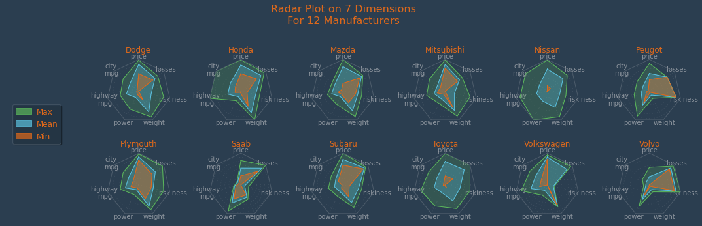
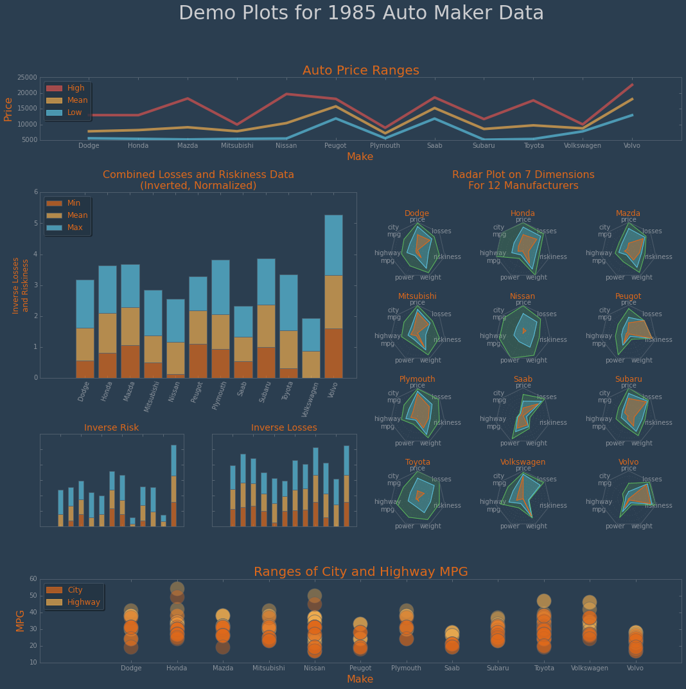

# Advanced Customization and Configuration

<!-- toc orderedList:0 depthFrom:1 depthTo:6 -->

- [Advanced Customization and Configuration](#advanced-customization-and-configuration)
	- [Customization](#customization)
		- [Creating a custom style](#creating-a-custom-style)
		- [Subplots](#subplots)
			- [Making a Plan](#making-a-plan)
			- [Revisiting Pandas](#revisiting-pandas)
			- [Individual Plots](#individual-plots)
			- [Combined Plots](#combined-plots)
	- [Configuration](#configuration)

<!-- tocstop -->


Warm-up proceedures:


```python
import matplotlib
matplotlib.use('nbagg')
%matplotlib inline

import matplotlib as mpl
import matplotlib.pyplot as plt
import numpy as np
import pandas as pd
from IPython.display import Image
```

Note that we're not using Seaborn for styling like we did previously -- that's beccause the first thing we're going to tackle is creating a custom matplotlib style :-)

## Customization

### Creating a custom style

In the previous notebook, we saw that we could list the available styles with the following call:


```python
print(plt.style.available)
```

    ['fivethirtyeight', 'ggplot', 'bmh', 'dark_background', 'grayscale']


You can create custom styles and use them by calling ``style.use`` with the path or URL to the style sheet. Alternatively, if you save your ``<style-name>.mplstyle`` file to the ``~/.matplotlib/stylelib`` directory (you may need to create it), you can reuse your custom style sheet with a call to ``style.use(<style-name>)``. Note that a custom style sheet in ``~/.matplotlib/stylelib`` will override a style sheet defined by matplotlib if the styles have the same name.

We've created a style sheet for you to use in this repository for this notebook, but before we go further, let's create a function that will generate a demo plot for us. Then we'll render it, using the default style -- thus having a baseline to compare our work to:


```python
def make_plot ():
    x = np.random.randn(5000, 6)
    (figure, axes) = plt.subplots(figsize=(16,10))
    (n, bins, patches) = axes.hist(x, 12, normed=1, histtype='bar',
                                   label=['Color 1', 'Color 2', 'Color 3',
                                          'Color 4', 'Color 5', 'Color 6'])
    axes.set_title("Histogram\nfor a\nNormal Distribution", fontsize=24)
    axes.set_xlabel("Data Points", fontsize=16)
    axes.set_ylabel("Counts", fontsize=16)
    axes.legend()
    plt.show()
```


```python
make_plot()
```


Okay, we've got our sample plot. Now let's look at the style.

We've created a style called "Superheroine", based on [Thomas Park](http://thomaspark.me/)'s excellent Bootstrap theme, [Superhero](http://bootswatch.com/superhero/). Here's a screenshot of the Boostrap theme:


```python
Image(filename="superhero.png")
```


We've saved captured some of the colors from this screenshot and saved them in a couple of plot style files to the "styles" directory in this notebook repo:


```python
ls -l ../styles/
```

    total 16

    -rw-r--r--  1 oubiwann  staff  473 Feb  4 14:54 superheroine-1.mplstyle

    -rw-r--r--  1 oubiwann  staff  473 Feb  4 14:53 superheroine-2.mplstyle



Basically, we couldn't make up our mind about whether we liked the light text (style 1) or the orange text (style 2). So we kept both :-)

Let's take a look at the second one's contents which show the hexadecimal colors we copied from the Boostrap theme:


```python
cat ../styles/superheroine-2.mplstyle
```

    lines.color: 4e5d6c

    patch.edgecolor: 4e5d6c


    text.color: df691b


    axes.facecolor: 2b3e50

    axes.edgecolor: 4e5d6c

    axes.labelcolor: df691b

    axes.color_cycle: df691b, 5cb85c, 5bc0de, f0ad4e, d9534f, 4e5d6c

    axes.axisbelow: True


    xtick.color: 8c949d

    ytick.color: 8c949d


    grid.color: 4e5d6c


    figure.facecolor: 2b3e50

    figure.edgecolor: 2b3e50


    savefig.facecolor: 2b3e50

    savefig.edgecolor: 2b3e50


    legend.fancybox: True

    legend.shadow: True

    legend.frameon: True

    legend.framealpha: 0.6



Now let's load it:


```python
plt.style.use("../styles/superheroine-2.mplstyle")
```

And then re-render our plot:


```python
make_plot()
```


A full list of styles available for customization is in given in the [matplotlib run control file](http://matplotlib.org/users/customizing.html). We'll be discussing this more in the next section.

### Subplots

#### Making a Plan

In this next section, we'll be creating a sophisticated subplot to give you a sense of what's possible with matplotlib's layouts. We'll be ingesting data from the [UCI Machine Learning Repository](http://archive.ics.uci.edu/ml/index.html), in particular the 1985 [Automobile Data Set](https://archive.ics.uci.edu/ml/datasets/Automobile), an example of data which can be used to assess the insurance risks for different vehicles.

We will use it in an effort to compare 21 automobile manufacturers (using 1985 data) along the following dimensions:
* mean price
* mean city MPG
* mean highway MPG
* mean horsepower
* mean curb-weight
* mean relative average loss payment
* mean insurance riskiness

We will limit ourselves to automobile manufacturers that have data for losses as well as 6 or more data rows.

Our subplot will be comprised of the following sections:
 * An overall title
 * Line plots for max, mean, and min prices
 * Stacked bar chart for combined riskiness/losses
 * Stacked bar chart for riskiness
 * Stacked bar chart for losses
 * Radar charts for each automobile manufacturer
 * Combined scatter plot for city and highway MPG

These will be composed as subplots in the following manner:

```
--------------------------------------------
|               overall title              |
--------------------------------------------
|               price ranges               |
--------------------------------------------
| combined loss/risk |                     |
|                    |        radar        |
----------------------        plots        |
|  risk   |   loss   |                     |
--------------------------------------------
|                   mpg                    |
--------------------------------------------
```

#### Revisiting Pandas


```python
import sys
sys.path.append("../lib")
import demodata, demoplot, radar

raw_data = demodata.get_raw_data()
raw_data.head()
```


<div style="max-height:1000px;max-width:1500px;overflow:auto;">
<table border="1" class="dataframe">
  <thead>
    <tr style="text-align: right;">
      <th></th>
      <th>riskiness</th>
      <th>losses</th>
      <th>make</th>
      <th>fuel type</th>
      <th>aspiration</th>
      <th>doors</th>
      <th>body</th>
      <th>drive</th>
      <th>engine location</th>
      <th>wheel base</th>
      <th>...</th>
      <th>engine size</th>
      <th>fuel system</th>
      <th>bore</th>
      <th>stroke</th>
      <th>compression ratio</th>
      <th>horsepower</th>
      <th>peak rpm</th>
      <th>city mpg</th>
      <th>highway mpg</th>
      <th>price</th>
    </tr>
  </thead>
  <tbody>
    <tr>
      <th>0</th>
      <td> 2</td>
      <td> 164</td>
      <td> audi</td>
      <td> gas</td>
      <td>   std</td>
      <td> four</td>
      <td> sedan</td>
      <td> fwd</td>
      <td> front</td>
      <td>  99.8</td>
      <td>...</td>
      <td> 109</td>
      <td> mpfi</td>
      <td> 3.19</td>
      <td> 3.4</td>
      <td> 10.0</td>
      <td> 102</td>
      <td> 5500</td>
      <td> 24</td>
      <td> 30</td>
      <td> 13950</td>
    </tr>
    <tr>
      <th>1</th>
      <td> 2</td>
      <td> 164</td>
      <td> audi</td>
      <td> gas</td>
      <td>   std</td>
      <td> four</td>
      <td> sedan</td>
      <td> 4wd</td>
      <td> front</td>
      <td>  99.4</td>
      <td>...</td>
      <td> 136</td>
      <td> mpfi</td>
      <td> 3.19</td>
      <td> 3.4</td>
      <td>  8.0</td>
      <td> 115</td>
      <td> 5500</td>
      <td> 18</td>
      <td> 22</td>
      <td> 17450</td>
    </tr>
    <tr>
      <th>2</th>
      <td> 1</td>
      <td> 158</td>
      <td> audi</td>
      <td> gas</td>
      <td>   std</td>
      <td> four</td>
      <td> sedan</td>
      <td> fwd</td>
      <td> front</td>
      <td> 105.8</td>
      <td>...</td>
      <td> 136</td>
      <td> mpfi</td>
      <td> 3.19</td>
      <td> 3.4</td>
      <td>  8.5</td>
      <td> 110</td>
      <td> 5500</td>
      <td> 19</td>
      <td> 25</td>
      <td> 17710</td>
    </tr>
    <tr>
      <th>3</th>
      <td> 1</td>
      <td> 158</td>
      <td> audi</td>
      <td> gas</td>
      <td> turbo</td>
      <td> four</td>
      <td> sedan</td>
      <td> fwd</td>
      <td> front</td>
      <td> 105.8</td>
      <td>...</td>
      <td> 131</td>
      <td> mpfi</td>
      <td> 3.13</td>
      <td> 3.4</td>
      <td>  8.3</td>
      <td> 140</td>
      <td> 5500</td>
      <td> 17</td>
      <td> 20</td>
      <td> 23875</td>
    </tr>
    <tr>
      <th>4</th>
      <td> 2</td>
      <td> 192</td>
      <td>  bmw</td>
      <td> gas</td>
      <td>   std</td>
      <td>  two</td>
      <td> sedan</td>
      <td> rwd</td>
      <td> front</td>
      <td> 101.2</td>
      <td>...</td>
      <td> 108</td>
      <td> mpfi</td>
      <td> 3.50</td>
      <td> 2.8</td>
      <td>  8.8</td>
      <td> 101</td>
      <td> 5800</td>
      <td> 23</td>
      <td> 29</td>
      <td> 16430</td>
    </tr>
  </tbody>
</table>
<p>5 rows × 26 columns</p>
</div>


```python
limited_data = demodata.get_limited_data()
limited_data.head()
```


<div style="max-height:1000px;max-width:1500px;overflow:auto;">
<table border="1" class="dataframe">
  <thead>
    <tr style="text-align: right;">
      <th></th>
      <th>make</th>
      <th>price</th>
      <th>city mpg</th>
      <th>highway mpg</th>
      <th>horsepower</th>
      <th>weight</th>
      <th>riskiness</th>
      <th>losses</th>
    </tr>
  </thead>
  <tbody>
    <tr>
      <th>0</th>
      <td> audi</td>
      <td> 13950</td>
      <td> 24</td>
      <td> 30</td>
      <td> 102</td>
      <td> 2337</td>
      <td> 2</td>
      <td> 164</td>
    </tr>
    <tr>
      <th>1</th>
      <td> audi</td>
      <td> 17450</td>
      <td> 18</td>
      <td> 22</td>
      <td> 115</td>
      <td> 2824</td>
      <td> 2</td>
      <td> 164</td>
    </tr>
    <tr>
      <th>2</th>
      <td> audi</td>
      <td> 17710</td>
      <td> 19</td>
      <td> 25</td>
      <td> 110</td>
      <td> 2844</td>
      <td> 1</td>
      <td> 158</td>
    </tr>
    <tr>
      <th>3</th>
      <td> audi</td>
      <td> 23875</td>
      <td> 17</td>
      <td> 20</td>
      <td> 140</td>
      <td> 3086</td>
      <td> 1</td>
      <td> 158</td>
    </tr>
    <tr>
      <th>4</th>
      <td>  bmw</td>
      <td> 16430</td>
      <td> 23</td>
      <td> 29</td>
      <td> 101</td>
      <td> 2395</td>
      <td> 2</td>
      <td> 192</td>
    </tr>
  </tbody>
</table>
</div>


```python
demodata.get_all_auto_makes()
```


    array(['audi', 'bmw', 'chevrolet', 'dodge', 'honda', 'jaguar', 'mazda',
           'mercedes-benz', 'mitsubishi', 'nissan', 'peugot', 'plymouth',
           'porsche', 'saab', 'subaru', 'toyota', 'volkswagen', 'volvo'], dtype=object)


```python
(makes, counts) = demodata.get_make_counts(limited_data)
counts
```


    [('audi', 4),
     ('bmw', 4),
     ('chevrolet', 3),
     ('dodge', 8),
     ('honda', 13),
     ('jaguar', 1),
     ('mazda', 11),
     ('mercedes-benz', 5),
     ('mitsubishi', 10),
     ('nissan', 18),
     ('peugot', 7),
     ('plymouth', 6),
     ('porsche', 1),
     ('saab', 6),
     ('subaru', 12),
     ('toyota', 31),
     ('volkswagen', 8),
     ('volvo', 11)]


```python
(makes, counts) = demodata.get_make_counts(limited_data, lower_bound=6)
```


```python
counts
```


    [('dodge', 8),
     ('honda', 13),
     ('mazda', 11),
     ('mitsubishi', 10),
     ('nissan', 18),
     ('peugot', 7),
     ('plymouth', 6),
     ('saab', 6),
     ('subaru', 12),
     ('toyota', 31),
     ('volkswagen', 8),
     ('volvo', 11)]


```python
data = demodata.get_limited_data(lower_bound=6)
data.head()
```


<div style="max-height:1000px;max-width:1500px;overflow:auto;">
<table border="1" class="dataframe">
  <thead>
    <tr style="text-align: right;">
      <th></th>
      <th>make</th>
      <th>price</th>
      <th>city mpg</th>
      <th>highway mpg</th>
      <th>horsepower</th>
      <th>weight</th>
      <th>riskiness</th>
      <th>losses</th>
    </tr>
  </thead>
  <tbody>
    <tr>
      <th>11</th>
      <td> dodge</td>
      <td> 5572</td>
      <td> 37</td>
      <td> 41</td>
      <td>  68</td>
      <td> 1876</td>
      <td> 1</td>
      <td> 118</td>
    </tr>
    <tr>
      <th>12</th>
      <td> dodge</td>
      <td> 6377</td>
      <td> 31</td>
      <td> 38</td>
      <td>  68</td>
      <td> 1876</td>
      <td> 1</td>
      <td> 118</td>
    </tr>
    <tr>
      <th>13</th>
      <td> dodge</td>
      <td> 7957</td>
      <td> 24</td>
      <td> 30</td>
      <td> 102</td>
      <td> 2128</td>
      <td> 1</td>
      <td> 118</td>
    </tr>
    <tr>
      <th>14</th>
      <td> dodge</td>
      <td> 6229</td>
      <td> 31</td>
      <td> 38</td>
      <td>  68</td>
      <td> 1967</td>
      <td> 1</td>
      <td> 148</td>
    </tr>
    <tr>
      <th>15</th>
      <td> dodge</td>
      <td> 6692</td>
      <td> 31</td>
      <td> 38</td>
      <td>  68</td>
      <td> 1989</td>
      <td> 1</td>
      <td> 148</td>
    </tr>
  </tbody>
</table>
</div>


```python
len(data.index)
```


    141


```python
sum([x[1] for x in counts])
```


    141


```python
normed_data = data.copy()
normed_data.rename(columns={"horsepower": "power"}, inplace=True)
```

Higher values are better for these:


```python
demodata.norm_columns(["city mpg", "highway mpg", "power"], normed_data)
normed_data.head()
```


<div style="max-height:1000px;max-width:1500px;overflow:auto;">
<table border="1" class="dataframe">
  <thead>
    <tr style="text-align: right;">
      <th></th>
      <th>make</th>
      <th>price</th>
      <th>city mpg</th>
      <th>highway mpg</th>
      <th>power</th>
      <th>weight</th>
      <th>riskiness</th>
      <th>losses</th>
    </tr>
  </thead>
  <tbody>
    <tr>
      <th>11</th>
      <td> dodge</td>
      <td> 5572</td>
      <td> 0.62500</td>
      <td> 0.59375</td>
      <td> 0.108108</td>
      <td> 1876</td>
      <td> 1</td>
      <td> 118</td>
    </tr>
    <tr>
      <th>12</th>
      <td> dodge</td>
      <td> 6377</td>
      <td> 0.43750</td>
      <td> 0.50000</td>
      <td> 0.108108</td>
      <td> 1876</td>
      <td> 1</td>
      <td> 118</td>
    </tr>
    <tr>
      <th>13</th>
      <td> dodge</td>
      <td> 7957</td>
      <td> 0.21875</td>
      <td> 0.25000</td>
      <td> 0.337838</td>
      <td> 2128</td>
      <td> 1</td>
      <td> 118</td>
    </tr>
    <tr>
      <th>14</th>
      <td> dodge</td>
      <td> 6229</td>
      <td> 0.43750</td>
      <td> 0.50000</td>
      <td> 0.108108</td>
      <td> 1967</td>
      <td> 1</td>
      <td> 148</td>
    </tr>
    <tr>
      <th>15</th>
      <td> dodge</td>
      <td> 6692</td>
      <td> 0.43750</td>
      <td> 0.50000</td>
      <td> 0.108108</td>
      <td> 1989</td>
      <td> 1</td>
      <td> 148</td>
    </tr>
  </tbody>
</table>
</div>


Lower values are better for these:


```python
demodata.invert_norm_columns(["price", "weight", "riskiness", "losses"], normed_data)
normed_data.head()
```


<div style="max-height:1000px;max-width:1500px;overflow:auto;">
<table border="1" class="dataframe">
  <thead>
    <tr style="text-align: right;">
      <th></th>
      <th>make</th>
      <th>price</th>
      <th>city mpg</th>
      <th>highway mpg</th>
      <th>power</th>
      <th>weight</th>
      <th>riskiness</th>
      <th>losses</th>
    </tr>
  </thead>
  <tbody>
    <tr>
      <th>11</th>
      <td> dodge</td>
      <td> 0.974068</td>
      <td> 0.62500</td>
      <td> 0.59375</td>
      <td> 0.108108</td>
      <td> 0.897031</td>
      <td> 0.4</td>
      <td> 0.722513</td>
    </tr>
    <tr>
      <th>12</th>
      <td> dodge</td>
      <td> 0.928086</td>
      <td> 0.43750</td>
      <td> 0.50000</td>
      <td> 0.108108</td>
      <td> 0.897031</td>
      <td> 0.4</td>
      <td> 0.722513</td>
    </tr>
    <tr>
      <th>13</th>
      <td> dodge</td>
      <td> 0.837836</td>
      <td> 0.21875</td>
      <td> 0.25000</td>
      <td> 0.337838</td>
      <td> 0.737840</td>
      <td> 0.4</td>
      <td> 0.722513</td>
    </tr>
    <tr>
      <th>14</th>
      <td> dodge</td>
      <td> 0.936540</td>
      <td> 0.43750</td>
      <td> 0.50000</td>
      <td> 0.108108</td>
      <td> 0.839545</td>
      <td> 0.4</td>
      <td> 0.565445</td>
    </tr>
    <tr>
      <th>15</th>
      <td> dodge</td>
      <td> 0.910093</td>
      <td> 0.43750</td>
      <td> 0.50000</td>
      <td> 0.108108</td>
      <td> 0.825648</td>
      <td> 0.4</td>
      <td> 0.565445</td>
    </tr>
  </tbody>
</table>
</div>


#### Individual Plots


```python
figure = plt.figure(figsize=(15, 5))
prices_gs = mpl.gridspec.GridSpec(1, 1)
prices_axes = demoplot.make_autos_price_plot(figure, prices_gs, data)
plt.show()
```


```python
figure = plt.figure(figsize=(15, 5))
mpg_gs = mpl.gridspec.GridSpec(1, 1)
mpg_axes = demoplot.make_autos_mpg_plot(figure, mpg_gs, data)
plt.show()
```


```python
figure = plt.figure(figsize=(15, 5))
risk_gs = mpl.gridspec.GridSpec(1, 1)
risk_axes = demoplot.make_autos_riskiness_plot(figure, risk_gs, normed_data)
plt.show()
```


```python
figure = plt.figure(figsize=(15, 5))
loss_gs = mpl.gridspec.GridSpec(1, 1)
loss_axes = demoplot.make_autos_losses_plot(figure, loss_gs, normed_data)
plt.show()
```


```python
figure = plt.figure(figsize=(15, 5))
risk_loss_gs = mpl.gridspec.GridSpec(1, 1)
risk_loss_axes = demoplot.make_autos_loss_and_risk_plot(figure, risk_loss_gs, normed_data)
plt.show()
```


```python
figure = plt.figure(figsize=(15, 5))
radar_gs = mpl.gridspec.GridSpec(3, 7, height_ratios=[1, 10, 10], wspace=0.50, hspace=0.60, top=0.95, bottom=0.25)
radar_axes = demoplot.make_autos_radar_plot(figure, radar_gs, normed_data)
plt.show()
```





#### Combined Plots

Here's a refresher on the plot layout we're aiming for:

```
--------------------------------------------
|               overall title              |
--------------------------------------------
|               price ranges               |
--------------------------------------------
| combined loss/risk |                     |
|                    |        radar        |
----------------------        plots        |
|  risk   |   loss   |                     |
--------------------------------------------
|                   mpg                    |
--------------------------------------------
```

Let's try that now with just empty graphs, to get a sense of things:


```python
figure = plt.figure(figsize=(10, 8))
gs_master = mpl.gridspec.GridSpec(4, 2, height_ratios=[1, 2, 8, 2])
# Layer 1 - Title
gs_1 = mpl.gridspec.GridSpecFromSubplotSpec(1, 1, subplot_spec=gs_master[0, :])
title_axes = figure.add_subplot(gs_1[0])
# Layer 2 - Price
gs_2 = mpl.gridspec.GridSpecFromSubplotSpec(1, 1, subplot_spec=gs_master[1, :])
price_axes = figure.add_subplot(gs_2[0])
# Layer 3 - Risks & Radar
gs_31 = mpl.gridspec.GridSpecFromSubplotSpec(2, 2, height_ratios=[2, 1], subplot_spec=gs_master[2, :1])
risk_and_loss_axes = figure.add_subplot(gs_31[0, :])
risk_axes = figure.add_subplot(gs_31[1, :1])
loss_axes = figure.add_subplot(gs_31[1:, 1])
gs_32 = mpl.gridspec.GridSpecFromSubplotSpec(1, 1, subplot_spec=gs_master[2, 1])
radar_axes = figure.add_subplot(gs_32[0])
# Layer 4 - MPG
gs_4 = mpl.gridspec.GridSpecFromSubplotSpec(1, 1, subplot_spec=gs_master[3, :])
mpg_axes = figure.add_subplot(gs_4[0])
# Tidy up
gs_master.tight_layout(figure)
plt.show()
```


```python
figure = plt.figure(figsize=(15, 15))
gs_master = mpl.gridspec.GridSpec(4, 2, height_ratios=[1, 24, 128, 32], hspace=0, wspace=0)

# Layer 1 - Title
gs_1 = mpl.gridspec.GridSpecFromSubplotSpec(1, 1, subplot_spec=gs_master[0, :])
title_axes = figure.add_subplot(gs_1[0])
title_axes.set_title("Demo Plots for 1985 Auto Maker Data", fontsize=30, color="#cdced1")
demoplot.hide_axes(title_axes)

# Layer 2 - Price
gs_2 = mpl.gridspec.GridSpecFromSubplotSpec(1, 1, subplot_spec=gs_master[1, :])
price_axes = figure.add_subplot(gs_2[0])
demoplot.make_autos_price_plot(figure, pddata=data, axes=price_axes)

# Layer 3, Part I - Risks
gs_31 = mpl.gridspec.GridSpecFromSubplotSpec(2, 2, height_ratios=[2, 1], hspace=0.4, subplot_spec=gs_master[2, :1])
risk_and_loss_axes = figure.add_subplot(gs_31[0, :])
demoplot.make_autos_loss_and_risk_plot(
    figure, pddata=normed_data, axes=risk_and_loss_axes, x_label=False, rotate_ticks=True)
risk_axes = figure.add_subplot(gs_31[1, :1])
demoplot.make_autos_riskiness_plot(figure, pddata=normed_data, axes=risk_axes, legend=False, labels=False)
loss_axes = figure.add_subplot(gs_31[1:, 1])
demoplot.make_autos_losses_plot(figure, pddata=normed_data, axes=loss_axes, legend=False, labels=False)

# Layer 3, Part II - Radar
gs_32 = mpl.gridspec.GridSpecFromSubplotSpec(
    5, 3, height_ratios=[1, 20, 20, 20, 20], hspace=0.6, wspace=0, subplot_spec=gs_master[2, 1])
(rows, cols) = geometry = gs_32.get_geometry()
title_axes = figure.add_subplot(gs_32[0, :])
inner_axes = []
projection = radar.RadarAxes(spoke_count=len(normed_data.groupby("make").mean().columns))
[inner_axes.append(figure.add_subplot(m, projection=projection)) for m in [n for n in gs_32][cols:]]
demoplot.make_autos_radar_plot(
    figure, pddata=normed_data, title_axes=title_axes, inner_axes=inner_axes, legend_axes=False,
    geometry=geometry)

# Layer 4 - MPG
gs_4 = mpl.gridspec.GridSpecFromSubplotSpec(1, 1, subplot_spec=gs_master[3, :])
mpg_axes = figure.add_subplot(gs_4[0])
demoplot.make_autos_mpg_plot(figure, pddata=data, axes=mpg_axes)

# Tidy up
gs_master.tight_layout(figure)
plt.show()
```





## Configuration

Get the directory for the matplotlib config files and cache:


```python
mpl.get_configdir()
```


    '/Users/oubiwann/.matplotlib'


```python
mpl.matplotlib_fname()
```


    '/Users/oubiwann/Dropbox/lab/python/mastering-matplotlib/.venv-mmpl/lib/python3.4/site-packages/matplotlib/mpl-data/matplotlibrc'


matplotlib's ``rcParams`` configuration dictionary holds a great many options for tweaking your use of matplotlib the way you want to:


```python
len(mpl.rcParams.keys())
```


    200


The first 10 configuration options in ``rcParams`` are:


```python
dict(list(mpl.rcParams.items())[:10])
```


    {'axes.grid': False,
     'mathtext.fontset': 'cm',
     'mathtext.cal': 'cursive',
     'docstring.hardcopy': False,
     'animation.writer': 'ffmpeg',
     'animation.mencoder_path': 'mencoder',
     'backend.qt5': 'PyQt5',
     'keymap.fullscreen': ['f', 'ctrl+f'],
     'image.resample': False,
     'animation.ffmpeg_path': 'ffmpeg'}


```python
mpl.rcParams['savefig.jpeg_quality'] = 72
mpl.rcParams['axes.formatter.limits'] = [-5, 5]
```


```python
mpl.rcParams['axes.formatter.limits']
```


    [-5, 5]


```python
mpl.rcdefaults()
```


```python
mpl.rcParams['axes.formatter.limits']
```


    [-7, 7]
