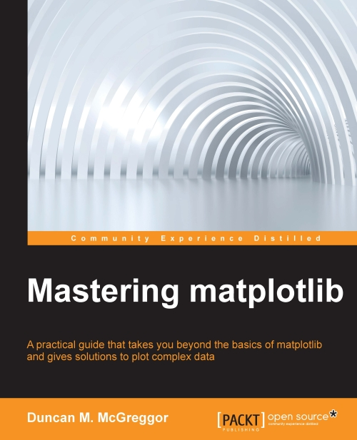

# Mastering matplotlib

  
* **Publisher** https://www.packtpub.com/big-data-and-business-intelligence/mastering-matplotlib  

## TOC
* [Ch01 Getting Up to Speed](Ch01_Getting_Up_to_Speed.md)  
* [Ch02 The matplotlib Architecture](Ch02_The_matplotlib_Architecture.md)  
* [Ch03 matplotlib APIs and Integrations](Ch03_matplotlib_APIs_and_Integrations.md)  
* [Ch04 Event Handling and Interactive Plots](Ch04_Event_Handling_and_Interactive_Plots.md)  
* [Ch05 High-level Plotting and Data Analysis](Ch05_High_level_Plotting_and_Data_Analysis.md)  
* [Ch06 Customization and Configuration](Ch06_Customization_and_Configuration.md)  
* [Ch07 Deploying matplotlib in Cloud Environments](Ch07_Deploying_matplotlib_in_Cloud_Environments.md)  
* [Ch08 matplotlib and Big Data](Ch08_matplotlib_and_Big_Data.md)  
* [Ch09 Clustering for matplotlib](Ch09_Clustering_for_matplotlib.md)  
* [disco](mmpl-disco.md)  
* [factoring](sympy-factoring-bfield.md)  