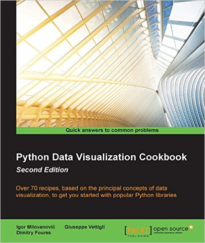

# Python Data Visualization Cookbook 2ed

## TOC
* [Ch01 Preparing Your Working Environment]()
* [Ch02 Knowing Your Data]()
* [Ch03 Drawing Your First Plots and Customizing Them]()
* [Ch04 More Plots and Customizations]()
* [Ch05 Making 3D Visualizations]()
* [Ch06 Plotting Charts with Images and Maps]()
* [Ch07 Using the Right Plots to Understand Data]()
* [Ch08 More on matplotlib Gems]()
* [Ch09 Visualizations in the Clouds with Plot.ly]()