# Chapter 1: First Steps

<!-- toc orderedList:0 depthFrom:1 depthTo:6 -->

* [Chapter 1: First Steps](#chapter-1-first-steps)
  * [Introduction](#introduction)
  * [Installing matplotlib](#installing-matplotlib)
  * [Plotting one curve](#plotting-one-curve)
  * [Using NumPy](#using-numpy)
  * [Plotting multiple curves](#plotting-multiple-curves)
  * [Plotting curves from file data](#plotting-curves-from-file-data)
  * [Plotting points](#plotting-points)
  * [Plotting bar charts](#plotting-bar-charts)
  * [Plotting multiple bar charts](#plotting-multiple-bar-charts)
  * [Plotting stacked bar charts](#plotting-stacked-bar-charts)
  * [Plotting back-to-back bar charts](#plotting-back-to-back-bar-charts)
  * [Plotting pie charts](#plotting-pie-charts)
  * [Plotting histograms](#plotting-histograms)
  * [Plotting boxplots](#plotting-boxplots)
  * [Plotting triangulations](#plotting-triangulations)

<!-- tocstop -->


## Introduction  
## Installing matplotlib  
## Plotting one curve  


```python
import matplotlib.pyplot as plt

X = range(100)
Y = [value ** 2 for value in X]

plt.plot(X, Y)
plt.show()
```


## Using NumPy  


```python
import math
import matplotlib.pyplot as plt

T = range(100)
X = [(2 * math.pi * t) / len(T) for t in T]
Y = [math.sin(value) for value in X]

plt.plot(X, Y)
plt.show()
```


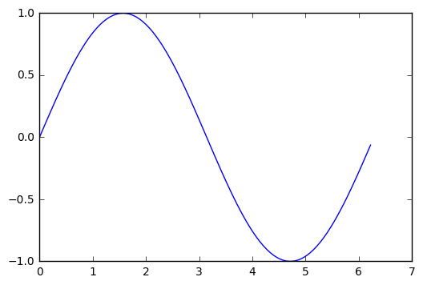


```python
# %load Chapter1/02.py
import numpy
import matplotlib.pyplot as plot

X = numpy.linspace(0, 2 * numpy.pi, 100)
Y = numpy.sin(X)

plot.plot(X, Y)
plot.show()

```


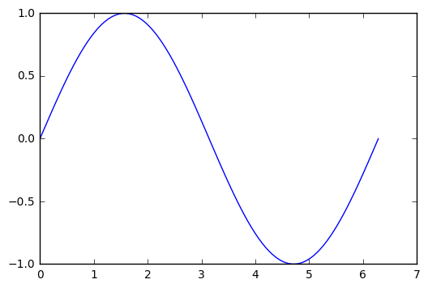


```python
# %load Chapter1/03.py
import numpy
import matplotlib.pyplot as plot

X = numpy.linspace(-3, 2, 200)
Y = X ** 2 - 2 * X + 1.

plot.plot(X, Y)
plot.show()

```


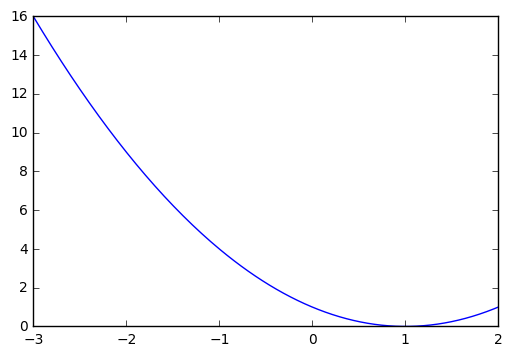


## Plotting multiple curves  


```python
# %load Chapter1/04.py
import numpy
import matplotlib.pyplot as plot

X = numpy.linspace(0, 2 * numpy.pi, 100)
Ya = numpy.sin(X)
Yb = numpy.cos(X)

plot.plot(X, Ya)
plot.plot(X, Yb)
plot.show()

```


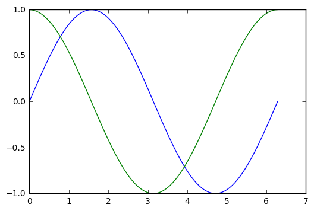


```python
# %load Chapter1/05.py
import numpy
import matplotlib.pyplot as plot

def plot_slope(X, Y):
	Xs = X[1:] - X[:-1]
	Ys = Y[1:] - Y[:-1]
	plot.plot(X[1:], Ys / Xs)

X = numpy.linspace(-3, 3, 100)
Y = numpy.exp(-X ** 2)

plot.plot(X, Y)
plot_slope(X, Y)
plot.show()

```


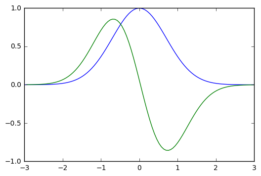


## Plotting curves from file data  


```python
import matplotlib.pyplot as plt
X, Y = [], []

for line in open('Chapter1/sample.txt', 'r'):
    values = [float(s) for s in line.split()]
    X.append(values[0])
    Y.append(values[1])

plt.plot(X, Y)
plt.show()
```


```python
# %load Chapter1/06.py
import matplotlib.pyplot as plot

X, Y, Z = zip(*[
        [float(s) for s in line.split()]
        for line in open('Chapter1/sample.txt', 'r')
    ])

plot.plot(X, Y)
plot.show()

```


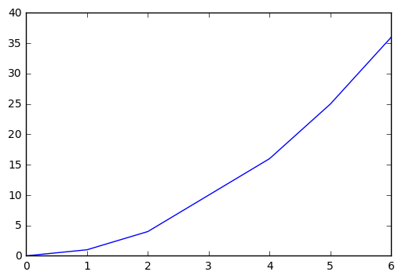


```python
# %load Chapter1/07.py
import numpy
import matplotlib.pyplot as plot

data = numpy.loadtxt('Chapter1/sample.txt')

plot.plot(data[:,0], data[:,1])
plot.show()

```


```python
# %load Chapter1/08.py
import numpy
import matplotlib.pyplot as plot

data = numpy.loadtxt('Chapter1/sample.txt')

for column in data.T:
	plot.plot(data[:,0], column)

plot.show()


```


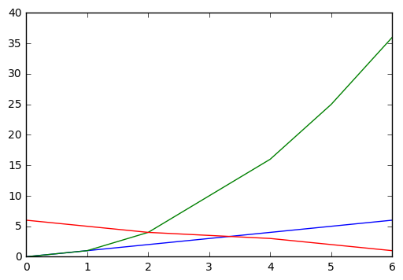


## Plotting points  


```python
# %load Chapter1/09.py
import random
import matplotlib.pyplot as plot

count = 1024
X = [random.random() for i in range(count)]
Y = [random.random() for i in range(count)]

plot.scatter(X, Y)
plot.show()


```


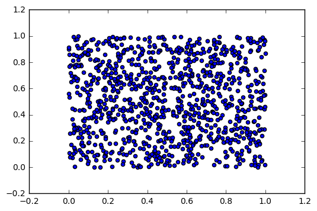


## Plotting bar charts  


```python
# %load Chapter1/10.py
import matplotlib.pyplot as plot

data = [5., 25., 50., 20.]

plot.bar(range(len(data)), data)
plot.show()

```


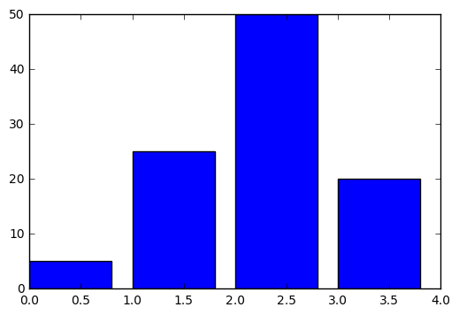


* **The thickness of a bar**


```python
# %load Chapter1/11.py
import matplotlib.pyplot as plot

data = [5., 25., 50., 20.]

plot.bar(range(len(data)), data, width = 1.)
plot.show()

```


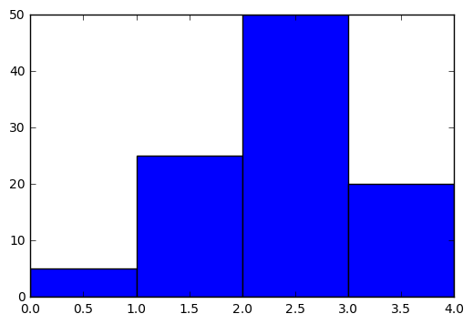


* **Horizontal bars**


```python
# %load Chapter1/12.py
import matplotlib.pyplot as plot

data = [5., 25., 50., 20.]

plot.barh(range(len(data)), data)
plot.show()

```


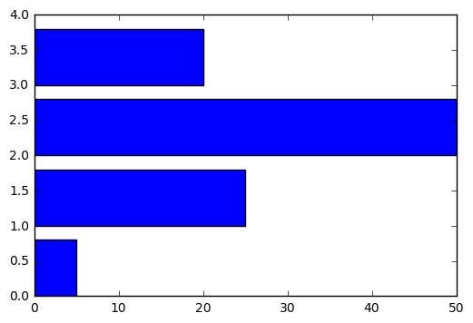


## Plotting multiple bar charts  


```python
# %load Chapter1/13.py
import matplotlib.pyplot as plot

data = [[5., 25., 50., 20.],
        [4., 23., 51., 17.],
        [6., 22., 52., 19.]]

plot.bar(range(4), data[0], width = 0.25)
plot.bar([x + 0.25 for x in range(4)], data[1], width = 0.25)
plot.bar([x + 0.50 for x in range(4)], data[2], width = 0.25)

plot.show()

```


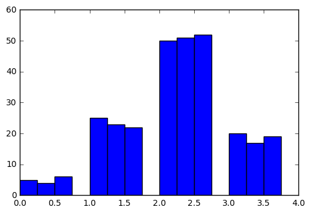


```python
# %load Chapter1/14.py
import matplotlib.pyplot as plot

data = [[5., 25., 50., 20.],
        [4., 23., 51., 17.],
        [6., 22., 52., 19.]]

gap = .8 / len(data)
for i, row in enumerate(data):
	plot.bar([x + i * gap for x in range(len(row))], row, width = gap)

plot.show()


```


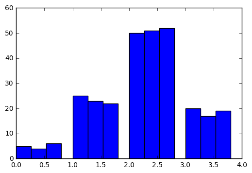


```python
# %load Chapter1/15.py
import matplotlib.pyplot as plot

data = [[5., 25., 50., 20.],
        [4., 23., 51., 17.],
        [6., 22., 52., 19.]]

color_list = ['b', 'g', 'r']

gap = .8 / len(data)

for i, row in enumerate(data):
	plot.bar([x + i * gap for x in range(len(row))],
             row,
             width = gap,
             color = color_list[i])

plot.show()

```


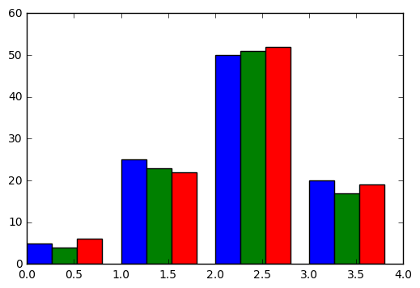


## Plotting stacked bar charts  


```python
import matplotlib.pyplot as plt

A = [5., 30., 45., 22.]
B = [5., 25., 50., 20.]
X = range(4)

plt.bar(X, A, color = 'b')
plt.bar(X, B, color = 'r', bottom = A)
plt.show()
```


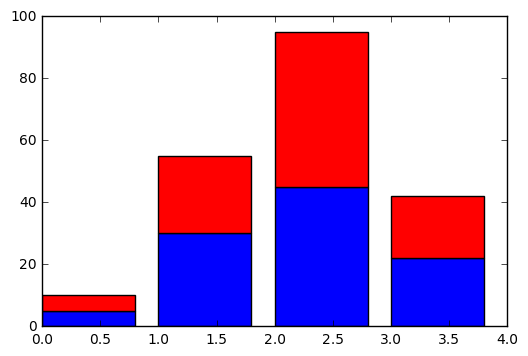


```python
import numpy as np
import matplotlib.pyplot as plt

A = np.array([5., 30., 45., 22.])
B = np.array([5., 25., 50., 20.])
C = np.array([1., 2., 1., 1.])

X = np.arange(4)

plt.bar(X, A, color = 'b')
plt.bar(X, B, color = 'g', bottom = A)
plt.bar(X, C, color = 'r', bottom = A + B)
plt.show()
```


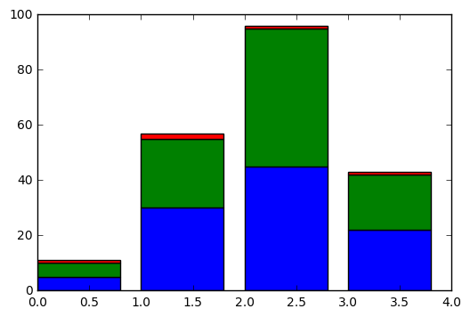


```python
import numpy as np
import matplotlib.pyplot as plt

data = np.array([[5., 30., 45., 22.],
                 [5., 25., 50., 20.],
                 [1., 2., 1., 1.]])

color_list = ['b', 'g', 'r']

X = np.arange(data.shape[1])

for i in range(data.shape[0]):
    plt.bar(X, data[i],
            bottom = np.sum(data[:i], axis = 0),
            color = color_list[i % len(color_list)])
plt.show()
```


## Plotting back-to-back bar charts  


```python
# %load Chapter1/16.py
import matplotlib.pyplot as plot

women_pop = [5., 30., 45., 22.]
men_pop   = [5., 25., 50., 20.]

X = range(4)
plot.barh(X, women_pop, color = 'r')
plot.barh(X, [-value for value in men_pop], color = 'b')
plot.show()

```


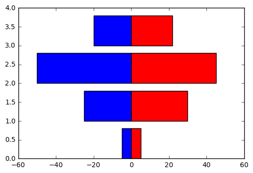


## Plotting pie charts  


```python
# %load Chapter1/20.py
import matplotlib.pyplot as plot

data = [5, 25, 50, 20]

plot.pie(data)
plot.show()

```


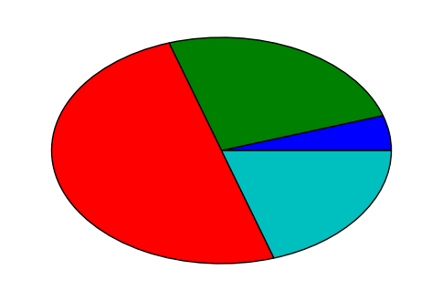


## Plotting histograms  


```python
import numpy as np
import matplotlib.pyplot as plt

X = np.random.randn(1000)

plt.hist(X, bins = 20)
plt.show()
```


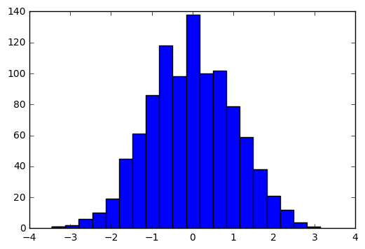


## Plotting boxplots  


```python
# %load Chapter1/21.py
import random
import matplotlib.pyplot as plot

data = [random.gauss(0., 1.) for i in range(100)]

plot.boxplot(data)

plot.show()

```


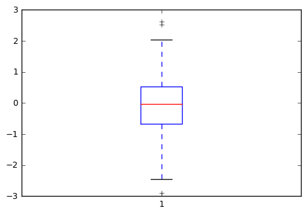


```python
# %load Chapter1/22.py
import numpy
import matplotlib.pyplot as plot

data = numpy.random.randn(100, 5)

plot.boxplot(data)
plot.show()

```


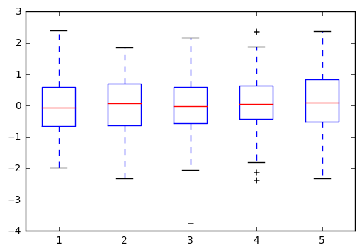


```python
# %load Chapter1/21.py
import random
import matplotlib.pyplot as plot

data = [random.gauss(0., 1.) for i in range(100)]

plot.boxplot(data)

plot.show()

```


```python
# %load Chapter1/22.py
import numpy
import matplotlib.pyplot as plot

data = numpy.random.randn(100, 5)

plot.boxplot(data)
plot.show()

```


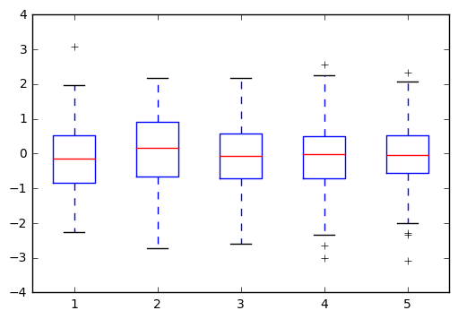


## Plotting triangulations  


```python
# %load Chapter1/23.py
import random
import matplotlib.pyplot as plot
import matplotlib.tri as tri


count = 100
X = [random.random() for i in range(count)]
Y = [random.random() for i in range(count)]

triangles = tri.Triangulation(X, Y)

plot.triplot(triangles, 'bo-')
plot.show()

```


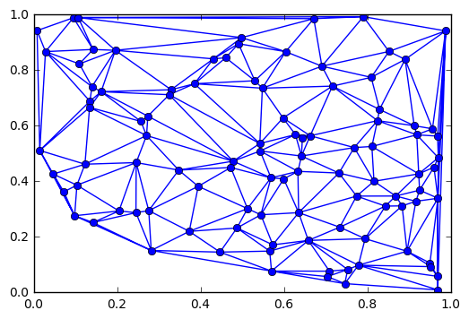
