# Chapter 2: Customizing the Color and Styles

<!-- toc orderedList:0 depthFrom:1 depthTo:6 -->

- [Chapter 2: Customizing the Color and Styles](#chapter-2-customizing-the-color-and-styles)
	- [Introduction](#introduction)
	- [Defining your own colors](#defining-your-own-colors)
	- [Using custom colors for scatter plots](#using-custom-colors-for-scatter-plots)
	- [Using custom colors for bar charts](#using-custom-colors-for-bar-charts)
	- [Using custom colors for pie charts](#using-custom-colors-for-pie-charts)
	- [Using custom colors for boxplots](#using-custom-colors-for-boxplots)
	- [Using colormaps for scatter plots](#using-colormaps-for-scatter-plots)
	- [Using colormaps for bar charts](#using-colormaps-for-bar-charts)
	- [Controlling line pattern and thickness](#controlling-line-pattern-and-thickness)
	- [Controlling a fill pattern](#controlling-a-fill-pattern)
	- [Controlling a marker's style](#controlling-a-markers-style)
	- [Controlling a marker's size](#controlling-a-markers-size)
	- [Creating your own markers](#creating-your-own-markers)
	- [Getting more control over markers](#getting-more-control-over-markers)
	- [Creating your own color scheme](#creating-your-own-color-scheme)

<!-- tocstop -->


## Introduction

## Defining your own colors


```python
# %load Chapter2/01.py
import numpy
import matplotlib.pyplot as plot


def pdf(X, mu, sigma):
	a = 1. / (sigma * numpy.sqrt(2. * numpy.pi))
	b = -1. / (2. * sigma ** 2)
	return a * numpy.exp(b * (X - mu) ** 2)

X = numpy.linspace(-6, 6, 1024)

for i in range(5):
	samples = numpy.random.standard_normal(50)
	mu, sigma = numpy.mean(samples), numpy.std(samples)
	plot.plot(X, pdf(X, mu, sigma), color = '.75')

plot.plot(X, pdf(X, 0., 1.), color = 'k')

plot.show()

```


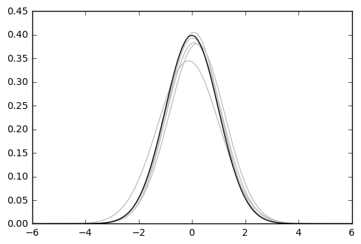


## Using custom colors for scatter plots


```python
# %load Chapter2/02.py
import numpy
import matplotlib.pyplot as plot

A = numpy.random.standard_normal((100, 2))
A += numpy.array((-1, -1))

B = numpy.random.standard_normal((100, 2))
B += numpy.array((1, 1))

plot.scatter(A[:,0], A[:,1], color = '.25')
plot.scatter(B[:,0], B[:,1], color = '.75')

plot.show()

```


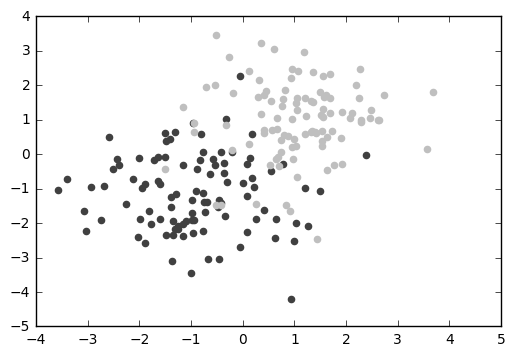


```python
# %load Chapter2/03.py
import numpy
import matplotlib.pyplot as plot

label_list = (
	b'Iris-setosa',
	b'Iris-versicolor',
	b'Iris-virginica',
)

def read_label(label):
	return label_list.index(label)

data = numpy.loadtxt('Chapter2/iris.data.txt',
                     delimiter = ',',
                     converters = { 4 : read_label })

color_set = ('.00', '.50', '.25')
color_list = [color_set[int(label)] for label in data[:,4]]

plot.scatter(data[:,0], data[:,1], color = color_list)
plot.show()


```


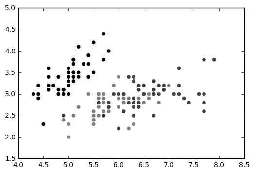


```python
# %load Chapter2/04.py
import numpy
import matplotlib.pyplot as plot

data = numpy.random.standard_normal((100, 2))

plot.scatter(data[:,0], data[:,1], color = '1.0', edgecolor='0.0')
plot.show()

```


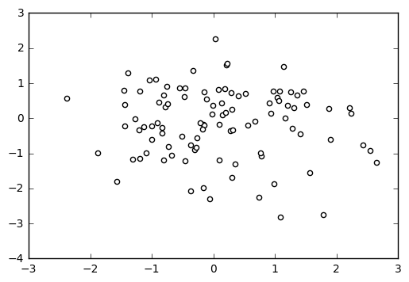


## Using custom colors for bar charts


```python
# %load Chapter2/05.py
import matplotlib.pyplot as plot

women_pop = [5., 30., 45., 22.]
men_pop   = [5., 25., 50., 20.]

X = range(4)
plot.barh(X, women_pop, color = '.25')
plot.barh(X, [-value for value in men_pop], color = '.75')
plot.show()

```


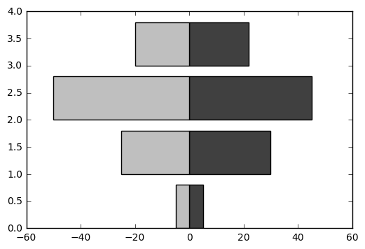


```python
# %load Chapter2/06.py
import random
import matplotlib.pyplot as plot

values = [random.randint(0, 99) for i in range(50)]

color_set = ['.00', '.25', '.50', '.75']
color_list = [color_set[(len(color_set) * val) // 100] for val in values]

plot.bar(range(len(values)), values, color = color_list)
plot.show()

```


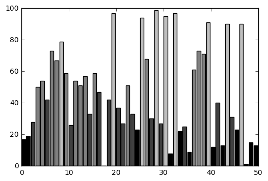


## Using custom colors for pie charts


```python
# %load Chapter2/07.py
import random
import matplotlib.pyplot as plot

values = [random.random() for i in range(8)]

color_set = ['.00', '.25', '.50', '.75']
plot.pie(values, colors = color_set)
plot.show()

```


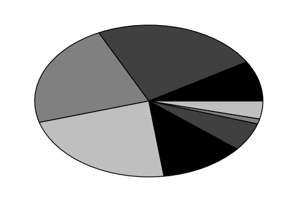


## Using custom colors for boxplots


```python
# %load Chapter2/08.py
import random
import matplotlib.pyplot as plot

values = [random.gauss(0., 1.) for i in range(100)]

b = plot.boxplot(values)
print(b.keys())

for name, line_list in b.items():
    for line in line_list:
        line.set_color('k')

plot.show()
```

    dict_keys(['boxes', 'whiskers', 'caps', 'means', 'medians', 'fliers'])


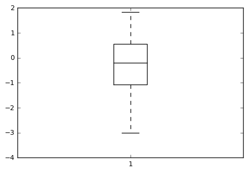


## Using colormaps for scatter plots


```python
# %load Chapter2/09.py
import numpy
import matplotlib.cm as cm
import matplotlib.pyplot as plot

N = 256
angle  = numpy.linspace(0, 8 * 2 * numpy.pi, N)
radius = numpy.linspace(.5, 1., N)

X = radius * numpy.cos(angle)
Y = radius * numpy.sin(angle)

#plot.scatter(X, Y, c = angle, cmap = cm.hsv)
plot.scatter(X, Y, c = angle, cmap = cm.PuOr)
plot.show()

```


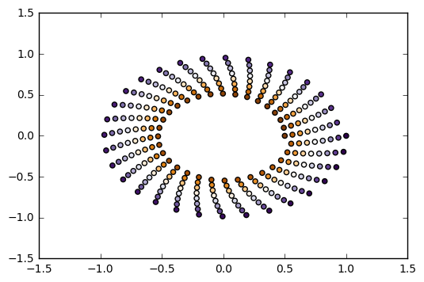


## Using colormaps for bar charts


```python
import numpy as np
import matplotlib.cm as cm
import matplotlib.colors as col
import matplotlib.pyplot as plt

values = np.random.random_integers(99, size = 50)
cmap = cm.ScalarMappable(col.Normalize(0, 99), cm.binary)

plt.bar(np.arange(len(values)), values, color = cmap.to_rgba(values))
plt.show()
```

    C:\Anaconda3\lib\site-packages\ipykernel\__main__.py:6: DeprecationWarning: This function is deprecated. Please call randint(1, 99 + 1) instead


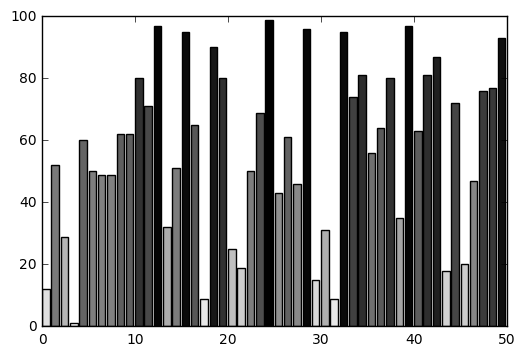


```python
# %load Chapter2/10.py
import random
import matplotlib.cm as cm
import matplotlib.colors as col
import matplotlib.pyplot as plot

values = [random.randint(0, 99) for i in range(50)]
values.sort()

cmap = cm.ScalarMappable(col.Normalize(0, 99), cm.binary)

plot.bar(range(len(values)), values, color = cmap.to_rgba(values))
plot.show()

```


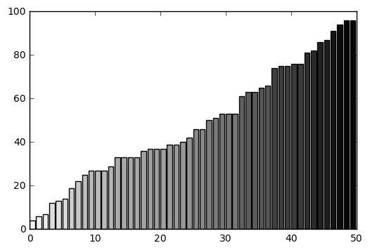


## Controlling line pattern and thickness


```python
# %load Chapter2/11.py
import numpy
import matplotlib.pyplot as plot


def pdf(X, mu, sigma):
	a = 1. / (sigma * numpy.sqrt(2. * numpy.pi))
	b = -1. / (2. * sigma ** 2)
	return a * numpy.exp(b * (X - mu) ** 2)

X = numpy.linspace(-6, 6, 1024)

plot.plot(X, pdf(X, 0., 1.),   color = 'k', linestyle = 'solid')
plot.plot(X, pdf(X, 0.,  .5),  color = 'k', linestyle = 'dashed')
plot.plot(X, pdf(X, 0.,  .25), color = 'k', linestyle = 'dashdot')

plot.show()

```


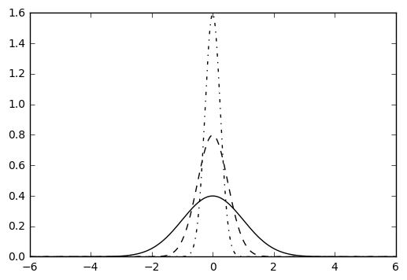


* **The line style with other plot types**


```python
# %load Chapter2/12.py
import numpy
import matplotlib.pyplot as plot

N = 8
A = numpy.random.random(N)
B = numpy.random.random(N)

plot.bar(range(N), A, color = '.75')
plot.bar(range(N), A + B, bottom = A, color = 'w', linestyle = 'dashed')

plot.show()

```


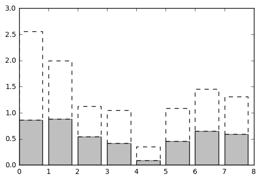


* **The line width**


```python
# %load Chapter2/13.py
import numpy
import matplotlib.pyplot as plot


def pdf(X, mu, sigma):
	a = 1. / (sigma * numpy.sqrt(2. * numpy.pi))
	b = -1. / (2. * sigma ** 2)
	return a * numpy.exp(b * (X - mu) ** 2)

X = numpy.linspace(-6, 6, 1024)

for i in range(64):
	samples = numpy.random.standard_normal(50)
	mu, sigma = numpy.mean(samples), numpy.std(samples)
	plot.plot(X, pdf(X, mu, sigma), color = '.75', linewidth = .5)

plot.plot(X, pdf(X, 0., 1.), color = 'k', linewidth = 3.)

plot.show()

```


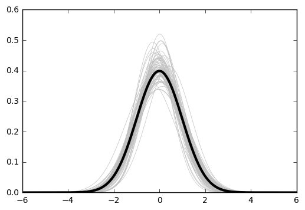


## Controlling a fill pattern


```python
# %load Chapter2/14.py
import numpy
import matplotlib.pyplot as plot

N = 8
A = numpy.random.random(N)
B = numpy.random.random(N)

plot.bar(range(N), A, color = 'w', hatch = 'x')
plot.bar(range(N), A + B, bottom = A, color = 'w', hatch = '/')

plot.show()

```


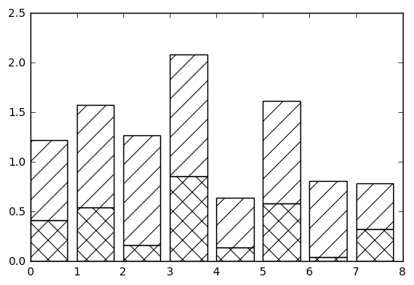


## Controlling a marker's style


```python
import numpy as np
import matplotlib.pyplot as plt

A = np.random.standard_normal((100, 2))
A += np.array((-1, -1))

B = np.random.standard_normal((100, 2))
B += np.array((1, 1))

plt.scatter(A[:,0], A[:,1], color = 'k', marker = 'x')
plt.scatter(B[:,0], B[:,1], color = 'k', marker = '^')
plt.show()
```


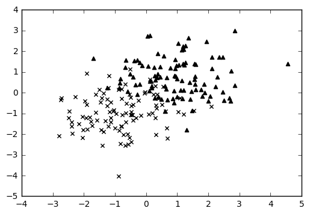


```python
import numpy as np
import matplotlib.pyplot as plt

label_list = (
    b'Iris-setosa',
    b'Iris-versicolor',
    b'Iris-virginica',
)

def read_label(label):
    return label_list.index(label)

data = np.loadtxt('Chapter2/iris.data.txt',
                  delimiter = ',',
                  converters = { 4 : read_label })

marker_set = ('^', 'x', '.')

for i, marker in enumerate(marker_set):
    data_subset = numpy.asarray([x for x in data if x[4] == i])
    plt.scatter(data_subset[:,0], data_subset[:,1],
                color = 'k',
                marker = marker)
plt.show()
```


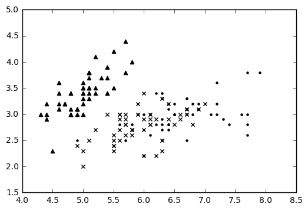


```python
import numpy as np
import matplotlib.pyplot as plt

X = np.linspace(-6, 6, 1024)
Y1 = np.sinc(X)
Y2 = np.sinc(X) + 1

plt.plot(X, Y1, marker = 'o', color = '.75')
plt.plot(X, Y2, marker = 'o', color = 'k', markevery = 32)
plt.show()
```


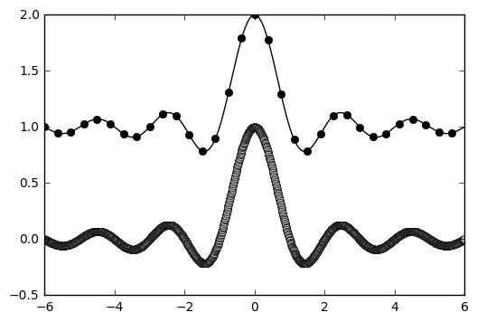


## Controlling a marker's size


```python
import numpy as np
import matplotlib.pyplot as plt

A = np.random.standard_normal((100, 2))
A += np.array((-1, -1))

B = np.random.standard_normal((100, 2))
B += np.array((1, 1))

plt.scatter(B[:,0], B[:,1], c = 'k', s = 100.)
plt.scatter(A[:,0], A[:,1], c = 'w', s = 25.)
plt.show()

```


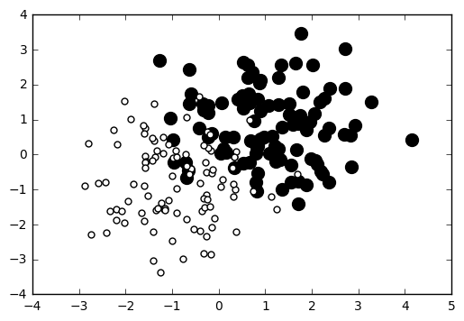


```python
import numpy as np
import matplotlib.pyplot as plt

M = np.random.standard_normal((1000, 2))
R = np.sum(M ** 2, axis = 1)

plt.scatter(M[:, 0], M[:, 1], c = 'w', marker = 's', s = 32. * R)
plt.show()
```


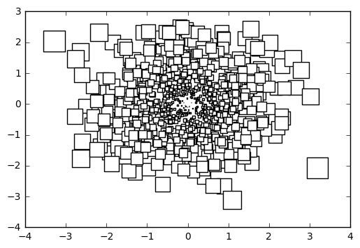


## Creating your own markers


```python
import numpy as np
import matplotlib.path as mpath
from matplotlib import pyplot as plt

shape_description = [
    ( 1., 2., mpath.Path.MOVETO),
    ( 1., 1., mpath.Path.LINETO),
    ( 2., 1., mpath.Path.LINETO),
    ( 2., -1., mpath.Path.LINETO),
    ( 1., -1., mpath.Path.LINETO),
    ( 1., -2., mpath.Path.LINETO),
    (-1., -2., mpath.Path.LINETO),
    (-1., -1., mpath.Path.LINETO),
    (-2., -1., mpath.Path.LINETO),
    (-2., 1., mpath.Path.LINETO),
    (-1., 1., mpath.Path.LINETO),
    (-1., 2., mpath.Path.LINETO),
    ( 0., 0., mpath.Path.CLOSEPOLY),
]

u, v, codes = zip(*shape_description)
my_marker = mpath.Path(np.asarray((u, v)).T, codes)
data = np.random.rand(8, 8)

plt.scatter(data[:,0], data[:, 1], c = '.75',
            marker = my_marker,
            s = 64)
plt.show()
```


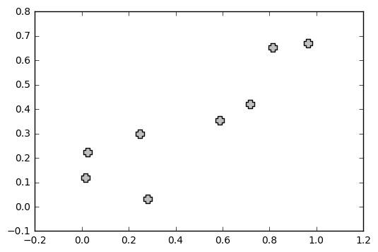


## Getting more control over markers


```python
import numpy as np
import matplotlib.pyplot as plt

X = np.linspace(-6, 6, 1024)
Y = np.sinc(X)

plt.plot(X, Y,
         linewidth = 3.,
         color = 'k',
         markersize = 9,
         markeredgewidth = 1.5,
         markerfacecolor = '.75',
         markeredgecolor = 'k',
         marker = 'o',
         markevery = 32)

plt.show()
```


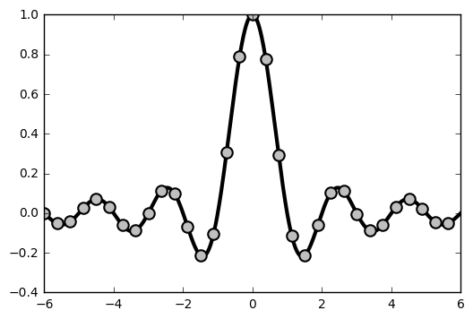


## Creating your own color scheme


```python
import numpy as np
import matplotlib as mpl
from matplotlib import pyplot as plt

mpl.rc('lines', linewidth = 2.)
mpl.rc('axes', facecolor = 'k', edgecolor = 'w')
mpl.rc('xtick', color = 'w')
mpl.rc('ytick', color = 'w')
mpl.rc('text', color = 'w')
mpl.rc('figure', facecolor = 'k', edgecolor ='w')
mpl.rc('axes', color_cycle = ('w', '.5', '.75'))

X = np.linspace(0, 7, 1024)

plt.plot(X, np.sin(X))
plt.plot(X, np.cos(X))
plt.show()
```

    C:\Anaconda3\lib\site-packages\matplotlib\__init__.py:878: UserWarning: axes.color_cycle is deprecated and replaced with axes.prop_cycle; please use the latter.
      warnings.warn(self.msg_depr % (key, alt_key))


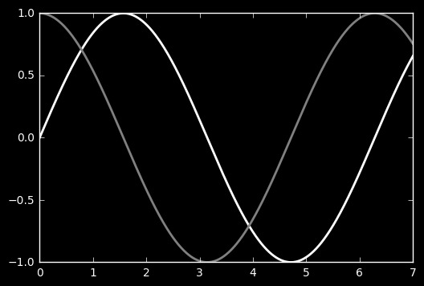


```python

```
