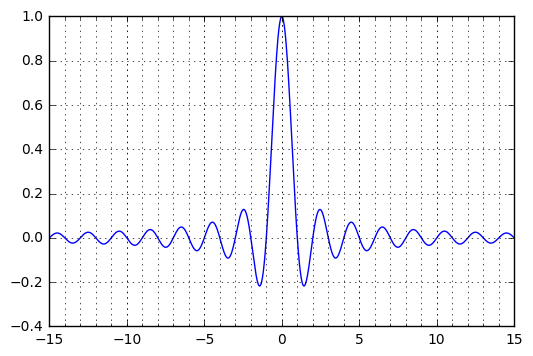

# Chapter 3: Working with Annotations

<!-- toc orderedList:0 depthFrom:1 depthTo:6 -->

- [Chapter 3: Working with Annotations](#chapter-3-working-with-annotations)
	- [Introduction](#introduction)
	- [Adding a title](#adding-a-title)
	- [Using LaTeX-style notations](#using-latex-style-notations)
	- [Adding a label to each axis](#adding-a-label-to-each-axis)
	- [Adding text](#adding-text)
	- [Adding arrows](#adding-arrows)
	- [Adding a legend](#adding-a-legend)
	- [Adding a grid](#adding-a-grid)
	- [Adding lines](#adding-lines)
	- [Adding shapes](#adding-shapes)
	- [Controlling ticks' spacing](#controlling-ticks-spacing)
	- [Controlling ticks labeling](#controlling-ticks-labeling)

<!-- tocstop -->

## Introduction

## Adding a title


```python
# %load Chapter3/01.py
import numpy
import matplotlib.pyplot as plot

X = numpy.linspace(-4, 4, 1024)
Y = .25 * (X + 4.) * (X + 1.) * (X - 2.)

plot.title('A polynomial')

plot.plot(X, Y, c = 'k')
plot.show()

```


## Using LaTeX-style notations


```python
# %load Chapter3/02.py
import numpy
import matplotlib.pyplot as plot

X = numpy.linspace(-4, 4, 1024)
Y = .25 * (X + 4.) * (X + 1.) * (X - 2.)

plot.title(r'$f(x)=\frac{1}{4}(x+4)(x+1)(x-2)$')
plot.plot(X, Y, c = 'k')
plot.show()

```


## Adding a label to each axis


```python
# %load Chapter3/03.py
import numpy
import matplotlib.pyplot as plot

X = numpy.linspace(-4, 4, 1024)
Y = .25 * (X + 4.) * (X + 1.) * (X - 2.)

# here is important
plot.title('Power curve for airfoil KV873')
plot.xlabel('Air speed')
plot.ylabel('Total drag')

plot.plot(X, Y, c = 'k')
plot.show()

```


## Adding text


```python
# %load Chapter3/04.py
import numpy
import matplotlib.pyplot as plot

X = numpy.linspace(-4, 4, 1024)
Y = .25 * (X + 4.) * (X + 1.) * (X - 2.)

plot.text(-0.5, -0.25, 'Brackmard minimum')

plot.plot(X, Y, c = 'k')
plot.show()

```


```python
# %load Chapter3/05.py
import matplotlib.pyplot as plot

align_list = ('center', 'left', 'right')

ax1 = plot.axes()
ax1.axes.get_xaxis().set_visible(False)
ax1.axes.get_yaxis().set_visible(False)

for i, align in enumerate(align_list):
	plot.text(0, i, 'align=\'%s\'' % align, ha = align)

plot.plot([0, 0], [-1, len(align_list)], c = '#808080', ls = '--')
plot.scatter([0] * len(align_list), range(len(align_list)))

plot.show()

```


```python
# %load Chapter3/06.py
import matplotlib.pyplot as plot

align_list = ('center', 'bottom', 'top', 'baseline')

ax1 = plot.axes()
ax1.axes.get_xaxis().set_visible(False)
ax1.axes.get_yaxis().set_visible(False)

for i, align in enumerate(align_list):
	plot.text(3 * i, 0, 'align=\'%s\'' % align, ha = 'center', va = align)

plot.plot([-3, 3 * len(align_list)], [0, 0], c = '#808080', ls = '--')
plot.scatter([3 * i for i in range(len(align_list))], [0] * len(align_list))

plot.show()

```


```python
# %load Chapter3/07.py
import numpy
import matplotlib.pyplot as plot

X = numpy.linspace(-4, 4, 1024)
Y = .25 * (X + 4.) * (X + 1.) * (X - 2.)

box = {
	'facecolor' : '.75',
	'edgecolor' : 'k',
  'boxstyle'  : 'round'
}

plot.text(-0.5, -0.20, 'Brackmard minimum', bbox = box)

plot.plot(X, Y, c = 'k')
plot.show()

```


## Adding arrows


```python
# %load Chapter3/08.py
import numpy
import matplotlib.pyplot as plot

X = numpy.linspace(-4, 4, 1024)
Y = .25 * (X + 4.) * (X + 1.) * (X - 2.)

plot.annotate('Brackmard minimum',
              ha = 'center', va = 'bottom',
              xytext = (-1.5, 3.),
              xy = (0.75, -2.7),
              arrowprops = { 'facecolor' : 'k', 'shrink' : 0.05 })

plot.plot(X, Y, c = 'k')
plot.show()

```


## Adding a legend


```python
# %load Chapter3/09.py
import numpy
import matplotlib.pyplot as plot

X = numpy.linspace(0, 6, 1024)
Y1 = numpy.sin(X)
Y2 = numpy.cos(X)

plot.xlabel('X')
plot.xlabel('Y')

plot.plot(X, Y1, c = 'k',             lw = 3., label = 'sin(X)')
plot.plot(X, Y2, c = '.5', ls = '--', lw = 3., label = 'cos(X)')

plot.legend()
plot.show()

```


## Adding a grid


```python
# %load Chapter3/10.py
import numpy
import matplotlib.pyplot as plot

X = numpy.linspace(-4, 4, 1024)
Y = .25 * (X + 4.) * (X + 1.) * (X - 2.)

plot.plot(X, Y, c = 'k')

plot.grid(True, lw = 2, ls = '--', c = '.75')
plot.show()

```


## Adding lines


```python
import matplotlib.pyplot as plt
N = 16

for i in range(N):
    plt.gca().add_line(plt.Line2D((0, i), (N - i, 0), color = '.75'))

plt.grid(True)
plt.axis('scaled')
plt.show()
```


## Adding shapes


```python
import matplotlib.patches as patches
import matplotlib.pyplot as plt

# Circle
shape = patches.Circle((0, 0), radius = 1., color = '.75')
plt.gca().add_patch(shape)

# Rectangle
shape = patches.Rectangle((2.5, -.5), 2., 1., color = '.75')
plt.gca().add_patch(shape)

# Ellipse
shape = patches.Ellipse((0, -2.), 2., 1., angle = 45., color = '.75')
plt.gca().add_patch(shape)

# Fancy box
shape = patches.FancyBboxPatch((2.5, -2.5), 2., 1., boxstyle = 'sawtooth', color = '.75')
plt.gca().add_patch(shape)

# Display all
plt.grid(True)
plt.axis('scaled')
plt.show()
```


* **Working with polygons**


```python
import numpy as np
import matplotlib.patches as patches
import matplotlib.pyplot as plt
theta = np.linspace(0, 2 * np.pi, 8)
points = np.vstack((np.cos(theta), np.sin(theta))).transpose()
plt.gca().add_patch(patches.Polygon(points, color = '.75'))
plt.grid(True)
plt.axis('scaled')
plt.show()
```


* **Working with path attributes**


```python
import numpy as np
import matplotlib.patches as patches
import matplotlib.pyplot as plt

theta = np.linspace(0, 2 * np.pi, 6)
points = np.vstack((np.cos(theta), np.sin(theta))).transpose()
plt.gca().add_patch(plt.Circle((0, 0), radius = 1., color = '.75'))
plt.gca().add_patch(plt.Polygon(points, closed=None, fill=None,
                                lw = 3., ls = 'dashed', edgecolor = 'k'))

plt.grid(True)
plt.axis('scaled')
plt.show()
```


## Controlling ticks' spacing


```python
import numpy as np
import matplotlib.pyplot as plt
import matplotlib.ticker as ticker

X = np.linspace(-15, 15, 1024)
Y = np.sinc(X)

ax = plt.axes()
ax.xaxis.set_major_locator(ticker.MultipleLocator(5))
ax.xaxis.set_minor_locator(ticker.MultipleLocator(1))

plt.plot(X, Y, c = 'k')
plt.show()
```


```python
import numpy as np
import matplotlib.pyplot as plt
import matplotlib.ticker as ticker

X = np.linspace(-15, 15, 1024)
Y = np.sinc(X)

ax = plt.axes()
ax.xaxis.set_major_locator(ticker.MultipleLocator(5))
ax.xaxis.set_minor_locator(ticker.MultipleLocator(1))
plt.grid(True, which='both')
plt.plot(X, Y)
plt.show()
```





## Controlling ticks labeling


```python
import numpy as np
import matplotlib.ticker as ticker
import matplotlib.pyplot as plt

name_list = ('Omar', 'Serguey', 'Max', 'Zhou', 'Abidin')
value_list = np.random.randint(0, 99, size = len(name_list))
pos_list = np.arange(len(name_list))

ax = plt.axes()
ax.xaxis.set_major_locator(ticker.FixedLocator((pos_list)))
ax.xaxis.set_major_formatter(ticker.FixedFormatter((name_list)))

plt.bar(pos_list, value_list, color = '.75', align = 'center')
plt.show()
```


* **A simpler way to create bar charts with fied labels**


```python
import numpy as np
import matplotlib.pyplot as plt

name_list = ('Omar', 'Serguey', 'Max', 'Zhou', 'Abidin')
value_list = np.random.randint(0, 99, size = len(name_list))
pos_list = np.arange(len(name_list))

plt.bar(pos_list, value_list, color = '.75', align = 'center')
plt.xticks(pos_list, name_list)
plt.show()
```


* **Advanced label generation**


```python
import numpy as np
import matplotlib.pyplot as plt
import matplotlib.ticker as ticker

def make_label(value, pos):
    return '%0.1f%%' % (100. * value)

ax = plt.axes()
ax.xaxis.set_major_formatter(ticker.FuncFormatter(make_label))
X = np.linspace(0, 1, 256)

plt.plot(X, np.exp(-10 * X), c ='k')
plt.plot(X, np.exp(-5 * X), c= 'k', ls = '--')
plt.show()
```


```python
import numpy as np
import datetime
import matplotlib.pyplot as plt
import matplotlib.ticker as ticker

start_date = datetime.datetime(1998, 1, 1)

def make_label(value, pos):
    time = start_date + datetime.timedelta(days = 365 * value)
    return time.strftime('%b %y')

ax = plt.axes()
ax.xaxis.set_major_formatter(ticker.FuncFormatter(make_label))
X = np.linspace(0, 1, 256)

plt.plot(X, np.exp(-10 * X), c = 'k')
plt.plot(X, np.exp(-5 * X), c = 'k', ls = '--')
labels = ax.get_xticklabels()

plt.setp(labels, rotation = 30.)
plt.show()
```


```python

```
