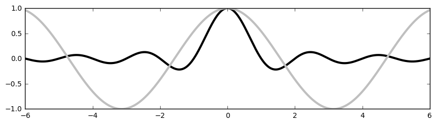

# Chapter 4: Working with Figures

<!-- toc orderedList:0 depthFrom:1 depthTo:6 -->

- [Chapter 4: Working with Figures](#chapter-4-working-with-figures)
	- [Introduction](#introduction)
	- [Compositing multiple figures](#compositing-multiple-figures)
	- [Scaling both axes equally](#scaling-both-axes-equally)
	- [Setting an axis range](#setting-an-axis-range)
	- [Setting the aspect ratio](#setting-the-aspect-ratio)
	- [Inserting subfigures](#inserting-subfigures)
	- [Using a logarithmic scale](#using-a-logarithmic-scale)
	- [Using polar coordinates](#using-polar-coordinates)

<!-- tocstop -->

## Introduction

## Compositing multiple figures


```python
# %load Chapter4/01.py
import numpy
from matplotlib import pyplot as plot

T = numpy.linspace(-numpy.pi, numpy.pi, 1024)

grid_size = (4, 2)

plot.subplot2grid(grid_size, (0, 0), rowspan=3, colspan=1)
plot.plot(numpy.sin(2 * T), numpy.cos(0.5 * T), c= 'k')

plot.subplot2grid(grid_size, (0, 1), rowspan=3, colspan=1)
plot.plot(numpy.cos(3 * T), numpy.sin(T), c= 'k')

plot.subplot2grid(grid_size, (3, 0), rowspan=1, colspan=3)
plot.plot(numpy.cos(5 * T), numpy.sin(7 * T), c= 'k')

plot.tight_layout()
plot.show()

```


```python
# %load Chapter4/02.py
import numpy
from matplotlib import pyplot as plot

def get_radius(T, params):
	m, n_1, n_2, n_3 = params
	U = (m * T) / 4
	return (numpy.fabs(numpy.cos(U)) ** n_2 + numpy.fabs(numpy.sin(U)) ** n_3) ** (-1. / n_1)

grid_size = (3, 4)
T = numpy.linspace(0, 2 * numpy.pi, 1024)

for i in range(grid_size[0]):
	for j in range(grid_size[1]):
		params = numpy.random.random_integers(1, 20, size = 4)
		R = get_radius(T, params)

		axes = plot.subplot2grid(grid_size, (i, j), rowspan=1, colspan=1)
		axes.get_xaxis().set_visible(False)
		axes.get_yaxis().set_visible(False)
		plot.plot(R * numpy.cos(T), R * numpy.sin(T), c = 'k')

		plot.title('%d, %d, %d, %d' % tuple(params), fontsize = 'small')

plot.tight_layout()
plot.show()

```

    C:\Anaconda3\lib\site-packages\ipykernel\__main__.py:15: DeprecationWarning: This function is deprecated. Please call randint(1, 20 + 1) instead


* **An alternative way to composite fiures**


```python
import numpy as np
from matplotlib import pyplot as plt

T = np.linspace(-np.pi, np.pi, 1024)
fig, (ax0, ax1) = plt.subplots(ncols =2)

ax0.plot(np.sin(2 * T), np.cos(0.5 * T), c = 'k')
ax1.plot(np.cos(3 * T), np.sin(T), c = 'k')

plt.show()
```


## Scaling both axes equally


```python
# %load Chapter4/03.py
import numpy
import matplotlib.pyplot as plot

T = numpy.linspace(0, 2 * numpy.pi, 1024)

plot.plot(2. * numpy.cos(T), numpy.sin(T), c = 'k', lw = 3.)
#plot.axes().set_aspect('equal')

plot.show()

```


```python
# %load Chapter4/03.py
import numpy
import matplotlib.pyplot as plot

T = numpy.linspace(0, 2 * numpy.pi, 1024)

plot.plot(2. * numpy.cos(T), numpy.sin(T), c = 'k', lw = 3.)
plot.axes().set_aspect('equal')

plot.show()

```


## Setting an axis range


```python
# %load Chapter4/04.py
import numpy
import matplotlib.pyplot as plot

X = numpy.linspace(-6, 6, 1024)

plot.ylim(-.5, 1.5)
plot.plot(X, numpy.sinc(X), c = 'k')

plot.show()

```


## Setting the aspect ratio


```python
# %load Chapter4/05.py
import numpy
import matplotlib.pyplot as plot

X = numpy.linspace(-6, 6, 1024)
Y1, Y2 = numpy.sinc(X), numpy.cos(X)

fig = plot.figure(figsize=(10.24, 2.56))

#plot.ylim(-0.5 * numpy.pi, 0.5 * numpy.pi)

plot.plot(X, Y1, c='k', lw = 3.)
plot.plot(X, Y2, c='.75', lw = 3.)
plot.show()


```





## Inserting subfigures


```python
import numpy as np
from matplotlib import pyplot as plt

X = np.linspace(-6, 6, 1024)
Y = np.sinc(X)
X_detail = np.linspace(-3, 3, 1024)
Y_detail = np.sinc(X_detail)

plt.plot(X, Y, c = 'k')

sub_axes = plt.axes([.6, .6, .25, .25])
sub_axes.plot(X_detail, Y_detail, c = 'k')

plt.setp(sub_axes)
plt.show()
```

      adjustable: [ 'box' | 'datalim' | 'box-forced']
      agg_filter: unknown
      alpha: float (0.0 transparent through 1.0 opaque)
      anchor: unknown
      animated: [True | False]
      aspect: unknown
      autoscale_on: unknown
      autoscalex_on: unknown
      autoscaley_on: unknown
      axes: an :class:`~matplotlib.axes.Axes` instance
      axes_locator: unknown
      axis_bgcolor: any matplotlib color - see :func:`~matplotlib.pyplot.colors`
      axisbelow: [ *True* | *False* ]
      clip_box: a :class:`matplotlib.transforms.Bbox` instance
      clip_on: [True | False]
      clip_path: [ (:class:`~matplotlib.path.Path`, :class:`~matplotlib.transforms.Transform`) | :class:`~matplotlib.patches.Patch` | None ]
      color_cycle: unknown
      contains: a callable function
      figure: unknown
      frame_on: [ *True* | *False* ]
      gid: an id string
      label: string or anything printable with '%s' conversion.
      navigate: [ *True* | *False* ]
      navigate_mode: unknown
      path_effects: unknown
      picker: [None|float|boolean|callable]
      position: unknown
      rasterization_zorder: unknown
      rasterized: [True | False | None]
      sketch_params: unknown
      snap: unknown
      title: unknown
      transform: :class:`~matplotlib.transforms.Transform` instance
      url: a url string
      visible: [True | False]
      xbound: unknown
      xlabel: unknown
      xlim: length 2 sequence of floats
      xmargin: unknown
      xscale: ['linear' | 'log' | 'logit' | 'symlog']
      xticklabels: sequence of strings
      xticks: sequence of floats
      ybound: unknown
      ylabel: unknown
      ylim: length 2 sequence of floats
      ymargin: unknown
      yscale: ['linear' | 'log' | 'logit' | 'symlog']
      yticklabels: sequence of strings
      yticks: sequence of floats
      zorder: any number


## Using a logarithmic scale


```python
# %load Chapter4/06.py
import numpy
import matplotlib.pyplot as plot

X = numpy.linspace(1, 10, 1024)

plot.yscale('log', basey=2)

plot.plot(X, X, c = 'k', lw = 2., label = r'$f(x)=x$')
plot.plot(X, 10 ** X, c = '.75', ls = '--', lw = 2., label = r'$f(x)=e^x$')
plot.plot(X, numpy.log(X), c = '.75', lw = 2., label = r'$f(x)=\log(x)$')

plot.legend()
plot.show()

```


```python
# %load Chapter4/07.py
import numpy
import matplotlib.pyplot as plot

X = numpy.linspace(-100, 100, 4096)

plot.xscale('symlog', linthreshx=6.)

plot.plot(X, numpy.sinc(X), c = 'k')
plot.show()

```


## Using polar coordinates


```python
# %load Chapter4/08.py
import numpy
import matplotlib.pyplot as plot

T = numpy.linspace(0 , 2 * numpy.pi, 1024)

plot.axes(polar = True)
plot.plot(T, 1. + .25 * numpy.sin(16 * T), c = 'k')

plot.show()

```


```python
# %load Chapter4/09.py
import numpy
import matplotlib.patches as patches
import matplotlib.pyplot as plot

ax = plot.axes(polar = True)

theta = numpy.linspace(0, 2 * numpy.pi, 8, endpoint = False)
radius = .25 + .75 * numpy.random.random(size = len(theta))
points = list(zip(theta, radius))

plot.gca().add_patch(patches.Polygon(points, color = '.75'))

plot.show()

```


