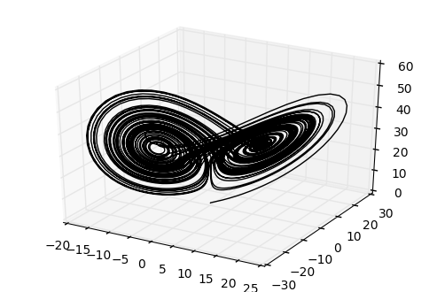
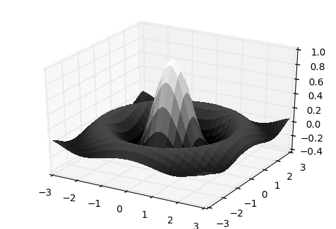
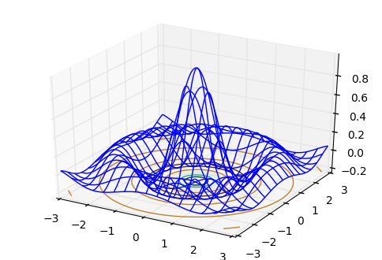
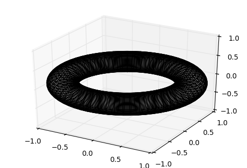
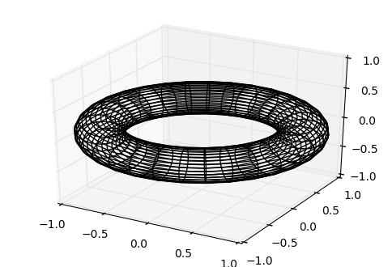
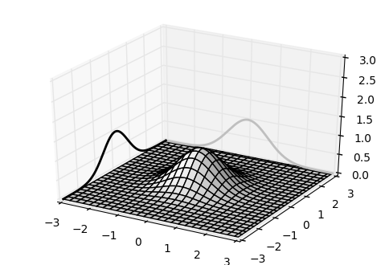
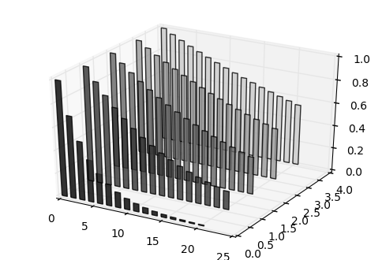
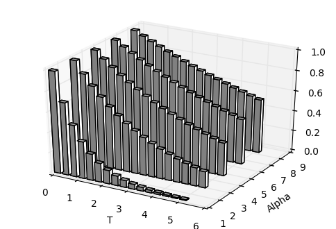

# Chapter 7: Working with 3D Figures

<!-- toc orderedList:0 depthFrom:1 depthTo:6 -->

- [Chapter 7: Working with 3D Figures](#chapter-7-working-with-3d-figures)
	- [Introduction](#introduction)
	- [Creating 3D scatter plots](#creating-3d-scatter-plots)
	- [Creating 3D curve plots](#creating-3d-curve-plots)
	- [Plotting a scalar field in 3D](#plotting-a-scalar-field-in-3d)
	- [Plotting a parametric 3D surface](#plotting-a-parametric-3d-surface)
	- [Embedding 2D figures in a 3D figure](#embedding-2d-figures-in-a-3d-figure)
	- [Creating a 3D bar plot](#creating-a-3d-bar-plot)

<!-- tocstop -->

## Introduction

## Creating 3D scatter plots


```python
# %load Chapter7/01.py
import numpy
from mpl_toolkits.mplot3d import Axes3D
import matplotlib.pyplot as plot

# Dataset generation
a, b, c = 10., 28., 8. / 3.
def lorenz_map(X, dt = 1e-2):
	X_dt = numpy.array([a * (X[1] - X[0]),
	                    X[0] * (b - X[2]) - X[1],
	                    X[0] * X[1] - c * X[2]])
	return X + dt * X_dt

points = numpy.zeros((2000, 3))
X = numpy.array([.1, .0, .0])
for i in range(points.shape[0]):
	points[i], X = X, lorenz_map(X)

# Plotting
fig = plot.figure()
ax = fig.gca(projection = '3d')

ax.set_xlabel('X axis')
ax.set_ylabel('Y axis')
ax.set_zlabel('Z axis')
ax.set_title('Lorenz Attractor a=%0.2f b=%0.2f c=%0.2f' % (a, b, c))

'''
ax.scatter(points[:, 0], points[:, 1],  points[:, 2],
           marker = 's',
           edgecolor = '.5',
           facecolor = '.5')
'''
ax.scatter(points[:, 0], points[:, 1],  points[:, 2],
           zdir = 'z',
           c = '.5')
plot.show()

```


## Creating 3D curve plots


```python
# %load Chapter7/02.py
import numpy
from mpl_toolkits.mplot3d import Axes3D
import matplotlib.pyplot as plot

a, b, c = 10., 28., 8. / 3.
def lorenz_map(X, dt = 1e-2):
	X_dt = numpy.array([a * (X[1] - X[0]),
	                    X[0] * (b - X[2]) - X[1],
	                    X[0] * X[1] - c * X[2]])
	return X + dt * X_dt

points = numpy.zeros((10000, 3))
X = numpy.array([.1, .0, .0])
for i in range(points.shape[0]):
	points[i], X = X, lorenz_map(X)


fig = plot.figure()
ax = fig.gca(projection = '3d')

ax.plot(points[:, 0], points[:, 1],  points[:, 2], c = 'k')
plot.show()

```





## Plotting a scalar field in 3D


```python
# %load Chapter7/03.py
import numpy
from matplotlib import cm
from mpl_toolkits.mplot3d import Axes3D
import matplotlib.pyplot as plot


x = numpy.linspace(-3, 3, 256)
y = numpy.linspace(-3, 3, 256)
X, Y = numpy.meshgrid(x, y)
Z = numpy.sinc(numpy.sqrt(X ** 2 + Y ** 2))

fig = plot.figure()
ax = fig.gca(projection = '3d')
#ax.plot_surface(X, Y, Z, color = 'w')
#ax.plot_surface(X, Y, Z, cmap=cm.gray)
ax.plot_surface(X, Y, Z, cmap=cm.gray, linewidth=0, antialiased=False)

plot.show()

```





```python
# %load Chapter7/04.py
import numpy
from matplotlib import cm
from mpl_toolkits.mplot3d import Axes3D
import matplotlib.pyplot as plot


x = numpy.linspace(-3, 3, 256)
y = numpy.linspace(-3, 3, 256)
X, Y = numpy.meshgrid(x, y)
Z = numpy.sinc(numpy.sqrt(X ** 2 + Y ** 2))

fig = plot.figure()
ax = fig.gca(projection = '3d')
ax.plot_wireframe(X, Y, Z, cstride=8, rstride=8, color = 'k')

plot.show()

```


```python
# %load Chapter7/05.py
import numpy
from matplotlib import cm
from mpl_toolkits.mplot3d import Axes3D
import matplotlib.pyplot as plot


x = numpy.linspace(-3, 3, 256)
y = numpy.linspace(-3, 3, 256)
X, Y = numpy.meshgrid(x, y)
Z = numpy.sinc(numpy.sqrt(X ** 2 + Y ** 2))

fig = plot.figure()
ax = fig.gca(projection = '3d')
ax.plot_wireframe(X, Y, Z, rstride=16, cstride=16)
ax.contour(X, Y, Z, zdir='z', offset=-.2, cmap = cm.BrBG)

plot.show()

```





## Plotting a parametric 3D surface


```python
# %load Chapter7/06.py
import numpy
from mpl_toolkits.mplot3d import Axes3D
import matplotlib.pyplot as plot

angle = numpy.linspace(0, 2 * numpy.pi, 64)
theta, phi = numpy.meshgrid(angle, angle)

r, R = .25, 1.
X = (R + r * numpy.cos(phi)) * numpy.cos(theta)
Y = (R + r * numpy.cos(phi)) * numpy.sin(theta)
Z = r * numpy.sin(phi)

fig = plot.figure()
ax = fig.gca(projection = '3d')

ax.set_xlim3d(-1, 1)
ax.set_ylim3d(-1, 1)
ax.set_zlim3d(-1, 1)
#ax.plot_surface(X, Y, Z, rstride = 1, cstride = 1, linewidth = 0, antialiased = False, cmap = plot.get_cmap('jet'))
#ax.pbaspect = [6., 6., 1]
#ax.plot_surface(X, Y, Z, color = 'w', rstride = 1, cstride = 1)
ax.plot_wireframe(X, Y, Z, color = 'k')


plot.show()


```





```python
# %load Chapter7/06.py
import numpy as np
from mpl_toolkits.mplot3d import Axes3D
import matplotlib.pyplot as plot

angle = np.linspace(0, 2 * np.pi, 32)
theta, phi = np.meshgrid(angle, angle)

r, R = .25, 1.
X = (R + r * np.cos(phi)) * np.cos(theta)
Y = (R + r * np.cos(phi)) * np.sin(theta)
Z = r * np.sin(phi)

fig = plot.figure()
ax = fig.gca(projection = '3d')

ax.set_xlim3d(-1, 1)
ax.set_ylim3d(-1, 1)
ax.set_zlim3d(-1, 1)
# ax.plot_surface(X, Y, Z, rstride = 1, cstride = 1, linewidth = 0, antialiased = False, cmap = plot.get_cmap('jet'))
# ax.pbaspect = [6., 6., 1]
# ax.plot_surface(X, Y, Z, color = 'w', rstride = 1, cstride = 1)
ax.plot_wireframe(X, Y, Z, color = 'k')


plot.show()


```





## Embedding 2D figures in a 3D figure


```python
# %load Chapter7/07.py
import numpy
from mpl_toolkits.mplot3d import Axes3D
import matplotlib.pyplot as plot

x = numpy.linspace(-3, 3, 256)
y = numpy.linspace(-3, 3, 256)
X, Y = numpy.meshgrid(x, y)

Z = numpy.exp(-(X ** 2 + Y ** 2))
u = numpy.exp(-(x ** 2))

fig = plot.figure()
ax = fig.gca(projection = '3d')

ax.set_zlim3d(0, 3)

ax.plot(x, u, zs=3, zdir='y', lw = 2, color = '.75')
ax.plot(x, u, zs=-3, zdir='x', lw = 2., color = 'k')
ax.plot_surface(X, Y, Z, color = 'w')

plot.show()

```





```python
# %load Chapter7/08.py
import numpy
from matplotlib import cm
import matplotlib.colors as col
from mpl_toolkits.mplot3d import Axes3D
import matplotlib.pyplot as plot

# Data generation
alpha = 1. / numpy.linspace(1, 8, 5)
t = numpy.linspace(0, 5, 16)
T, A = numpy.meshgrid(t, alpha)
data = numpy.exp(-T * A)

# Plotting
fig = plot.figure()
ax = fig.gca(projection = '3d')

cmap = cm.ScalarMappable(col.Normalize(0, len(alpha)), cm.gray)
for i, row in enumerate(data):
	ax.bar(4 * t, row, zs=i, zdir='y', alpha=0.8, color=cmap.to_rgba(i))

plot.show()

```





## Creating a 3D bar plot


```python
# %load Chapter7/09.py
import numpy
from mpl_toolkits.mplot3d import Axes3D
import matplotlib.pyplot as plot

# Data generation
alpha = numpy.linspace(1, 8, 5)
t = numpy.linspace(0, 5, 16)
T, A = numpy.meshgrid(t, alpha)
data = numpy.exp(-T * (1. / A))

# Plotting
fig = plot.figure()
ax = fig.gca(projection = '3d')

Xi = T.flatten()
Yi = A.flatten()
Zi = numpy.zeros(data.size)

dx = .25 * numpy.ones(data.size)
dy = .25 * numpy.ones(data.size)
dz = data.flatten()

ax.set_xlabel('T')
ax.set_ylabel('Alpha')
ax.bar3d(Xi, Yi, Zi, dx, dy, dz, color = 'w')

plot.show()

```



