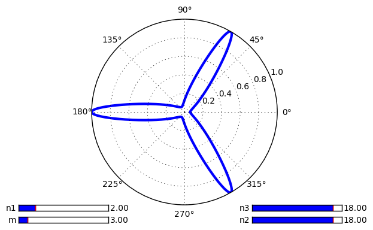

# Chapter 8: User Interface

<!-- toc orderedList:0 depthFrom:1 depthTo:6 -->

- [Chapter 8: User Interface](#chapter-8-user-interface)
	- [Introduction](#introduction)
	- [Making a user-controllable plot](#making-a-user-controllable-plot)
	- [Integrating a plot to a Tkinter user interface](#integrating-a-plot-to-a-tkinter-user-interface)
	- [Integrating a plot to wxWidgets user interface](#integrating-a-plot-to-wxwidgets-user-interface)
	- [Integrating a plot to GTK user interface](#integrating-a-plot-to-gtk-user-interface)
	- [Integrating a plot in a Pyglet application](#integrating-a-plot-in-a-pyglet-application)

<!-- tocstop -->

## Introduction

## Making a user-controllable plot


```python
# %load Chapter8/supershape.py
import numpy
from matplotlib import pyplot as plot
from matplotlib.widgets import Slider


def supershape_radius(phi, a, b, m, n1, n2, n3):
	theta = .25 * m * phi
	cos = numpy.fabs(numpy.cos(theta) / a) ** n2
	sin = numpy.fabs(numpy.sin(theta) / b) ** n3
	r = (cos + sin) ** (-1. / n1)
	r /= numpy.max(r)
	return r


phi = numpy.linspace(0, 2 * numpy.pi, 1024)
m_init = 3
n1_init = 2
n2_init = 18
n3_init = 18
r = supershape_radius(phi, 1, 1, m_init, n1_init, n2_init, n3_init)

fig = plot.figure()
ax = fig.add_subplot(111, polar = True)

ax_m  = plot.axes([0.05, 0.05, 0.25, 0.025])
ax_n1 = plot.axes([0.05, 0.10, 0.25, 0.025])
ax_n2 = plot.axes([0.7, 0.05, 0.25, 0.025])
ax_n3 = plot.axes([0.7, 0.10, 0.25, 0.025])

slider_m  = Slider(ax_m,  'm',  1, 20, valinit = m_init)
slider_n1 = Slider(ax_n1, 'n1', .1, 10, valinit = n1_init)
slider_n2 = Slider(ax_n2, 'n2', .1, 20, valinit = n2_init)
slider_n3 = Slider(ax_n3, 'n3', .1, 20, valinit = n3_init)

lines, = ax.plot(phi, r, lw = 3.)

def update(val):
    lines.set_ydata(supershape_radius(phi, 1, 1, numpy.floor(slider_m.val), slider_n1.val, slider_n2.val, slider_n3.val))
    fig.canvas.draw_idle()

slider_n1.on_changed(update)
slider_n2.on_changed(update)
slider_n3.on_changed(update)
slider_m.on_changed(update)

plot.show()

```





## Integrating a plot to a Tkinter user interface


```python
# %load Chapter8/tk-supershape.py
import numpy
from Tkinter import *

from matplotlib.backends.backend_tkagg import FigureCanvasTkAgg
from matplotlib.figure import Figure


def supershape_radius(phi, a, b, m, n1, n2, n3):
	theta = .25 * m * phi
	cos = numpy.fabs(numpy.cos(theta) / a) ** n2
	sin = numpy.fabs(numpy.sin(theta) / b) ** n3
	r = (cos + sin) ** (-1. / n1)
	r /= numpy.max(r)
	return r


class LinearScaling(object):
	def __init__(self, src_range, dst_range):
		self.src_start, src_diff = src_range[0], src_range[1] - src_range[0]
		self.dst_start, dst_diff = dst_range[0], dst_range[1] - dst_range[0]
		self.src_to_dst_coeff = dst_diff / src_diff
		self.dst_to_src_coeff = src_diff / dst_diff

	def src_to_dst(self, X):
		return (X - self.src_start) * self.src_to_dst_coeff + self.dst_start

	def dst_to_src(self, X):
		return (X - self.dst_start) * self.dst_to_src_coeff + self.src_start


class SuperShapeFrame(Frame):
	def __init__(self, master = None):
		Frame.__init__(self, master)
		self.grid()

		self.m = 3

		self.n1 = 2
		self.n1_scaling = LinearScaling((.1, 20), (0, 200))

		self.n2 = 18
		self.n2_scaling = LinearScaling((.1, 20), (0, 200))

		self.n3 = 18
		self.n3_scaling = LinearScaling((.1, 20), (0, 200))

		self.fig = Figure((6, 6), dpi = 80)

		canvas = FigureCanvasTkAgg(self.fig, master = self)
		canvas.get_tk_widget().grid(row = 0, column = 0, columnspan = 4)

		label = Label(self, text = 'M')
		label.grid(row = 1, column = 1)
		self.m_slider = Scale(self, from_ = 1, to = 20, orient = HORIZONTAL, command = lambda i : self.update_m())
		self.m_slider.grid(row = 1, column = 2)

		label = Label(self, text = 'N1')
		label.grid(row = 2, column = 1)
		self.n1_slider = Scale(self, from_ = 0, to = 200, orient = HORIZONTAL, command = lambda i : self.update_n1())
		self.n1_slider.grid(row = 2, column = 2)

		label = Label(self, text = 'N2')
		label.grid(row = 3, column = 1)
		self.n2_slider = Scale(self, from_ = 0, to = 200, orient = HORIZONTAL, command = lambda i : self.update_n2())
		self.n2_slider.grid(row = 3, column = 2)

		label = Label(self, text = 'N3')
		label.grid(row = 4, column = 1)
		self.n3_slider = Scale(self, from_ = 0, to = 200, orient = HORIZONTAL, command = lambda i : self.update_n3())
		self.n3_slider.grid(row = 4, column = 2)

		self.draw_figure()

	def update_m(self):
		self.m = self.m_slider.get()
		self.refresh_figure()

	def update_n1(self):
		self.n1 = self.n1_scaling.dst_to_src(self.n1_slider.get())
		self.refresh_figure()

	def update_n2(self):
		self.n2 = self.n2_scaling.dst_to_src(self.n2_slider.get())
		self.refresh_figure()

	def update_n3(self):
		self.n3 = self.n3_scaling.dst_to_src(self.n3_slider.get())
		self.refresh_figure()

	def refresh_figure(self):
		r = supershape_radius(self.phi, 1, 1, self.m, self.n1, self.n2, self.n3)
		self.lines.set_ydata(r)
		self.fig.canvas.draw_idle()

	def draw_figure(self):
		self.phi = numpy.linspace(0, 2 * numpy.pi, 1024)
		r = supershape_radius(self.phi, 1, 1, self.m, self.n1, self.n2, self.n3)
		ax = self.fig.add_subplot(111, polar = True)
		self.lines, = ax.plot(self.phi, r, lw = 3.)
		self.fig.canvas.draw()


app = SuperShapeFrame()
app.master.title('SuperShape')
app.mainloop()


```

## Integrating a plot to wxWidgets user interface


```python
# %load Chapter8/wx-supershape-1.py
import wx, numpy

from matplotlib.backends.backend_wxagg import FigureCanvasWxAgg
from matplotlib.figure import Figure


def supershape_radius(phi, a, b, m, n1, n2, n3):
	theta = .25 * m * phi
	cos = numpy.fabs(numpy.cos(theta) / a) ** n2
	sin = numpy.fabs(numpy.sin(theta) / b) ** n3
	r = (cos + sin) ** (-1. / n1)
	r /= numpy.max(r)
	return r


class SuperShapeFrame(wx.Frame):
	def __init__(self, parent, id, title):
		wx.Frame.__init__(self, parent, id, title,
		                  style = wx.DEFAULT_FRAME_STYLE ^ wx.RESIZE_BORDER,
		                  size = (480, 480))
		self.fig = Figure((6, 6), dpi = 80)

		self.panel = wx.Panel(self, -1)
		sizer = wx.BoxSizer(wx.VERTICAL)
		sizer.Add(FigureCanvasWxAgg(self.panel, -1, self.fig), 1)
		self.panel.SetSizer(sizer)

		self.draw_figure()

	def draw_figure(self):
		phi = numpy.linspace(0, 2 * numpy.pi, 1024)
		r = supershape_radius(phi, 1, 1, 3, 2, 18, 18)
		ax = self.fig.add_subplot(111, polar = True)
		ax.plot(phi, r, lw = 3.)

		self.fig.canvas.draw()


app = wx.App(redirect = True)
top = SuperShapeFrame(None, -1, 'SuperShape')
top.Show()
app.MainLoop()

```


```python
# %load Chapter8/wx-supershape-2.py
import wx, numpy

from matplotlib.backends.backend_wxagg import FigureCanvasWxAgg
from matplotlib.figure import Figure


def supershape_radius(phi, a, b, m, n1, n2, n3):
	theta = .25 * m * phi
	cos = numpy.fabs(numpy.cos(theta) / a) ** n2
	sin = numpy.fabs(numpy.sin(theta) / b) ** n3
	r = (cos + sin) ** (-1. / n1)
	r /= numpy.max(r)
	return r


class LinearScaling(object):
	def __init__(self, src_range, dst_range):
		self.src_start, src_diff = src_range[0], src_range[1] - src_range[0]
		self.dst_start, dst_diff = dst_range[0], dst_range[1] - dst_range[0]
		self.src_to_dst_coeff = dst_diff / src_diff
		self.dst_to_src_coeff = src_diff / dst_diff

	def src_to_dst(self, X):
		return (X - self.src_start) * self.src_to_dst_coeff + self.dst_start

	def dst_to_src(self, X):
		return (X - self.dst_start) * self.dst_to_src_coeff + self.src_start


class SuperShapeFrame(wx.Frame):
	def __init__(self, parent, id, title):
		wx.Frame.__init__(self, parent, id, title,
		                  style = wx.DEFAULT_FRAME_STYLE ^ wx.RESIZE_BORDER,
		                  size = (480, 640))
		self.m = 3

		self.n1 = 2
		self.n1_scaling = LinearScaling((.01, 20), (0, 200))

		self.n2 = 18
		self.n2_scaling = LinearScaling((.01, 20), (0, 200))

		self.n3 = 18
		self.n3_scaling = LinearScaling((.01, 20), (0, 200))

		self.fig = Figure((6, 6), dpi = 80)

		panel = wx.Panel(self, -1)

		self.m_slider = wx.Slider(panel, -1, self.m, 1, 20, size = (250, -1), style = wx.SL_AUTOTICKS | wx.SL_HORIZONTAL | wx.SL_LABELS)
		self.n1_slider = wx.Slider(panel, -1, self.n1_scaling.src_to_dst(self.n1), 0, 200, size = (250, -1), style = wx.SL_AUTOTICKS | wx.SL_HORIZONTAL | wx.SL_LABELS)
		self.n2_slider = wx.Slider(panel, -1, self.n1_scaling.src_to_dst(self.n2), 0, 200, size = (250, -1), style = wx.SL_AUTOTICKS | wx.SL_HORIZONTAL | wx.SL_LABELS)
		self.n3_slider = wx.Slider(panel, -1, self.n1_scaling.src_to_dst(self.n3), 0, 200, size = (250, -1), style = wx.SL_AUTOTICKS | wx.SL_HORIZONTAL | wx.SL_LABELS)

		self.m_slider.Bind(wx.EVT_SCROLL, self.on_m_slide)
		self.n1_slider.Bind(wx.EVT_SCROLL, self.on_n1_slide)
		self.n2_slider.Bind(wx.EVT_SCROLL, self.on_n2_slide)
		self.n3_slider.Bind(wx.EVT_SCROLL, self.on_n3_slide)

		sizer = wx.BoxSizer(wx.VERTICAL)
		sizer.Add(FigureCanvasWxAgg(panel, -1, self.fig), 0, wx.TOP)
		sizer.Add(self.m_slider,  0, wx.ALIGN_CENTER)
		sizer.Add(self.n1_slider, 0, wx.ALIGN_CENTER)
		sizer.Add(self.n2_slider, 0, wx.ALIGN_CENTER)
		sizer.Add(self.n3_slider, 0, wx.ALIGN_CENTER)
		panel.SetSizer(sizer)

		self.draw_figure()

	def on_m_slide(self, event):
		self.m = self.m_slider.GetValue()
		self.refresh_figure()

	def on_n1_slide(self, event):
		self.n1 = self.n1_scaling.dst_to_src(self.n1_slider.GetValue())
		self.refresh_figure()

	def on_n2_slide(self, event):
		self.n2 = self.n2_scaling.dst_to_src(self.n2_slider.GetValue())
		self.refresh_figure()

	def on_n3_slide(self, event):
		self.n3 = self.n3_scaling.dst_to_src(self.n3_slider.GetValue())
		self.refresh_figure()

	def refresh_figure(self):
		r = supershape_radius(self.phi, 1, 1, self.m, self.n1, self.n2, self.n3)
		self.l.set_ydata(r)
		self.fig.canvas.draw_idle()

	def draw_figure(self):
		self.phi = numpy.linspace(0, 2 * numpy.pi, 1024)
		r = supershape_radius(self.phi, 1, 1, self.m, self.n1, self.n2, self.n3)
		ax = self.fig.add_subplot(111, polar = True)
		self.l, = ax.plot(self.phi, r, lw = 3.)

		self.fig.canvas.draw()


app = wx.App(redirect = True)
top = SuperShapeFrame(None, -1, 'SuperShape')
top.Show()
app.MainLoop()

```

## Integrating a plot to GTK user interface


```python
# %load Chapter8/gtk-supershape.py
from gi.repository import Gtk

import numpy
from matplotlib.figure import Figure
from matplotlib.backends.backend_gtk3agg import FigureCanvasGTK3Agg


def supershape_radius(phi, a, b, m, n1, n2, n3):
	theta = .25 * m * phi
	cos = numpy.fabs(numpy.cos(theta) / a) ** n2
	sin = numpy.fabs(numpy.sin(theta) / b) ** n3
	r = (cos + sin) ** (-1. / n1)
	r /= numpy.max(r)
	return r


phi = numpy.linspace(0, 2 * numpy.pi, 1024)
m_init = 3
n1_init = 2
n2_init = 18
n3_init = 18


fig = Figure((6, 6), dpi = 80)
ax = fig.add_subplot(111, polar = True)

r = supershape_radius(phi, 1, 1, m_init, n1_init, n2_init, n3_init)
lines, = ax.plot(phi, r, lw = 3.)


win = Gtk.Window()
win.connect('delete-event', Gtk.main_quit)
win.set_title('SuperShape')

canvas = FigureCanvasGTK3Agg(fig)
w, h = fig.get_size_inches()
dpi_res = fig.get_dpi()
w, h = int(numpy.ceil(w * dpi_res)), int(numpy.ceil(h * dpi_res))
canvas.set_size_request(w, h)
win.add(canvas)

win.show_all()
Gtk.main()

```

## Integrating a plot in a Pyglet application


```python
# %load Chapter8/pyglet-plot.py
import pyglet, math, numpy, StringIO

from matplotlib.figure import Figure
from matplotlib.backends.backend_agg import FigureCanvasAgg


def render_figure(fig):
	w, h = fig.get_size_inches()
	dpi_res = fig.get_dpi()
	w, h = int(math.ceil(w * dpi_res)), int(math.ceil(h * dpi_res))

	canvas = FigureCanvasAgg(fig)
	pic_data = StringIO.StringIO()
	canvas.print_raw(pic_data, dpi = dpi_res)
	return pyglet.image.ImageData(w, h, 'RGBA', pic_data.getvalue(), -4 * w)


def draw_figure():
	X = numpy.linspace(-6, 6, 1024)
	Y = numpy.sinc(X)

	fig = Figure()
	ax = fig.add_subplot(111)
	ax.plot(X, Y, lw = 2, color = 'k')

	return fig


image = render_figure(draw_figure())
window = pyglet.window.Window(image.width, image.height)

@window.event
def on_draw():
	window.clear()
	image.blit(0, 0)

pyglet.app.run()

```


```python
# %load Chapter8/pyglet-full-plot.py
import pyglet, math, numpy, StringIO

from matplotlib.figure import Figure
from matplotlib.backends.backend_agg import FigureCanvasAgg


def render_figure(fig):
	w, h = fig.get_size_inches()
	dpi_res = fig.get_dpi()
	w, h = int(math.ceil(w * dpi_res)), int(math.ceil(h * dpi_res))

	canvas = FigureCanvasAgg(fig)
	pic_data = StringIO.StringIO()
	canvas.print_raw(pic_data, dpi = dpi_res)
	return pyglet.image.ImageData(w, h, 'RGBA', pic_data.getvalue(), -4 * w)


def draw_figure(fig):
	X = numpy.linspace(-6, 6, 1024)
	Y = numpy.sinc(X)

	ax = fig.add_subplot(111)
	ax.plot(X, Y, lw = 2, color = 'k')


window = pyglet.window.Window(fullscreen = True)

dpi_res = min(window.width, window.height) / 10
fig = Figure((window.width / dpi_res, window.height / dpi_res), dpi = dpi_res)

draw_figure(fig)
image = render_figure(fig)

@window.event
def on_draw():
	window.clear()
	image.blit(0, 0)

pyglet.app.run()

```


```python

```
