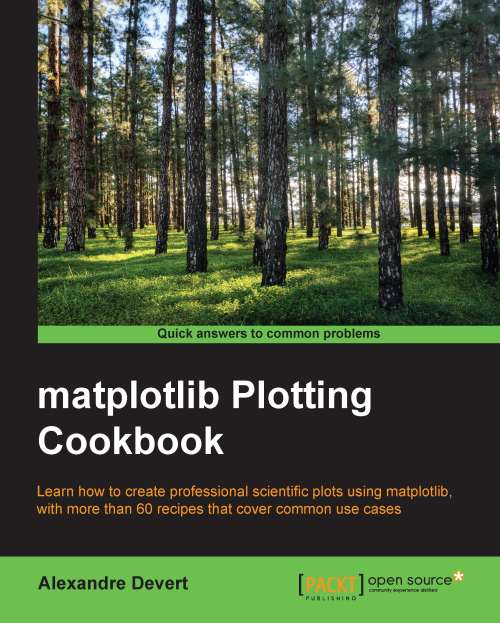

# matplotlib Plotting Cookbook

* **Publisher:** https://www.packtpub.com/big-data-and-business-intelligence/matplotlib-plotting-cookbook

# TOC
* [Chapter 1: First Steps](Ch01_First_Steps.md)
* [Chapter 2: Customizing the Color and Styles](Ch02_Customizing_the_Color_and_Styles.md)
* [Chapter 3: Working with Annotations](Ch03_Working_with_Annotations.md)
* [Chapter 4: Working with Figures](Ch04_Working_with_Figures.md)
* [Chapter 5: Working with a File Output](Ch05_Working_with_a_File_Output.md)
* [Chapter 6: Working with Maps](Ch06_Working_with_Maps.md)
* [Chapter 7: Working with 3D Figures](Ch07_Working_with_3D_Figures.md)
* [Chapter 8: User Interface](Ch08_User_Interface.md)
